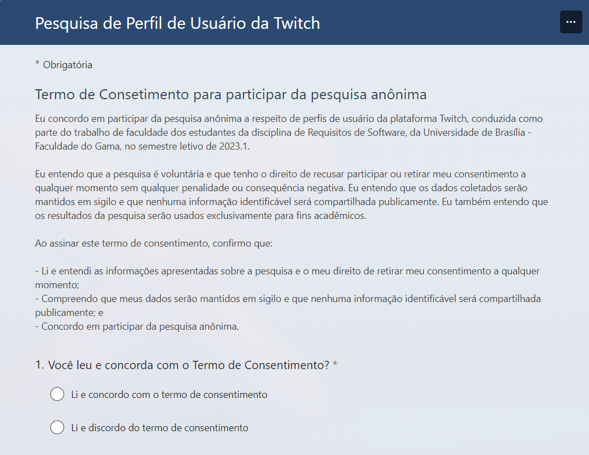

# Perfis de Usuário
## 1. Introdução

A fim de conhecer melhor quem de fato é usuário da plataforma Twitch, o grupo decidiu realizar uma pesquisa para descobrir o perfil de usuário do aplicativo objeto de estudo.

Perfil de usuário é um conjunto de suas características individuais, sejam elas socioeconômicas, formação intelectual, experiência com a ferramenta, comportamento, entre outras características. O objetivo de estabelecer um perfil de usuário é entender as variações de uma população que tem um aspecto em comum, no caso desse estudo, utilizar a plataforma Twitch. 

## 2. Metodologia

O grupo decidiu que a melhor forma de entender todas essas variações na população que utiliza essa plataforma seria por meio da aplicação de um questionário. O questionário foi desenvolvido na ferramenta de [Forms](https://forms.office.com/Pages/DesignPageV2.aspx) (formulários) da Microsoft. 

Os dados foram coletados de forma anônima. Essa medida preza pela privacidade dos participantes. Além disso, antes de responder ao questionário, cada participante deveria primeiramente concordar com os termos de consentimento estabelecidos pelo grupo. Caso não concordasse, a pesquisa seria descontinuada.

<h6 align = "center"> Imagem 1: Screenshot do Termo de Consentimento utilizado no quesrtionário
  Autor: Brunna Louise
 Fonte: Autor(es)</h6>

O grupo decidiu por aplicar o formulário com os seguintes questionamentos:
    
- Já usou a Twitch;
- Faixa etária;
- Escolaridade;
- Tipos de conteúdo que consome na plataforma;
- Tempo médio de uso da plataforma;
- Gênero; e
- Em qual dispositivo o participante mais acessa a plataforma.

No fim, o participante poderia escrever sugestões de melhoria da plataforma, caso quisesse.

O questionário criado pela equipe pode ser acessado nesse [link](https://forms.office.com/r/zZz8BP0VqM).

## 3. Aplicação do Questionário

A aplicação do questionário ocorreu durante 4 dias, entre os dias 25/04/2023 e 28/04/2023, dia em que o grupo fez o download da planilha mais atualizada que continha as respostas às perguntas do questionário.

Para a aplicação do questionário, fizemos disparos de mensagens pelo whatsapp e telegram, buscando manter os grupos e os nichos de pessoas para as quais estávamos enviando o mais diverso possível. Buscamos enviar para diferentes idades, como adolescentes e pessoas mais velhas, a fim de captar dados de diversas naturezas.

Na etapa de verificação de artefatos, quando foi feita verificação do artefato de [Perfis de Usuário](../verifica_valida_grupo08/verificacao_perfis_usuario.md), o grupo percebeu que havia cometido um erro na aplicação do questionário, pois o  ele não incluia coleta de dados referentes a estado civil e atitudes (tecnófilos, tecnófobos) do usuário. O engano, apesar de reconhecido, não pôde ser corrigido, pois naquele ponto do projeto, não havia possibilidade de reaplicação do questionário, haja vista que isso implicaria em refazer artefatos de estágio inicial, como este que estabele o Perfil de Usuário, e artefatos consequentes deste, como o artefato de [Personas](./personas.md) e todos os artefatos que se utilizam das personas obtidas a partir da coleta dos dados do questionário.

## 4. Resultados da Aplicação do Questionário

Os resultados obtidos no questionário foram armazenados em planilha e organizados visualmente no Dashboard 1 a seguir.

<iframe title="BI" width="800" height="486" src="https://app.powerbi.com/view?r=eyJrIjoiZjE0NDU4YTctZGM0OC00NGE4LWIwODUtNWIyY2ZkZWRmMmFmIiwidCI6ImVjMzU5YmExLTYzMGItNGQyYi1iODMzLWM4ZTZkNDhmODA1OSJ9" frameborder="0" allowFullScreen="true"></iframe>

<h6 align = "center"> Dashboard 1: Dashboard do perfil de usuário
  Autor: Rafael Nobre
 Fonte: Autor(es)</h6>

## 5. Análise dos Resultados 

De acordo com o Dashboard 1, pode-se abstrair algumas informações relevantes:

1. O público atingido pelo aplicativo Twitch é majoritariamente masculino, com idade entre 18 e 24 anos
2. O conteúdo mais acessado é o de jogos, informação que se confirma por observações dos _trending topics_ da plataforma
3. Grande parte acessa pelo computador/notebook
4. A média de consumo semanal oscila entre 2 a 5 horas semanais
5. As sugestões dos usuários são majoritariamente reclamações de propagandas, e alegações de que a interface é muito poluída.

## 6. Requisitos Elicitados

A partir dos resultados obtidos no questionário, informações relevantes foram coletadas e possibilitaram a elicitação de alguns requisitos com base na percepção dos usuários da plataforma que responderam o questionário. 

| Identificador | Requisitos | Tipo |
| --------------| ---------- | ---- |
| QUE01 | Redução de anúncios seguidos | RNF |
| QUE02 | Opção para ocultar as recomendações ou canais que outros usuários assistem | RF |
| QUE03 | Recomendação de vídeos publicados que estão em ascensão na plataforma (semelhante ao "Em Alta" no Youtube) | RF |
| QUE04 | Integração nativa com servidor do Discord | RF |
| QUE05 | Recomendação de conteúdos que condizem com o tipo de conteúdo consumido pelo usuário | RNF |
| QUE06 | Filtragem de direitos autorais, combatendo a pirataria | RF |
| QUE07 | Telas Múltiplas | RF |
| QUE08 | Modo Rascunho para Salvar e Editar vídeos, após sair da sessão.| RNF |
<h6 align = "center"> Tabela 1: Requisitos elicitados a partir de resultados do questionário.
  Autor: Brunna Louise
 Fonte: Autor(es)</h6>

| Identificador | Significado |
| --- | ---------- |
| QUEXX | Requisito elicitado a partir do questionário. |
| RF | Requisito funcional. |
| RNF | Requisito não funcional. | 
<h6 align = "center"> Tabela 2: Legenda que apresenta os significados de siglas utilizadas na Tabela 1.
  Autor: Brunna Louise
 Fonte: Autor(es)</h6>

## 7. Conclusão

Dessa maneira, conclui-se que o perfil do usuário mais comum da plataforma, dada a amostragem captada pela presente pesquisa, se identifica com o gênero masculino, possui de 18 a 24 anos, e seu maior interesse dentro da plataforma é por jogos. 

## 8. Referências

> Slides da E-Disciplina da USP de Interação Humano-Computador. Acesse os slides nesse [link](https://edisciplinas.usp.br/pluginfile.php/4531121/mod_resource/content/1/IHC%20Usuario_Personas_Pesquisas.pdf). Acesso em 25 de abril de 2023.

## Histórico de Versões

A Tabela 1 registra o histórico de versão desse documento.

|**Data** | **Versão** | **Descrição** | **Autor** | **Revisor** |
|:---: | :---: | :---: | :---: | :---: |
| 25/04/2023 | 1.0 | Primeira Versão do artefato de perfis de usuário | Brunna Louise | Rafael Nobre |
| 28/04/2023 | 1.1 | Inserção do Dashboard e análise dos resultados | Rafael Nobre | Brunna Louise |
| 01/05/2023 | 1.2 | Padronização das referências | Brunna Louise | Rafael Nobre |
| 09/05/2023 | 1.3 | Adicionando informação relativa à duração do questionário | Brunna Louise | Rafael Nobre |
| 09/05/2023 | 2.0 | Versão final do artefato de Perfis de Usuário: padronização; apresentação do termo de consentimento; inclusão de erros que não poderiam ser reparados. | Brunna Louise | Rafael |

<h6 align = "center"> Tabela 3: Histórico de Versões
  Autor: Brunna Louise
 Fonte: Autor(es)</h6>