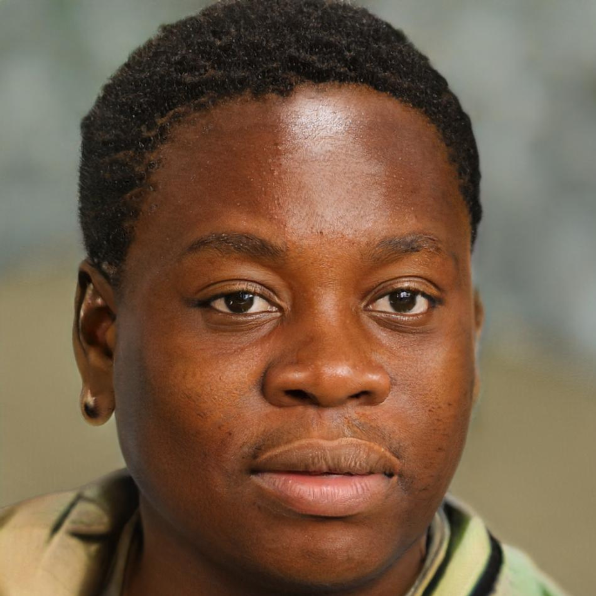
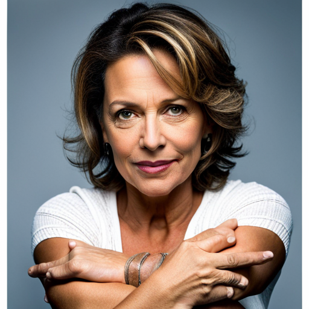

## 1. Introdução

Uma persona é um personagem fictício, arquétipo hipotético de um grupo de usuários reais, criada para descrever um usuário típico.

É utilizada principalmente para representar um grupo de usuários finais durante discussões de design, mantendo todos focados no mesmo alvo. As personas são definidas principalmente por seus objetivos, que são determinados num processo de refinamentos sucessivos durante a investigação inicial do domínio de atividade do usuário.

## 2. Metodologia
Depois de analisar os dados coletados por meio de formulários, foi possível identificar diferentes perfis de usuários relacionados ao produto ou serviço em análise. Com base nessas informações, foi criado um conjunto de personas que representam usuários com características distintas entre si. Cada persona recebeu um nome, história e atributos específicos, a fim de torná-las mais palpáveis e detalhadas. Essas personas ajudam a compreender melhor as necessidades e desejos do público-alvo, permitindo oferecer soluções mais efetivas e personalizadas.

## 3. Personas

| Persona | |
|:--:|:--:|
|Foto:|  
Figura 1: Persona
<small>Fonte: <a href='https://thispersondoesnotexist.com/'>Thispersondoesnotexist</a> </small>|
|Nome:|Enzo Oliveira|
|Idade:|19 anos|
|Status:|Persona Primária|
|Dados Demográficos:| Namorando, Sexo Masculino, Mora com os pais e 2 irmãs em uma casa|
|Profissão:|Estudande de Relações Internacionais|
|Escolaridade:|Cursando Ensino Superior|
|Habilidades:| Boa comunicação, alta criatividade, alta habilidade em jogos online, conhecimento de línguas estrangeiras|
|Objetivos:| Assistir gameplays de jogos eletrônicos|
|Tarefas:| Se entreter assistindo gameplays, estudar novas línguas através de lives de jogos em diferentes idiomas sem interrupções|
|Tempo de Uso:| 4 dias na semana, 2 horas cada dia | 
|Relacionamentos:| Família, amigos da faculdade e vizinhos |
|Requisitos:| O estudante deseja uma opção de filtro na Twitch para encontrar gameplays em diferentes línguas, sem ser interrompido por anúncios excessivos durante a visualização|
|Expectativas:| Espera assisitr gameplays na Twitch em canais interessantes em diferentes idiomas, sem interrupções de anúncios excessivos e com conteúdo de jogos de diferentes tipos (FPS, Corrida, Simualador etc). |

<h6 align = "center"> Tabela 1: Persona: Enzo Oliveira
  Autor: Diógenes
 Fonte: Autor(es)</h6>

---

| Persona | |
|:--:|:--:|
|Foto:|  
Figura 2: Persona
<small>Fonte: <a href='https://thispersondoesnotexist.com/'>Thispersondoesnotexist</a> </small>|
|Nome:| Larissa da Silva|
|Idade:| 21 anos |
|Status:| Persona Primaria |
|Dados Demográficos:| Solteira, Sexo Feminino, Mora com os pais e 1 irmão em um apartamento|
|Profissão:| Estudante de Ciência da Computação|
|Escolaridade:| Cursando o ensino superior|
|Habilidades:| Alta habilidade em matemática, informática avançada, front-end|
|Objetivos:| Larissa utiliza o Twitch para acompanhar streams de profissionais de sua área de interesse, buscando aprender sobre técnicas, ferramentas e melhores práticas para se destacar em processos seletivos de estágio. Além disso, ela utiliza o chat do Twitch para tirar dúvidas e interagir com outros estudantes. |
|Tarefas:| Larissa assiste a streams de profissionais em sua área de interesse pelo menos 3 vezes por semana, por cerca de 2 horas cada vez. Ela interage com o chat, faz perguntas e participa de discussões com outros estudantes. Além disso, ela também anota ideias e insights importantes para utilizar em seus estudos futuros.|
|Tempo de Uso:| 5 dias na semana, 1 hora cada dia |
|Relacionamentos:| Amigos da época de escola, amigos da faculdade, família|
|Requisitos:| Larissa acredita ser necessário que a Twitch coloque uma opção pra não ver recomendações ou canais que outros usuários assistem|
|Expectativas:| Encontrar lives de estudo e assistir gameplays com poucas interrupções de anúncios|

<h6 align = "center"> Tabela 2: Persona: Larissa da Silva
  Autor: Ana Beatriz
 Fonte: Autor(es)</h6>

---

| Persona | |
|:--:|:--:|
|Foto:|  
Figura 3: Persona
<small>Fonte: <a href='https://thispersondoesnotexist.com/'>Thispersondoesnotexist</a> </small>|
|Nome:|João Carvalho|
|Idade:|15 anos|
|Status:|Persona Primária|
|Dados Demográficos:| Solteiro, Sexo Masculino, Mora com os pais e 2 irmãos em um apartamento|
|Profissão:|Estudande |
|Escolaridade:|Cursando Ensino Médio|
|Habilidades:| Habilidade em jogos de corrida, habilidade em comunicação e sociabilidade|
|Objetivos:| Assistir gameplays de jogos eletrônicos|
|Tarefas:| Assistir gameplays de jogos de corrida na Twitch, aprender sobre jogos de corrida em seu tempo livre, interagir com amigos da escola e vizinhos. |
|Tempo de Uso:| 3 dias por semana, 4 horas cada dia |
|Relacionamentos:| Família, amigos da escola e vizinhos |
|Requisitos:| João espera encontrar lives com boa qualidade de imagem e som nas gameplays de jogos de corrida, consumindo menos dados móveis de internet e uma opção para salvar vídeos da lives para assistir posteriomente sem conexão online e que possa editá-los. |
|Expectativas:| Espera encontrar na Twitch uma grande variedade de gameplays de jogos de corrida, sem muitos anúncios e com transmissões ao vivo de competições de simuladores de corrida. Também espera encontrar uma comunidade de jogadores e criadores de conteúdo que possam compartilhar dicas, truques e experiências. |

<h6 align = "center"> Tabela 3: Persona: João Carvalho
  Autor: Diógenes
 Fonte: Autor(es)</h6>

---

| Persona | |
|:--:|:--:|
|Foto:|  
Figura 4: Persona
<small>Fonte: <a href='https://thispersondoesnotexist.com/'>Thispersondoesnotexist</a> </small>| 
|Nome:|Roberto Silva|
|Idade:|25 anos|
|Status:|Persona Secundária|
|Dados Demográficos:| Namorando, Sexo Masculino, Mora sozinho em um apartamento|
|Profissão:|Professor de Educação Física|
|Escolaridade:|Ensino Superior Completo|
|Habilidades:| Conhecimento de Anatomina, Alta Habilidade Esportiva e conhecimento diverso sobre esportes|
|Objetivos:| Aprimorar seu conhecimento a respeito de esportes e se entrenter assistindo campeonatos e jogos de diferentes modalidades esportivas |
|Tarefas:| Se entreter assistindo esportes, misturando diversão e conhecimento |
|Tempo de Uso:| 2 dias por semana, 2 horas cada dia |
|Relacionamentos:| Família, namorada, amigos e colegas do trabalho |
|Requisitos:| Roberto sugere que a Twitch ofereça uma opção para assistir a uma partida específica sem interrupções de anúncios e propagandas, pagando um valor inferior ao de uma inscrição regular e que seja cobrado por cada partida, não apenas por uma assinatura mensal. |
|Expectativas:| Encontrar lives de esportes que não tenham interrupções de anúncios durantes momentos importantes da partida esportiva ou que não seja durante o tempo corrido do jogo |

<h6 align = "center"> Tabela 4: Persona: Roberto Silva
  Autor: Diógenes
 Fonte: Autor(es)</h6>

---

| Persona | |
|:--:|:--:|
|Foto:| 
Figura 5: Antipersona
<small>Fonte: <a href='https://thispersondoesnotexist.com/'>Thispersondoesnotexist</a> </small>||
|Nome:| Maria das Graças |
|Idade:| 55 anos |
|Status:| Antipersona |
|Dados Demográficos:| Casada, Sexo Feminino, Mora com o marido em uma casa|
|Profissão:| Dona de casa |
|Escolaridade:| Ensino médio completo |
|Habilidades:| Alta habilidade culinaria, técnicas de limpeza|
|Objetivos:| Deseja viver o suficiente para ir ao casamento dos netos |
|Tarefas:| Maria não utiliza o Twitch, então ele não realiza nenhuma tarefa na plataforma.|
|Tempo de Uso:| Não utiliza a plataforma durante a semana |
|Relacionamentos:| Família, amigas da igreja e vizinhos |
|Expectativas:| Maria não tem nenhuma expectativa em relação a Twitch pois sequer sabe que ela existe |

<h6 align = "center"> Tabela 5: Persona: Maria das Graças
  Autor: Ana Beatriz
 Fonte: Autor(es)</h6>

---

## 4. Requisitos das Personas
| Personas | Requisitos |
|:--:|:--:|
| Enzo Oliveira | Filtro na Twitch para encontrar gameplays em diferentes línguas.|
| Enzo Oliveira | Não ser interrompido por anúncios excessivos durante a visualização.|
| Larissa da Silva| Opção para não ver recomendações ou canais que outros usuários assistem.
| João Carvalho| Lives com boa qualidade de imagem e som nas gameplays de jogos de corrida, consumindo menos dados móveis de internet.|
| João Carvalho| Opção para salvar vídeos da lives para assistir posteriomente sem conexão online e que possa editá-los.|
| Roberto Silva| Oferecer uma opção para assistir a uma partida específica sem interrupções de anúncios e propagandas, pagando um valor inferior ao de uma inscrição regular e que seja cobrado por cada partida, não apenas por uma assinatura mensal.
| Maria das Graças| N/A|

## 5. Conclusão
No tocante ao nosso projeto, foram utilizadas cinco personas, das quais três são primárias, uma é secundária e uma é antipersona. Tais personas foram embasadas nos perfis de usuários do projeto. 

Com base no questionário aplicado pelo grupo, foi possível identificar que o perfil de usuário da plataforma Twitch concentra-se majoritariamente na faixa etária compreendida entre 17 e 24 anos de idade, com preferência por conteúdos relacionados a jogos e estudos de tecnologia. Em vista desses dados, foi elaborada uma persona destinada a englobar a faixa etária próxima aos 17 anos, contemplando o público adolescente, além de duas personas voltadas a usuários adultos que se encontram na faixa etária de 18 a 24 anos, compreendendo o principal público adulto presente na plataforma.

Ademais, elaborou-se uma persona secundária para representar um grupo de usuários cujas necessidades divergem das da persona primária, porém ainda possuem relevância para o êxito do produto ou serviço em questão. Neste caso, a persona secundária engloba indivíduos com idade superior a 25 anos que utilizam a plataforma para assistir conteúdos relacionados a esportes. Apesar de não constituir o público-alvo principal, trata-se de um público significativo e para a plataforma.

Por fim, foi adicionada a antipersona que representa um perfil de usuário que não deve ser atendido pelo produto ou serviço em questão. 

## 6. Referências

> Barbosa, S. D. J.; Silva, B. S. da; Silveira, M. S.; Gasparini, I.; Darin, T.; Barbosa, G. D. J. (2021)
Interação Humano-Computador e Experiência do usuário. Autopublicação. ISBN: 978-65-00-19677-1. Acessado em 29 de Abril de 2023

> This Person Does Not Exist. [link](https://thispersondoesnotexist.com/). Acessado em: 29 de Abril de 2023 e em 30 de Abril de 2023.

## Histórico de Versões

A Tabela 7 registra o histórico de versão deste documento

|**Data** | **Versão** | **Descrição** | **Autor** | **Revisor** |
|:---: | :---: | :---: | :---: | :---: |
| 29/04/2023 | 1.0 | Criação do documento, adição de introdução, metologias e tabela de personas | Diógenes | Ana Beatriz |
| 29/04/2023 | 1.1 | Adiconando tabela de persona e antipersona | Ana Beatriz | Diógenes |
| 30/04/2023 | 1.2 | Adiconando duas personas primárias e uma secundária | Diógenes | Ana Beatriz |
| 09/05/2023 | 2.0 | Realizando alterações sugeridas pelo monitor | Ana Beatriz | Diógenes |
| 09/05/2023 | 2.1 | Adicionando correções sugeridas pelo monitor. Adicionando conclusão e motivo pela escolha de 5 personas. Adiciona tempo de uso nas personas | Diógenes | Ana Beatriz |

<h6 align = "center"> Tabela 7: Histórico de Versões
  Autor: Diógenes 
 Fonte: Autor(es)</h6>
