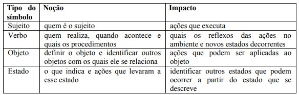

# Léxicos

## 1. Introdução

 O Léxico é uma técnica que procura descrever os símbolos de uma linguagem. O principal objetivo dos engenheiros de requisitos é buscar frases e símbolos do domínio da aplicação. Cada um desse símbolo é descrito com uma noção e um impacto, sendo a noção relacionada com o símbolo e o impacto com a descrição do efeito do símbolo na aplicação ou do efeito de algo na aplicação sobre o símbolo.

 Essas descrições seguem o princípio circular e o princípio do vocabulário mínimo. O princípio da circularidade torna cada extensão da descrição ou a conotação, referindo-se a outros símbolos da linguagem. A parte não simbólica da descrição deve vir de um subconjunto reduzido de palavras com significado claro (vocabulário mínimo).

## 2. Metodologia

 Os símbolos da Twitch foram identificados a partir do uso do aplicativo pelo o autor desse documento (Matheus) e dos requisitos previamente elicitados. Após identificados eles foram ordenados e descritos como: noção, impacto e sinônimo: 

| Léxico         | Sinônimo | Noção   | Impacto             | Classificação       |
| :--------------: | :--------: | :-------: | :-------------------: | :-------------------: |
| Nome do Léxico | Sinônimo | Símbolo | Descrição do efeito | Sujeito/Ação/Objeto/Estado |

<h6 align = "center"> Tabela 1: Modelo dos léxicos
 Autor(es): Matheus
 Fonte: Autor(es)</h6>

Os tipos do símbolo foram classificados e preenchidos seguindo a metodologia da figura abaixo. Os autores colocam perguntas subjetivas ao tipo do símbolo buscando responder a Noção e o Impacto deles.

{ width=700 }

<h6 align = "center"> Figura 1: Tipos de Símbolo
 Autor(es): Miriam Sayão e Gustavo R. de Carvalho
 Fonte: http://www.nilc.icmc.usp.br/til/til2006/0030.pdf</h6>
## 3. Léxicos

### L01 - Streamer

| Léxico | Sinônimo|  Noção  |  Impacto | Classificação |
| :----: | :-----: | :------:| :------: | :-----------: |
| Streamer | Produtor de conteúdo | Pessoa que transmite vídeos em tempo real de diversas categorias, principalmente jogos | Faz streamings, cria uma atmosfera divertida e engajadora para os espectadores, utilizando a integração de memes e [Emotes](./#l24-emote) | Sujeito |

### L02 - Usuário comum

| Léxico | Sinônimo|  Noção  |  Impacto | Classificação |
| :----: | :-----: | :------:| :------: | :-----------: |
|   Usuário Comum    |  Usuário   | Pessoa que pode assistir streamings e interagir nos chats, podendo fazer streamings também | Visualiza Streamings; Interaje no chat; Busca por conteúdos; Segue [streamers](./#l01-streamer); [Comprar Bits](./#l11-comprar-bits); Faz compras na plataforma |   Sujeito   |

### L03 - Assistir

| Léxico | Sinônimo|  Noção  |  Impacto | Classificação |
| :----: | :-----: | :------:| :------: | :-----------: |
|  Assistir   |   Ver  |   Ação de visualizar uma live ou um [VOD](./#l26-vod) (Video on Demand)     |  Permite aos usuários consumirem conteúdo  |  Ação |

### L04 - Interagir

| Léxico | Sinônimo|  Noção  |  Impacto | Classificação |
| :----: | :-----: | :------:| :------: | :-----------: |
|    Interagir    |  Comunicar   |   Ação de engajar ou se comunicar durante uma live |  Promove a participação dos espectadores durante um streaming |     Ação    |

### L05 - Comentar

| Léxico | Sinônimo|  Noção  |  Impacto | Classificação |
| :----: | :-----: | :------:| :------: | :-----------: |
|    Comentar    | Conversar | Ação de deixar um comentário em uma live |    Permite feedback e interação com o [streamer](./#l01-streamer) | Ação |

### L06 - Seguir

| Léxico | Sinônimo|  Noção  |  Impacto | Classificação |
| :----: | :-----: | :------:| :------: | :-----------: |
| Seguir    |  Acompanhar   |  Ação de acompanhar as transmissões de um [streamer](./#l01-streamer) | Receber notificações e mostrar apoio   |     Ação        |

### L07 - Compartilhar

| Léxico | Sinônimo|  Noção  |  Impacto | Classificação |
| :----: | :-----: | :------:| :------: | :-----------: |
|    Compartilhar   |    Enviar    | Ação de enviar o link de uma live para outras pessoas | Amplia o alcance da [transmissão](./#l16-transmitir) | Ação |

### L08 - Inscrever

| Léxico | Sinônimo|  Noção  |  Impacto | Classificação |
| :----: | :-----: | :------:| :------: | :-----------: |
| Inscrever | Assinar | Ação de se tornar assinante de um canal | Oferece benefícios exclusivos aos assinantes | Ação |

### L09 - Presentear

| Léxico | Sinônimo|  Noção  |  Impacto | Classificação |
| :----: | :-----: | :------:| :------: | :-----------: |
|    Presentear    | Brindar, oferecer |  Ação de dar uma inscrição para outro usuário  | Demonstra apoio ao canal | Ação |

### L10 - Reagir

| Léxico | Sinônimo|  Noção  |  Impacto | Classificação |
| :----: | :-----: | :------:| :------: | :-----------: |
|    Reagir   | Expressar uma emoção  |   Ação de expressar uma reação durante uma [transmissão](./#l16-transmitir)   |   Mostra emoções e engajamento     |    Ação      |

### L11 - Comprar Bits

| Léxico | Sinônimo|  Noção  |  Impacto | Classificação |
| :----: | :-----: | :------:| :------: | :-----------: |
| Comprar | Adquirir |    Ação de adquirir [bits](./#l25-bits) |    Permite o envio de mensagens com bits   |  Ação |

### L12 - Denunciar

| Léxico | Sinônimo|  Noção  |  Impacto | Classificação |
| :----: | :-----: | :------:| :------: | :-----------: |
| Denunciar | Reportar | Ação de reportar uma [transmissão](./#l16-transmitir) ao vivo ou mensagens de outro usuário |Garante a segurança e o cumprimento das regras | Ação |

### L13 - Buscar

| Léxico | Sinônimo|  Noção  |  Impacto | Classificação |
| :----: | :-----: | :------:| :------: | :-----------: |
| Buscar | Procurar, explorar | Ação de procurar por canais ou [transmissões](./#l16-transmitir) | Facilita a descoberta de novos conteúdos |  Ação  |

### L14 - Consultar

| Léxico | Sinônimo|  Noção  |  Impacto | Classificação |
| :----: | :-----: | :------:| :------: | :-----------: |
| Consultar | Verificar | Ação de verificar informações como saldo de [bits](./#l25-bits), histórico, etc. | Permite que os usuários acompanhem suas atividades | Ação |

### L15 - Personalizar

| Léxico | Sinônimo|  Noção  |  Impacto | Classificação |
| :----: | :-----: | :------:| :------: | :-----------: |
| Personalizar  | Customizar, configurar | Ação de configurar o perfil do [usuário](./#l02-usuario-comum) |  Traz uma experiência personalizada | Ação |

### L16 - Transmitir

| Léxico | Sinônimo|  Noção  |  Impacto | Classificação |
| :----: | :-----: | :------:| :------: | :-----------: |
| Transmitir | Fazer streaming | Ação de iniciar a transmissão ao vivo | Permite que um [streamer](./#l01-streamer) compartilhe seu conteúdo para a plataforma, podendo ser remunerado por tal | Ação  |

### L17 - Clipar

| Léxico | Sinônimo|  Noção  |  Impacto | Classificação |
| :----: | :-----: | :------:| :------: | :-----------: |
| Clipar  | Destacar, Recorte | Criar um trecho curto e destacado de uma [transmissão](./#l16-transmitir) ao vivo  | Compartilhamento de momentos, destaque de conteúdo| Ação |

### L18 - Drops

Léxico | Sinônimo |  Noção  |  Impacto | Classificação |
| :----: | :-----: | :------:| :------: | :-----------: |
| Drops | Recompensas | Recompensas obtidas ao assistir a transmissões para apoiar criadores | Incentiva a interação e recompensa os [usuários](./#l02-usuario-comum) | Objeto  |

### L19 - Prime Gaming

| Léxico | Sinônimo|  Noção  |  Impacto | Classificação |
| :----: | :-----: | :------:| :------: | :-----------: |
| [Prime Gaming](https://gaming.amazon.com/home) | - | Benefícios e conteúdos exclusivos disponíveis para assinantes do [Amazon Prime](https://www.amazon.com.br/prime) | Oferece vantagens aos assinantes do [Amazon Prime](https://www.amazon.com.br/prime) | Objeto |

### L20 - Loots

| Léxico | Sinônimo|  Noção  |  Impacto | Classificação |
| :----: | :-----: | :------:| :------: | :-----------: |
| Loots | Recompensas | Itens, jogos ou recompensas obtidos por meio do [Prime Gaming](./#l19-prime-gaming) | Oferece benefícios adicionais aos assinantes | Objeto |

### L21 - Notificações

| Léxico | Sinônimo|  Noção  |  Impacto | Classificação |
| :----: | :-----: | :------:| :------: | :-----------: |
|  Notificações | Alertas |Alertas ou mensagens enviadas aos usuários sobre atividades relevantes | Mantém os [usuários](./#l02-usuario-comum) informados e engajados | Objeto |

### L22 - Whisper

| Léxico | Sinônimo|  Noção  |  Impacto | Classificação |
| :----: | :-----: | :------:| :------: | :-----------: |
| Whisper  | Canal de comunicação privada  | Comunicação privada e direta entre [usuários](./#l02-usuario-comum) | Permite conversas discretas e particulares  |   Objeto |

### L23 - Thumbnail

| Léxico | Sinônimo|  Noção  |  Impacto | Classificação |
| :----: | :-----: | :------:| :------: | :-----------: |
| Thumbnail  | Miniatura | Imagem em miniatura que representa um conteúdo | Ajuda na identificação e visualização rápida do conteúdo transmitido | Objeto |

### L24 - Emote

| Léxico | Sinônimo|  Noção  |  Impacto | Classificação |
| :----: | :-----: | :------:| :------: | :-----------: |
| Emote  | Emoji  | Imagem ou ícone utilizado para expressar emoções ou reações em chat | Envolvimento emocional, comunicação visual  |   Objeto |

### L25 - Bits

| Léxico | Sinônimo|  Noção  |  Impacto | Classificação |
| :----: | :-----: | :------:| :------: | :-----------: |
| Bits  | Moeda Virtual | Moeda virtual utilizada na plataforma Twitch para apoio a [streamers](./#l01-streamer) e interação com o chat | Suporte financeiro, interação divertida | Objeto |

### L26 - VOD

| Léxico | Sinônimo|  Noção  |  Impacto | Classificação |
| :----: | :-----: | :------:| :------: | :-----------: |
| VOD  | Gravação, replay  | Vídeo on demand, conteúdo gravado disponível para visualização após a [transmissão](./#l16-transmitir) ao vivo  | Acesso a conteúdo passado, flexibilidade de horários | Objeto |

### L27 - Categorias

| Léxico | Sinônimo|  Noção  |  Impacto | Classificação |
| :----: | :-----: | :------:| :------: | :-----------: |
| Categorias  | Tags, Classificação  | Classificações ou tags que identificam diferentes tipos de conteúdo | Facilitar a organização e a descoberta  | Objeto |

### L28 - Confirmação de Conteúdos +18

| Léxico | Sinônimo|  Noção  |  Impacto | Classificação |
| :----: | :-----: | :------:| :------: | :-----------: |
| Confirmação de Conteúdos +18  | Etapa de Confirmação | Ao acessar um streaming classificado como +18, o usuário pode confirmar ou não que deseja acessar o conteúdo | Garante a confirmação de que o usuário deseja estar exposto ao tipo de conteúdo | Objeto |

### L29 - Registro

| Léxico | Sinônimo|  Noção  |  Impacto | Classificação |
| :----: | :-----: | :------:| :------: | :-----------: |
| Registro  | Cadastro  | Ação de criar uma conta na plataforma, sem autenticação por meios de provedores de email| Permite acesso personalizado e funcionalidades  |   Objeto |

### L30 - Segurança

| Léxico | Sinônimo|  Noção  |  Impacto | Classificação |
| :----: | :-----: | :------:| :------: | :-----------: |
| Segurança  | Proteção | Garantia de proteção contra acesso não autorizado | Protege os usuários e suas informações, além de evitar acesso indevido por provedores de email |   Objeto |

### L31 - Recomendações

| Léxico | Sinônimo|  Noção  |  Impacto | Classificação |
| :----: | :-----: | :------:| :------: | :-----------: |
| Recomendações  | Sugestões  | Sugestões personalizadas de conteúdo com base nas preferências do usuário | Ajuda a descobrir novos conteúdos relevantes  | Estado |

### L32 - Efeito Blur

| Léxico | Sinônimo|  Noção  |  Impacto | Classificação |
| :----: | :-----: | :------:| :------: | :-----------: |
| Efeito Blur  | Desfoque | Efeito de desfoque aplicado em imagens, [thumbnails](./#l23-thumbnail) e conteúdos indicados para adultos ou maiores de 18 anos | Garante a proteção e discrição dos usuários | Estado |

### L33 - Portabilidade

| Léxico | Sinônimo|  Noção  |  Impacto | Classificação |
| :----: | :-----: | :------:| :------: | :-----------: |
| Portabilidade | Multiplataforma  | Capacidade do sistema estar disponível em diferentes plataformas | Amplia o acesso e a conveniência do usuário  | Estado |

## 4. Conclusão 
Portanto, os léxicos encontrados foram buscados e reconhecidos através do uso do aplicativo por um usuário comum e autor deste documento, identificando o que poderia ser visto como uma figura de linguagem que passa a descrição de algo ou como um simples ícone.

## 5. Bibliografia
> CONSTRUÇÃO do léxico de aplicações. Proceedings of the International Joint Conference IBERAMIA/SBIA/SBRN 2006 : 4th Workshop in Information and Human Language Technology, Ribeirão Preto, Brazil, 23 out. 2006. CD-ROM. Disponível em: http://www.nilc.icmc.usp.br/til/til2006/0030.pdf

> SERRANO, Milene. Requisitos - Aula 10. Local: UnB-FGA, Gama, DF. Apresentação de Power Point. 35, color. Disponível em: [Requisitos - Aula 10](https://aprender3.unb.br/pluginfile.php/1668162/mod_resource/content/1/Aula%2010.pdf). Acesso em: 10/05/2023.

> Tik Tok. **Github** Disponível em : https://requisitos-de-software.github.io/2022.1-TikTok/lexicos/ . Acesso em: 10/05/2023.

## Histórico de Versão

| Versão |    Data    |                   Descrição                   |    Autor     | Revisor |
| :----: | :--------: | :-------------------------------------------: | :----------: | :-----: |
|  1.0   | 10/05/2023 | Criação do documento com todas as informações | Matheus | - |
|  1.1   | 04/06/2023 | Especificação de usuário e ligação entre léxicos com hyperlinks| Matheus | - |