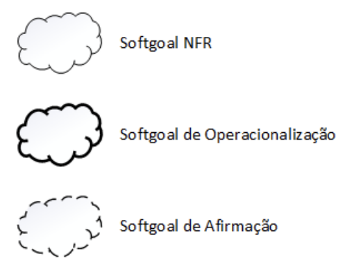
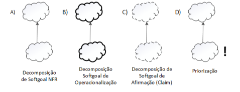
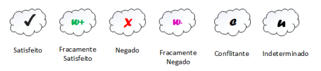
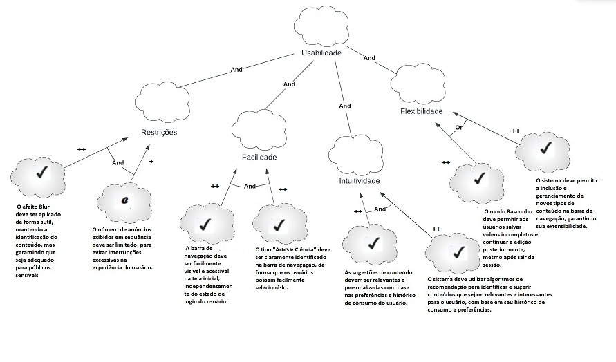
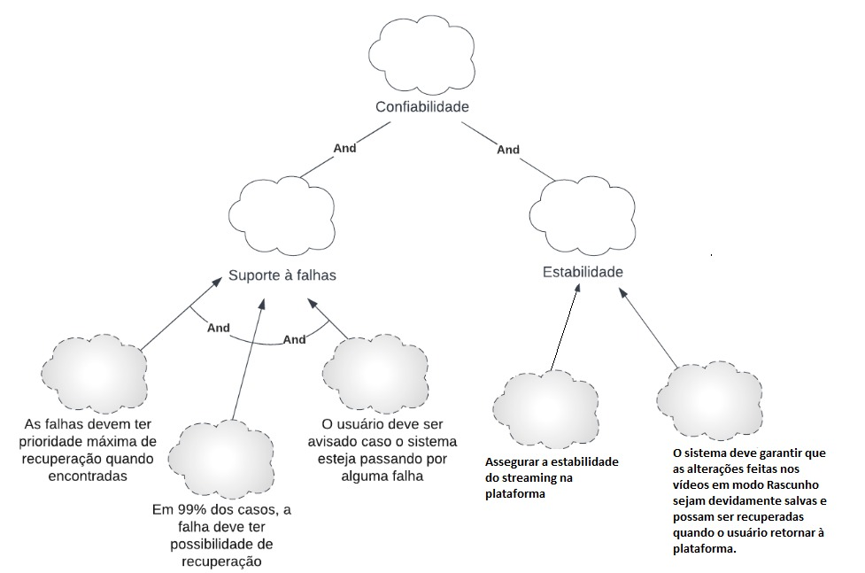
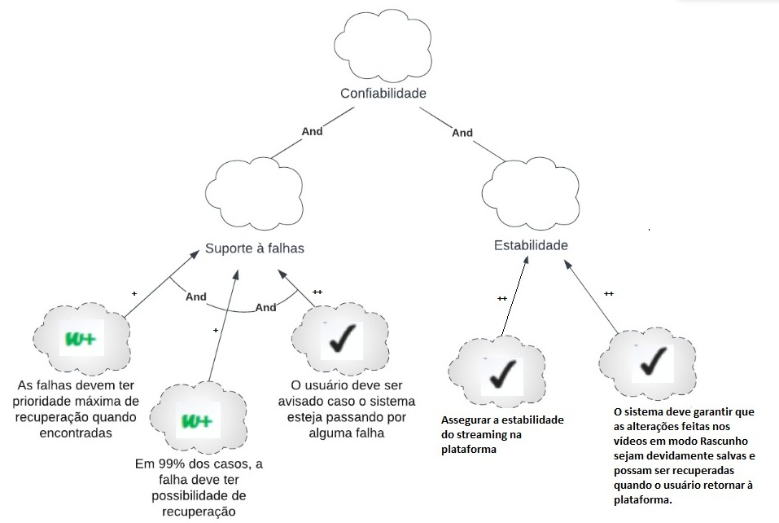
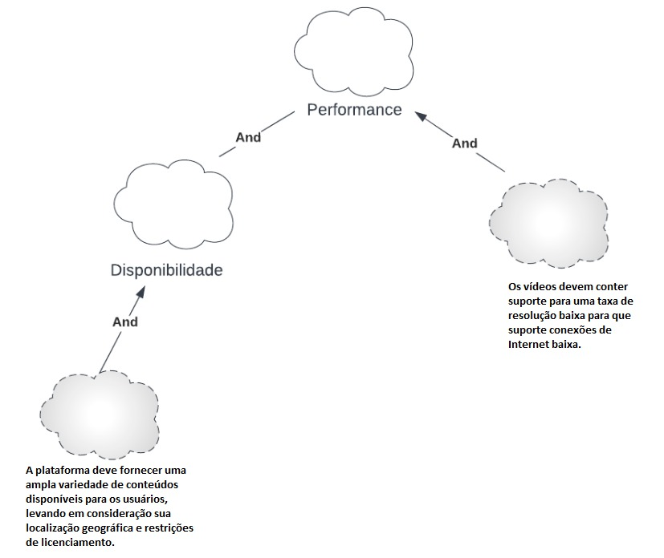
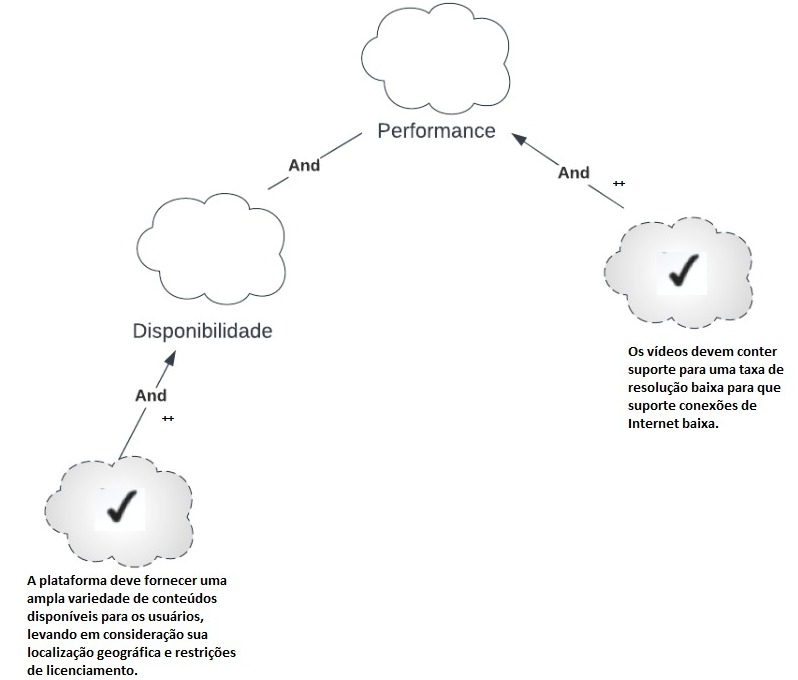
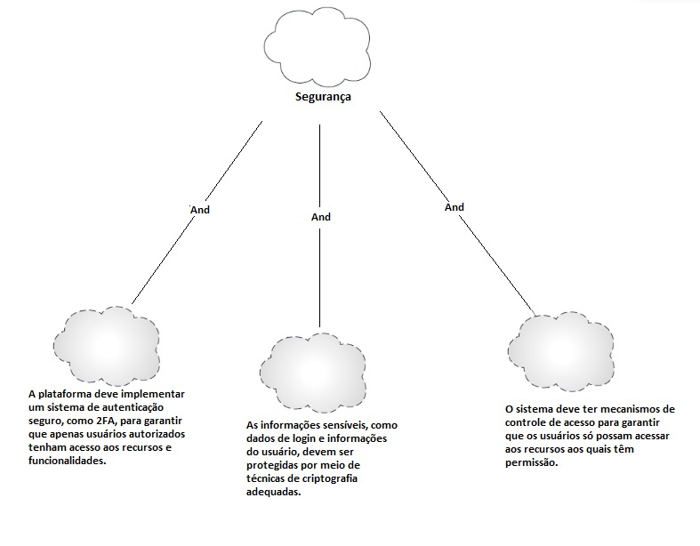
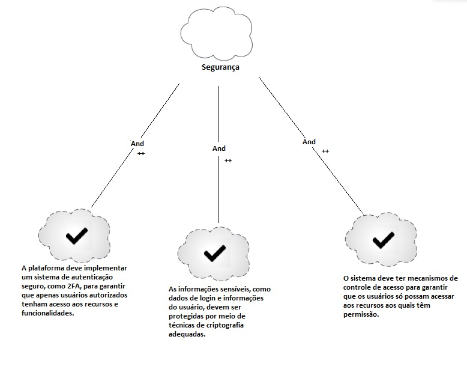

## 1. Introdução
O NFR (Non-Functional Requirements) Framework é uma abordagem para definir e gerenciar requisitos não funcionais de um sistema. Ele fornece uma estrutura para identificar, especificar, avaliar e validar aspectos como desempenho, segurança, usabilidade e escalabilidade. O NFR Framework auxilia no planejamento e desenvolvimento de sistemas que atendam a esses requisitos críticos para o sucesso do projeto.

Segundo a dissertação de Reinaldo Antônio da Silva,  O NFR Framework é uma abordagem para representar e analisar Requisitos Não-Funcionais. Seu objetivo é ajudar desenvolvedores na implementação de soluções personalizadas, levando em consideração as características do domínio e do sistema em questão. Tais características incluem Requisitos Não-funcionais, Requisitos funcionais, prioridades e carga de trabalho. 

O Framework utiliza o conceito de softgoal: um objetivo que não possui uma clara definição nem critérios de satisfação precisos. Os softgoals são utilizados para representar Requisitos Não-Funcionais e podem estar inter-relacionados, expressando a influência de um softgoal em outro.

Os softgoals e os seus inter-relacionamentos são representados em um grafo de interdependência de softgoals chamado SIG. Tal grafo será representado abaixo nesse documento.

## 2. Metodologia

O funcionamento do NFR framework pode ser visualizado em termos da construção, elaboração, análise e revisão incremental e interativa de um gráfico de interdependência 31 de softgoal conhecido como "Softgoal Interdependency Graph (SIG)". Este gráfico registra as considerações do desenvolvedor sobre os softgoals e mostra suas interdependências. Os SIGs armazenam um registro completo das decisões de desenvolvimento e da lógica do projeto de forma gráfica e concisa.

Para construir o SIG, o grupo decidiu usar a metodologia de construção descrita na dissertação do Reinaldo Antonio. Na dissertação, é abordado três tipos de softgoals:

- **Softgoals NFR**: representam os Requisitos Não- Funcionais e podem estar interrelacionados, organizados em catálogos e apresentados de forma hierárquica no desenvolvimento do projeto
- **Softgoals de Operacionalização**: representam soluções de implementação para satisfazer softgoals NFR ou outros softgoals de operacionalização. Essas soluções incluem operações, processos, representações de dados, estruturações e restrições no sistema alvo para atender às necessidades indicadas pelos softgoals NFR e de operacionalização
- **Softgoals de Afirmação**:permitem que as características do domínio (como prioridades e carga de trabalho) sejam consideradas e devidamente refletidas no processo de tomada de decisão. Eles servem como justificativa para apoiar ou negar a forma como os softgoals são priorizados, refinados e os componentes são selecionados

{ width=300 }

<h6 align = "center">Figura 1: Tipos de Softgoal.
 Fonte(es): (SILVA, 2019, p. 31).
</h6>

- **Interdependências**: as relações entre os softgoals podem ser divididas em 4 tipos diferentes de decomposição, conforme a figura 2

{ width=500 }

<h6 align = "center">Figura 2: Tipos de Interdependência.
 Fonte(es): (SILVA, 2019, p. 31).
</h6>

- **Contribuições**: A fim de descrever a satisfação de um softgoal descendente em relação a um ascendente, podem ser usadas algumas contribuições. No projeto serão usadas duas:
    
    **AND**: Os softgoals ascendentes só são satisfeitos se os descendentes também forem.
    
    **OR**: Se algum softgoal descendente for satisfeito, o ascendente também já será satisfeito.
    
    **MAKE(++)**: Ao usar a contribuição suficientemente positiva (MAKE), se o softgoal descendente for satisfeito, o softgoal ascendente também será satisfeito.
    
    **HELP(+)**: Ao usar a contribuição parcialmente positiva (HELP), se o softgoal descendente for parcialmente satisfeito, o softgoal ascendente também será parcialmente satisfeito.

- **Procedimento de avaliação**: para determinar o grau de satisfação de um requisito não-funcional, algumas legendas podem ser usadas. A figura 3 ilustra o significado de cada:

{ width=500 }

<h6 align = "center">Figura 3: Tipos de Procedimento de Avaliação.
 Fonte(es): (SILVA, 2019, p. 38).
</h6>

Dessa forma, a partir dos requisitos não-funcionais elicitados na fase de Elicitação, dando prioridade aos requisitos não implementados, foram criados os diagramas para o NFR Framework.

| Identificador | Requisitos não funcionais |
| --------------| ---------- |
| OBS10 | A plataforma deve colocar um efeito Blur nos Thumbnails para cada conteúdo categorizado como adulto ou 18+ |
| OBS12 | A barra de navegação de tipos de conteúdos deve aparecer na tela de início, mesmo estando logado  |
| OBS13 | Na Barra de navegação de tipos de conteúdos deve ser adicionado o tipo Artes e Ciência | 
| OBS14 | A experiência do usuário na questão de sugestões de conteúdo e o tipo de disponibilidade delas deve ser melhor logado na plataforma |
| RNFB02 | Segurança: o sistema deve garantir proteção contra acesso não autorizado |
| QUE01 | Redução de anúncios seguidos |
| QUE05 | Recomendação de conteúdos que condizem com o tipo de conteúdo consumido pelo usuário |
| QUE08 | Modo Rascunho para Salvar e Editar vídeos, após sair da sessão.|

<h6 align = "center"> Tabela 1: Requisitos não funcionais  
  Autor(es): Matheus
 Fonte: Autor(es)</h6>

## 3. NFR Framework

### 3.1 NFR de Usabilidade

{ width=700 }

<h6 align = "center">Figura 4: NFR Framework de Usabilidade.
 Fonte(es): Autor(es).
</h6>

### 3.1.1 NFR de Usabilidade com Propagação

{ width=700 }

<h6 align = "center">Figura 5: NFR Framework de Usabilidade com Propagação.
 Fonte(es): Autor(es).
</h6>

### 3.2 NFR de Confiabilidade

{ width=700 }

<h6 align = "center">Figura 6: NFR Framework de Confiabilidade.
 Fonte(es): Autor(es).
</h6>

### 3.2.1 NFR de Confiabilidade com Propagação

{ width=700 }

<h6 align = "center">Figura 7: NFR Framework de Confiablidade com Propagação.
 Fonte(es): Autor(es).
</h6>

### 3.3 NFR de Performance

{ width=700 }

<h6 align = "center">Figura 8: NFR Framework de Performance.
 Fonte(es): Autor(es).
</h6>

### 3.3.1 NFR de Performance com Propagação

{ width=700 }

<h6 align = "center">Figura 9: NFR Framework de Performance com Propagação.
 Fonte(es): Autor(es).
</h6>

### 3.4 Segurança

{ width=700 }

<h6 align = "center">Figura 10: NFR Framework de Segurança.
 Fonte(es): Autor(es).
</h6>

### 3.4.1 Segurança com Propagação

{ width=700 }

<h6 align = "center">Figura 11: NFR Framework de Segurança com Propagação.
 Fonte(es): Autor(es).
</h6>

## 4. Referências

> SILVA, Reinaldo Antônio da. NFR4ES: Um Catálogo de Requisitos Não-Funcionais para Sistemas Embarcados. 2019.

> Aula2-Parte2-NFR Framework.pdf - CIn UFPE. [link](https://www.cin.ufpe.br/~if716/arquivos20152/experimentoBruno/Aula2/Aula2-Parte2-NFR%20Framework.pdf). Acessado em 24 de maio de 2023

> CHUNG, L.; NIXON, B. A.; YU, E.; MYLOPOULOS, J. Non-functional requirements in software engineering. Springer Science & Business Media: [s.n.], 2000. v. 5.

## Histórico de Versões

A Tabela 2 registra o histórico de versão desse documento.

|**Data** | **Versão** | **Descrição** | **Autor** | **Revisor** |
|:---: | :---: | :---: | :---: | :---: |
| 23/05/2023 | 1.0 | Primeira Versão do artefato NFR Framework | Diógenes | Matheus |
| 23/05/2023 | 1.1 | Adicão de Introdução e parte da Metodologia | Diógenes | Matheus |
| 23/05/2023 | 1.2 | Adicão do final da metodologia e imagens | Matheus | Diógenes |
| 23/05/2023 | 1.3 | Adicão de títulos do NFR Framework (Confiabilidade, Usabilidade etc) | Diógenes | Matheus |
| 23/05/2023 | 1.4 | Adicão de imagens do NFR Framework | Diógenes, Matheus | Matheus |

<h6 align = "center"> Tabela 2: Histórico de Versões
  Autor(es): Diógenes Dantas, Matheus 
 Fonte: Autor(es)</h6>