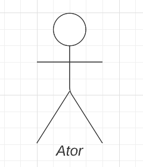
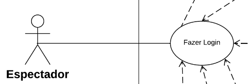
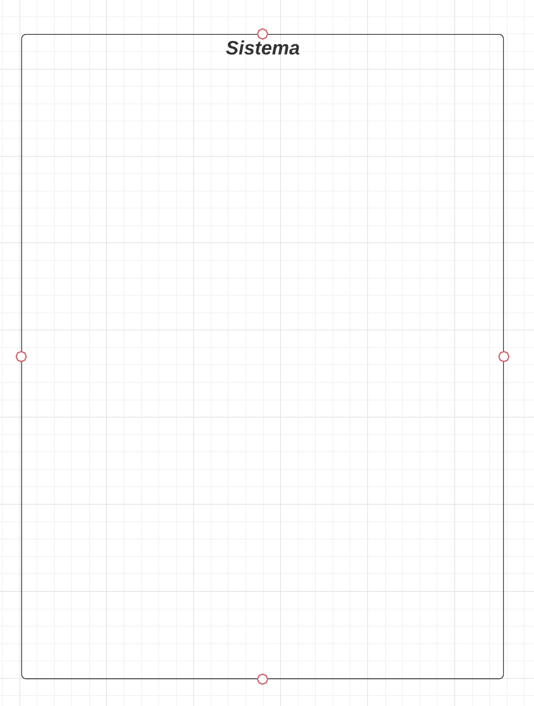

## 1. Introdução
Um diagrama de caso de uso UML tem como objetivo indicar as diferentes possibilidades que um usuário pode se comunicar ou interagir com um sistema específico. Em UML, um diagrama de caso de uso mostra de forma resumida as interações entre usuários de um sistema (ou atores) e o próprio sistema, bem como as metas que o sistema auxilia os atores a atingir e o escopo desse sistema.

Dada a simplicidade desse modelo, sua utilização e sua funcionalidade está dentro do escopo de: representar metas de interação sistema-usuário; definir requisitos funcionais de um sistema; especificação de contextos e requisitos do sistema; modelagem do fluxo básico de eventos que um sistema deve ser capaz de realizar.

## 2. Metodologia

Para elaborar esse artefato, o grupo decidiu representar os casos de uso por meio de um diagrama UML. Os passos seguidos para a produção do diagrama UML de Caso de Uso estão contidos a seguir:

1. Inserção da forma retangular de sistema no diagrama;
2. Adição de atores primários (inicia a utilização do sistema) e secundários (reage);
3. Inserção de casos de uso na ordem em que acontecem para representar as tarefas realizadas dentro do sistema;
4. Escolha de nomes intuitivos e simples para os casos de usos usando verbos e descrições simples para reforçar a ideia de que uma ação acontece, sem dar margens a dúvidas;
5. Criação de relacionamentos ao conectar atores e casos de uso.

O software empregado para construir o diagrama foi o LucidChart.

## 3. Legenda do Diagrama de Caso de Uso

A Tabela 1 a seguir descreve os elementos visuais utilizados no diagrama de caso de uso.

| Nome | Símbolo | Descrição | 
| ------ | ----------- | -----------  |
| Caso de Uso |  | Cada caso de uso representa uma ação que realiza uma tarefa dentro do sistema. |
| Ator(es) |  |  Representam as pessoas que utilizam os casos de uso, sejam elas atores primários (inicia a utilização do sistema, posicionados à esquerda) ou atores secundários (reagem à utilização do sistema, posicionados à direita).  |
| Associações |  | Descrevem os relacionamentos simples entre atores e casos de uso. Os atores se comunicam com os casos de uso ou interagem com os casos de uso. |
| Inclusões |  | Descreve o relacionamento entre um caso de uso base e um caso de uso incluído. O caso de uso base depende de um caso de uso incluído para estar completo, mas não é o ator que desempenha essa tarefa. A seta tracejada tem origem no caso de uso base e aponta para o caso de uso incluído. |
| Extensões |  | Descreve o relacionamento entre um caso de uso base e um caso de uso estendido. O caso de uso base, ao ser inicializado pelo ator, pode ou não resultar na ocorrência do caso de uso estentido; ou seja, o caso de uso estendido acontece apenas se certos critérios forem cumpridos na realização do caso de uso base. A seta tracejada tem origem no caso de uso estendido e aponta para o caso de uso base. |
| Generalização ou Herança |  | Descreve o relacionamento entre atores distintos ou entre casos de uso distintos. Um caso de uso especializado herda todas as características de um caso de uso geral, isto é, um caso de uso secundário herda as características de um caso de uso primário. A mesma dinâmica ocorre entre atores especializados, que herdam todas as características de um ator geral. |
| Caixa de limite do sistema |  | Retângulo que delimita o escopo do sistema. Casos de uso fora do retângulo estão fora do escopo do sistema descrito. |
<h6 align = "center"> Tabela 1: Legenda do Diagrama de Caso de Uso
  Autor(es): Brunna Louise, Diógenes Dantas
 Fonte: Autor(es)</h6>

## 4. Diagrama de Caso de Uso

O diagrama de Caso de Uso da Twitch está na figura 1 a seguir.

{: id="Diagrama de Casos de Uso"}
<h6 align = "center">Figura 1: Diagrama de Casos de Uso
 Autor(es): Brunna Louise e Diógenes Dantas
 Fonte: Autor(es)</h6>

## 5. Especificações de Caso de Uso

As especificações de cada Caso de Uso no diagrama mostrado na seção 4 serão descritas nas tabelas de 2 a X a seguir.
#### 5.1 Caso de Uso: Fazer Login

| Caso de Uso | Informações |
| ---- | ----------- | 
| Descrição | O usuário deve ser capaz de realizar login em sua conta para acessar as funcionalidades da Twitch. |
| Pré-Condições | - Possuir acesso à internet;   - Haver efetuado cadastro anteriormente. |
| Atores | Espectador, Criador, Moderador |
| Fluxo | 1. O usuário acessa a página web ou aplicativo da Twitch;   2. O usuário digita seu *username* e senha definidos no cadastro;   3. O usuário clica em *Login*.
| Pós-Condições  | O usuário terá acesso às principais funcionalidades oferecidas pela Twitch.
| Fluxo Alternativo | Caso o usuário tenha problemas para fazer login em sua conta (por exemplo, caso tenha esquecido sua senha), ele pode clicar em um hiperlink "Trouble logging in?", que redirecionará o usuário para recuperar sua conta por meio de um email ou um número de celular.
| Fluxo de Exceção 1 | O usuário digitou corretamente seu nome de usuário, mas errou sua senha. Caso isso aconteça, aparecerá uma mensagem de erro dizendo que a senha está incorreta e será possível ao usuário tentar digitá-la novamente.
| Fluxo de Exceção 2 | O usuário digitou um nome de usuário que não existe. Caso isso aconteça, aparecerá uma mensagem de erro dizendo que esse nome de usuário não existe e perguntando se o usuário deseja criar uma nova conta.
<h6 align = "center"> Tabela 2: Especificação de casos de uso - Fazer Login </h6>

#### 5.2 Caso de Uso: Buscar Conteúdo

| Caso de Uso | Informações |
| ---- | ----------- | 
| Descrição | O usuário acessa inicialmente uma página inicial que contém recomendações de lives, canais e categorias. Além disso, ele pode realizar uma busca caso queira encontrar algo em específico. |
| Pré-Condições | - Possuir acesso à internet.  |
| Atores | Espectador, Criador |
| Fluxo | 1. Caso o usuário não tenha encontrado o conteúdo que gostaria de visualizar na página inicial, ele precisará fazer uma busca;   2. O usuário clica na barra de busca no topo da página e digita o conteúdo que quer procurar;   3. O usuário encontra lives e canais atrelados às palavras-chave usadas no mecanismo de pesquisa.
| Pós-Condições  | Encontrar o conteúdo que estava procurando, ou não.
| Fluxo de Exceção 1 | O usuário buscou por um conteúdo inexistente ou digitou errado o que estava procurando. Caso isso aconteça, aparecerá uma mensagem de erro dizendo que não foram encontrados resultados para essa palavra-chave e que o usuário se certifique de que digitou corretamente o que buscava (conferir se há erros de digitação).
<h6 align = "center"> Tabela 3: Especificação de casos de uso - Buscar Conteúdo </h6>

#### 5.3 Caso de Uso: Consumir Conteúdo

| Caso de Uso | Informações |
| ---- | ----------- | 
| Descrição | O usuário deve ser capaz de assistir lives na plataforma da Twitch. |
| Pré-Condições | - Possuir acesso à internet. |
| Atores | Espectador |
| Fluxo | 1. O usuário clica na live que quer assistir;   2. O usuário tem acesso à live.
| Pós-Condições  | O usuário é capaz de assistir à live.
| Fluxo Alternativo  | O usuário clicou na live, porém o criador de conteúdo dono desse canal indicou que seu canal é direcionado a público adulto. Caso queira proceder, o usuário clica no botão "Start Watching" e pode, por fim, assistir à live.
<h6 align = "center"> Tabela 4: Especificação de casos de uso - Consumir Conteúdo </h6>

#### 5.4 Caso de Uso: Criar Conteúdo

| Caso de Uso | Informações |
| ---- | ----------- | 
| Descrição | Um usuário deve ser capaz de criar um canal para produzir conteúdo. No caso da Twitch, o conteúdo produzido é uma transmissão ao vivo. |
| Pré-Condições | - Possuir acesso à internet;   - Haver efetuado cadastro;   - Estar logado em sua conta. |
| Atores | Criador |
| Fluxo | 1. O usuário clica em *Criar Conteúdo*;   2. O usuário começa a transmitir ao vivo seu conteúdo. |
| Pós-Condições  | O usuário é capaz de transmitir o conteúdo que deseja ao vivo na plataforma. |
<h6 align = "center"> Tabela 5: Especificação de casos de uso - Criar Conteúdo </h6>

#### 5.5 Caso de Uso: Acessar notificações

| Caso de Uso | Informações |
| ---- | ----------- | 
| Descrição | O usuário deve ser capaz de ter acesso a notificações de canais que segue e de outros usuários que interagiram com seu canal. |
| Pré-Condições | - Possuir acesso à internet;   - Haver efetuado cadastro;   - Estar logado em sua conta. |
| Atores | Espectador, Criador |
| Fluxo | 1. O usuário clica no ícone de notificações;   2. O usuário pode alternar entre notificações relacionadas a quem interagiu com seu canal ou notificações relacionadas aos canais que segue.  |
| Pós-Condições | O usuário é capaz de visualizar quem interagiu com seu canal e que outros canais que ele segue produziram conteúdo enquanto estava ausente. |
<h6 align = "center"> Tabela 6: Especificação de casos de uso - Acessar Notificações </h6>

#### 5.6 Caso de Uso: Interagir em Lives

| Caso de Uso | Informações |
| ---- | ----------- | 
| Descrição | O usuário deve ser capaz de comentar nas lives as quais está assistindo, interagindo com outros usuários e com o criador de conteúdo. |
| Pré-Condições | - Possuir acesso à internet;   - Haver efetuado cadastro;   - Estar logado em sua conta;   - Estar consumindo conteúdo (assistindo a uma live). |
| Atores | Espectador, Criador |
| Fluxo | 1. O usuário clica na aba de comentários da live;   2. O usuário digita sua mensagem;   3. A mensagem pode ou não passar por moderação para ser enviada. |
| Pós-Condições  | A mensagem desejada é enviada (ou não, caso não seja aprovada), possibilitando o usuário a interagir com outros usuários e com o criador de conteúdo. |
| Fluxo Alternativo | O usuário tenta interagir em uma live, porém, o criador de conteúdo permite interação somente a usuários que o sigam. Caso o usuário queria interagir nessa live em específico, ela deve começar a seguir o criador de conteúdo. |
<h6 align = "center"> Tabela 7: Especificação de casos de uso - Interagir em Lives </h6>

#### 5.7 Caso de Uso: Moderar Conteúdo

| Caso de Uso | Informações |
| ---- | ----------- | 
| Descrição | O usuário deve ser capaz de monitorar os comentários em tempo real, procurando por mensagens que violem as regras do canal ou as diretrizes da Twitch e têm autoridade para remover ou ocultar tais mensagens. |
| Pré-Condições | - Possuir acesso à internet;   - Haver efetuado cadastro;   - Estar logado em sua conta; |
| Atores | Moderador |
| Fluxo | 1. O usuário entra em uma live;   2. O criador de conteúdo libera o acesso aos comentários;   3. O usuário designado pelo criador de conteúdo monitora os comentários em tempo real. |
| Pós-Condições  | O moderador tem acesso aos comentários e pode remover e ocultar mensagens que violam as regras do canal do criador ou as diretrizes da plataforma. |
| Fluxo Alternativo | Caso o criador de conteúdo não tenha habilitado essa opção em seu canal, não será possível que usuários designados por ele moderem o chat de sua live.
<h6 align = "center"> Tabela 8: Especificação de casos de uso - Moderar Conteúdo </h6>

#### 5.8 Caso de Uso: Apoiar Conteúdo

| Caso de Uso | Informações |
| ---- | ----------- | 
| Descrição | O usuário é capaz de oferecer suporte ativo à sua transmissão, demonstrando interesse e ajudando a fortalecer sua comunidade, utilizando a ferramenta de "seguir" ou pagando com o "inscrever". |
| Pré-Condições |  - Possuir acesso à internet;   - Haver efetuado cadastro;   - Estar logado em sua conta. |
| Atores | Espectador, Criador |
| Fluxo | 1. O usuário entra em uma live;   2. O usuário clica em seguir, botão ao lado do canal que está transmitindo esse conteúdo. |
| Pós-Condições  | O usuário é capaz de acompanhar o conteúdo de um criador de conteúdo e receber notificações quando há conteúdo novo. |
| Fluxo ALternativo | Além de apenas seguir um canal, um usuário pode se inscrever. Com isso, ele apoia financeiramente um canal por meio de uma assinatura, o que confere ao usuário benefícios estabelecidos pelo criador de conteúdo. |
<h6 align = "center"> Tabela 9: Especificação de casos de uso - Apoiar Conteúdo </h6>

#### 5.9 Acessar Sussurro

| Caso de Uso | Informações |
| ---- | ----------- | 
| Descrição | O usuário é capaz de acessar o chat privato da plataforma (sussurro) e mandar mensagens para outros usuários. |
| Pré-Condições |  - Possuir acesso à internet;   - Haver efetuado cadastro;   - Estar logado em sua conta. |
| Atores | Espectador, Criador |
| Fluxo | 1. O usuário clica no ícone de sussurros;   2. O usuário pode mandar mensagens para outros usuários. |
| Pós-Condições  | O usuário é capaz de enviar mensagens privadas para outros usuários e se comunicar com outros membros da plataforma. |
| Fluxo de Exceção | Há usuários que não permitem que outros usuários lhes envie sussurros. Dessa forma, não será possível enviar uma mensagem privada para esse usuário. |
<h6 align = "center"> Tabela 10: Especificação de casos de uso - Acessar Sussuro </h6>

## 6. Validação dos Casos de Uso
Utilizando-se da técnica de revisão de requisitos, os membros da equipe de modelagem Brunna e Diógenes fizeram uma reunião em que, utilizando-se de personas criadas anteriormente como usuários ativos/clientes dos serviços da Twitch, fez-se possível validar os casos de uso apresentados.
As personas capazes de validar o documento apresentado são: Enzo Oliveira, Larissa da Silva e João Carvalho, todas personas primárias utilizadas na etapa de elicitação de requisitos. É possível conferir mais características a respeito dessas personas no documento de [Personas](https://requisitos-de-software.github.io/2023.1-Twitch/elicitacao/personas/).
## 7. Participantes

A tabela 11 a seguir registra os membros do grupo que contribuíram com esse documento:

| **Participante** | **Papel** |
| ---- | ----------- | 
| Brunna Louise | Membro da Equipe de Modelagem |
| Diógenes Dantas | Membro da Equipe de Modelagem |

<h6 align = "center"> Tabela 11: Participantes e seus papéis na produção do artefato
  Autor(es): Diógenes, Brunna Louise
 Fonte: Autor(es)</h6>

## 8. Referências

> Diagrama de caso de uso UML: O que é, como fazer e exemplos, pela equipe do Lucidchart. Acesse o site com o tutorial nesse [link](https://www.lucidchart.com/pages/pt/diagrama-de-caso-de-uso-uml). Acesso em 11 de maio de 2023.

> O que é UML e Diagramas de Caso de Uso: Introdução Prática à UML. Acesse o site com o tutorial nesse [link](https://www.devmedia.com.br/o-que-e-uml-e-diagramas-de-caso-de-uso-introducao-pratica-a-uml/23408). Acesso em 13 de maio de 2023.

> Tutorial de Caso de Uso UML. [link](https://www.youtube.com/watch?v=ab6eDdwS3rA). Acesso em 13 de maio de 2023.

## Histórico de Versões

A Tabela 12 registra o histórico de versão desse documento.

|**Data** | **Versão** | **Descrição** | **Autor** | **Revisor** |
|:---: | :---: | :---: | :---: | :---: |
| 11/05/2023 | 1.0 | Primeira Versão do artefato de Use Case (Caso de Uso) | Brunna Louise, Diógenes Dantas | Milena Beatriz, Rafael Nobre |
| 14/05/2023 | 1.1 | Adição de metodologia e algumas legendas do Diagrama de Caso de Uso | Brunna Louise, Diógenes Dantas | Milena Beatriz |
| 15/05/2023 | 1.2 | Adição do Diagrama de Casos de Uso e novas imagens da Legenda do Diagrama de Caso de Uso | Diógenes Dantas | Brunna Louise |
| 16/05/2023 | 1.3 | Adição de passos seguidos para criação de diagrama de caso de uso | Brunna Louise | Diógenes Dantas |
| 16/05/2023 | 1.4 | Adição de primeira versão de Especificações de Casos de Uso | Brunna Louise | Diógenes Dantas |
| 16/05/2023 | 1.5 | Adição de novas Especificações de Casos de Uso e alteração da imagem de associações| Diógenes Dantas | Brunna Louise |
| 24/05/2023 | 1.6 | Adição de Correções ligadas ao diagrama de Casos de Uso| Diógenes Dantas | Brunna Louise |
| 01/06/2023 | 1.7 | Adição da Tabela de Validação do Diagrama dos Casos de Uso| Diógenes Dantas | Brunna Louise |
| 05/06/2023 | 1.8 | Adição de Fluxos Alternativos e Fluxos de Exceção (caso se aplique) | Brunna Louise | Diógenes Dantas |
| 12/06/2023 | 1.9 | Adição de Validação por meio de Personas | Brunna Louise | Diógenes Dantas |
| 20/06/2023 | 2.0 | Versão Final do Artefato: ajustes finais para a entrega completa do projeto | Diógenes Dantas | Brunna Louise |
<h6 align = "center"> Tabela 12: Histórico de Versões
  Autor(es): Brunna Louise, Diógenes Dantas
 Fonte: Autor(es)</h6>