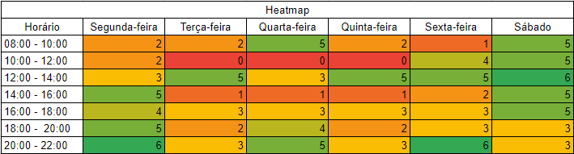

# Cronograma 

## 1. Introdução
Este documento tem como objetivo definir um cronograma para o projeto de acordo com as entregas impostas na disciplina de Requisitos de Software, seguindo datas e artefatos exigidos com seus respectivos responsáveis e revisores.

## 2. Heatmap
Um Heatmap é uma ferramenta de visualização de dados que usa cores para mostrar a distribuição de valores em uma matriz.
O Heatmap foi uma ferramenta valiosa para a equipe economizar tempo e esforço ao agendar reuniões.

Tabela 1 - Heatmap da equipe

Fonte: Autor(es)

 

## 3. Cronograma 
O cronograma foi separado em pontos de controle afim de organizar de uma maneira mais clara das etapas. 

### 3.1 Ponto de controle 1
O ponto de controle 1 tem como foco o planejamento para a execução do projeto, como as ferramentas que serão usadas, a metodologia adotada, etc. 

| Artefato | Elaboração| Revisão | Autor(es)  | Revisor  |
| :------: | :-------: | :-----: | :--------: | :------: |
| Página Inicial (equipe) e GitHub Pages | **Início**: 07.04.2023  **Término**: 15.04.2023 | **Início**: 16.04.2023  **Término**: 16.04.2023 | Matheus e Rafael | Ana Beatriz |
| Aplicativo Selecionado | **Início**: 07.04.2023  **Término**: 15.04.2023 | **Início**: 16.04.2023  **Término**: 16.04.2023 | Matheus | Diógenes |
| Ferramentas do Projeto | **Início**: 07.04.2023  **Término**: 15.04.2023 | **Início**: 16.04.2023  **Término**: 16.04.2023 | Brunna | Milena |
| Cronograma | **Início**: 07.04.2023  **Término**: 15.04.2023 | **Início**: 16.04.2023  **Término**: 16.04.2023 | Ana Beatriz e Milena | Brunna |
| Metodologia | **Início**: 07.04.2023  **Término**: 15.04.2023 | **Início**: 16.04.2023  **Término**: 16.04.2023 | Diógenes | Rafael |
| Rich Picture | **Início**: 07.04.2023  **Término**: 15.04.2023 | **Início**: 16.04.2023  **Término**: 16.04.2023 | Rafael | Matheus |
| Gravação e Postagem | **Início**: 17.04.2023  **Término**: 17.04.2023 | - | Ana Beatriz, Brunna, Diógenes, Matheus, Milena e Rafael | - |

<h6 align = "center"> Tabela 1: Cronograma planejado do ponto de controle 1 </h6>
<h6 align = "center"> Fonte: Autor(es) </h6>

### 3.2 Ponto de controle 2
O ponto de controle 2 tem como objetivo Elicitação – Técnicas e Priorização

| Artefato | Elaboração| Revisão | Autor(es)  | Revisor  |
| :------: | :-------: | :-----: | :--------: | :------: |
| Perfil dos usuários | **Início**: 18.04.2023 **Término**: 22.04.2023 | **Início**: 23.04.2023  **Término**: 23.04.2023 | Brunna e Rafael | Matheus e Diógenes |
| Personas | **Início**: 23.04.2023 **Término**: 27.04.2023 | **Início**: 28.04.2023  **Término**: 28.04.2023 | Ana Beatriz e Diógenes | Rafael e Milena |
| Técnicas de elecitação usadas e que serão usadas | **Início**: 18.04.2023 **Término**: 27.04.2023 | **Início**: 28.04.2023  **Término**: 28.04.2023 | Matheus | Ana Beatriz |
| Técnicas priorização usadas e que serão usadas no projeto. | **Início**: 18.04.2023 **Término**: 27.04.2023 | **Início**: 28.04.2023  **Término**: 28.04.2023 | Milena | Brunna |
| Gravação e Postagem | **Início**: 29.04.2023  **Término**: 29.04.2023 | **Início**: 30.05.2023  **Término**: 30.05.2023 |  Ana Beatriz, Brunna, Diógenes, Matheus, Milena e Rafael | Rafael |

<h6 align = "center"> Tabela 2: Cronograma planejado do ponto de controle 2 </h6>
<h6 align = "center"> Fonte: Autor(es) </h6>

### 3.3 Ponto de controle 3
O ponto de controle 3 tem como objetivo a modelagem de Requisitos.

| Artefato | Elaboração| Revisão | Autor(es)  | Revisor  |
| :------: | :-------: | :-----: | :--------: | :------: |
| Cenários | **Início**: 02.05.2023  **Término**: 10.05.2023 | **Início**: 11.05.2023  **Término**: 14.05.2023 | Milena | Diógenes |
| Léxico | **Início**: 02.05.2023  **Término**: 10.05.2023 | **Início**: 11.05.2023  **Término**: 14.05.2023  | Matheus | Ana Beatriz e Brunna |
| Use Case | **Início**: 02.05.2023  **Término**: 10.05.2023 | **Início**: 11.05.2023  **Término**: 14.05.2023  | Brunna e Diógenes | Milena e Rafael |
| Especificação Suplementar | **Início**: 02.05.2023  **Término**: 10.05.2023 | **Início**: 11.05.2023  **Término**: 14.05.2023  | Ana Beatriz e Rafael | Matheus |
| Gravação e Postagem | **Início**: 15.05.2023  **Término**: 15.05.2023 | **Início**: 16.05.2023  **Término**: 17.05.2023 |  Ana Beatriz, Brunna, Diógenes, Matheus, Milena e Rafael | Diógenes |

<h6 align = "center"> Tabela 3: Cronograma planejado do ponto de controle 3 </h6>
<h6 align = "center"> Fonte: Autor(es) </h6>

### 3.4 Ponto de controle 4
O ponto de controle 4 refere-se à Modelagem de Requisitos - Ágil

| Artefato | Elaboração| Revisão | Autor(es)  | Revisor  |
| :------: | :-------: | :-----: | :--------: | :------: |
| Histórias de Usuário | **Início**: 18.05.2023 **Término**: 20.05.2023 | **Início**: 20.05.2023  **Término**: 20.05.2023 | Ana Beatriz e Brunna | Milena e Rafael |
| Backlogs | **Início**: 20.05.2023 **Término**: 22.05.2023 | **Início**: 22.05.2023  **Término**: 22.05.2023 | Milena e Rafael | Diógenes e Matheus |
| NFR Framework | **Início**: 18.05.2023 **Término**: 22.05.2023 | **Início**: 22.05.2023  **Término**: 22.04.2023 | Diógenes e Matheus | Ana Beatriz e Brunna |
| Gravação e Postagem | **Início**: 23.05.2023  **Término**: 23.05.2023 | **Início**: 24.05.2023  **Término**: 24.05.2023 | Ana Beatriz, Brunna, Diógenes, Matheus, Milena e Rafael | Rafael |

<h6 align = "center"> Tabela 4: Cronograma planejado do ponto de controle 4 </h6>
<h6 align = "center"> Fonte: Autor(es) </h6>

### 3.5 Ponto de controle 5
O ponto de controle 5 foi divido em duas entregas respectivas, tendo como o foco a análise de requisitos: verficação e validação. 

#### 3.5.1 Ponto de controle 5.1

| Artefato | Elaboração| Revisão | Autor(es)  | Revisor  |
| :------: | :-------: | :-----: | :--------: | :------: |
| Verificação e Validação | **Início**: 25.05.2023  **Término**: 02.06.2023  | **Início**: 03.06.2023  **Término**: 04.06.2023  | Ana Beatriz, Brunna, Diógenes, Matheus, Milena e Rafael | Rafael |
| Gravação e Postagem | **Início**: 05.06.2023  **Término**: 05.06.2023 | **Início**: 06.06.2023  **Término**: 07.06.2023 |  Ana Beatriz, Brunna, Diógenes, Matheus, Milena e Rafael | Milena |

<h6 align = "center"> Tabela 5: Cronograma planejado do ponto de controle 5.1 </h6>
<h6 align = "center"> Fonte: Autor(es) </h6>

#### 3.5.2 Ponto de controle 5.2

| Artefato | Elaboração| Revisão | Autor(es)  | Revisor  |
| :------: | :-------: | :-----: | :--------: | :------: |
| Verificação e Validação | **Início**: 08.06.2023 **Término**: 09.06.2023 | **Início**: 10.06.2023  **Término**: 11.06.2023  | Ana Beatriz, Brunna, Diógenes, Matheus, Milena e Rafael | Ana Beatriz |
| Gravação e Postagem | **Início**: 12.06.2023  **Término**: 12.06.2023 | **Início**: 13.06.2023  **Término**: 14.06.2023 |  Ana Beatriz, Brunna, Diógenes, Matheus, Milena e Rafael | Brunna |

<h6 align = "center"> Tabela 6: Cronograma planejado do ponto de controle 5.2 </h6>
<h6 align = "center"> Fonte: Autor(es) </h6>

### 3.6 Ponto de controle 6
Ponto de controle 6 - Gerência de Desenvolvimento de Software orientada à baseline de Requisitos 

| Artefato | Elaboração| Revisão | Autor(es)  | Revisor  |
| :------: | :-------: | :-----: | :--------: | :------: |
| Backward From | **Início**: 15.06.2023 **Término**: 18.06.2023 | **Início**: 18.06.2023  **Término**: 18.06.2023 | Diógenes e Milena | Matheus e Brunna |
| Forward From | **Início**: 15.06.2023 **Término**: 18.06.2023 | **Início**: 18.06.2023  **Término**: 18.06.2023 | Matheus e Brunna | Diógenes e Matheus |
| Matriz Geral | **Início**: 15.06.2023 **Término**: 18.06.2023 | **Início**: 18.06.2023  **Término**: 18.06.2023 | Ana Beatriz e Rafael | Diógenes e Milena |
| Gravação e Postagem | **Início**: 19.06.2023  **Término**: 19.06.2023 | **Início**: 20.06.2023  **Término**: 20.06.2023 | Ana Beatriz, Brunna, Diógenes, Matheus, Milena e Rafael | Ana Beatriz |

<h6 align = "center"> Tabela 7: Cronograma planejado do ponto de controle 6 </h6>
<h6 align = "center"> Fonte: Autor(es) </h6>

### 3.7 Ponto de controle final
No ponto de controle final deve ser feita uma verificação, correção e refinamento dos artefatos para ser entregue na avaliação final do projeto.

| Artefato | Elaboração| Revisão | Autor(es)  | Revisor  |
| :------: | :-------: | :-----: | :--------: | :------: |
| Verificação, correção e refinamento | **Início**: 22.06.2023 **Término**: 30.06.2023 | **Início**: 01.07.2023  **Término**: 02.07.2023  | Ana Beatriz, Brunna, Diógenes, Matheus, Milena e Rafael | Diógenes |
| Gravação e Postagem | **Início**: 03.07.2023  **Término**: 03.07.2023 | **Início**: 04.07.2023  **Término**: 05.07.2023 |  Ana Beatriz, Brunna, Diógenes, Matheus, Milena e Rafael | Matheus |

<h6 align = "center"> Tabela 8: Cronograma planejado do ponto de controle final </h6>
<h6 align = "center"> Fonte: Autor(es) </h6>

## 4. Histórico de versão
|    Data    | Versão | Descrição                                                                      | Autor(es)  | Revisor  |
| :--------: | :----: | :----------------------------------------------------------------------------: | :--------: | :------: |
| 11.04.2023 | 1.0    | Criação do documento, adição de introdução e criação do template do cronograma |   Milena   |    Brunna     |
| 15.04.2023 | 1.1    | Adição do cronograma dos pontos de controle 1, 3, 5 e final |   Milena   |    Brunna     |
| 15.04.2023 | 1.2    | Adição do cronograma dos pontos de controle 2, 3 e 6 |   Ana Beatriz   |    Brunna     |
| 29.04.2023 | 1.2    | Adição de legendas e fontes nas tabelas |  Milena   |    -    |

