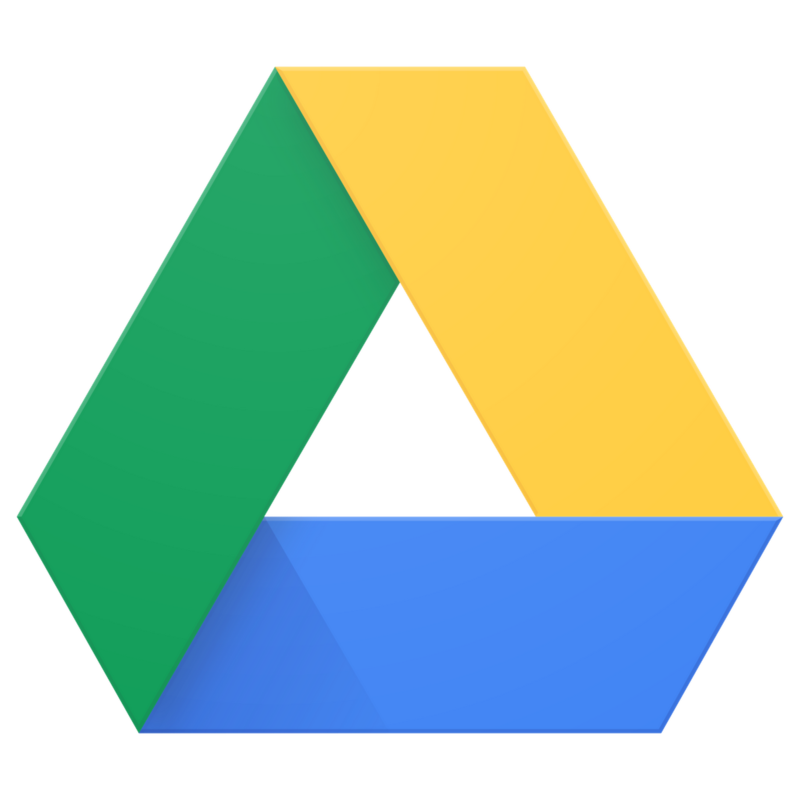
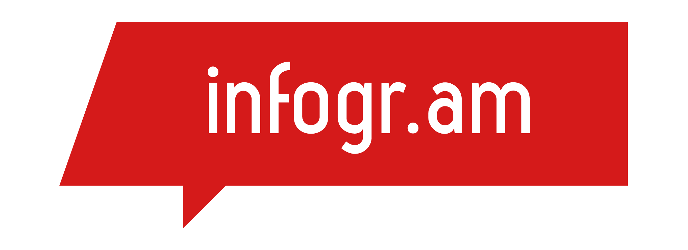
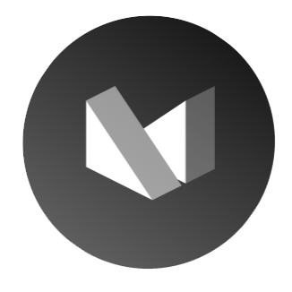
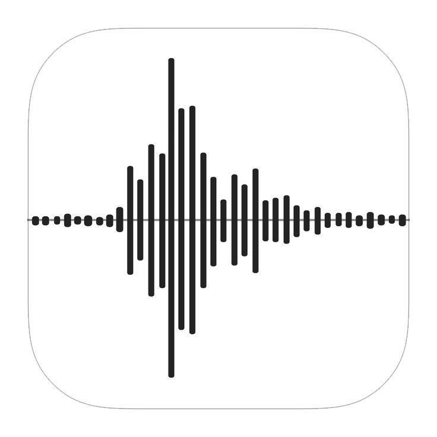

# Ferramentas

## 1. Introdução
Este documento tem como objetivo identificar as ferramentas utilizadas pela equipe em todo o projeto da disciplina de Requisitos de Software. No caso desse grupo, o aplicativo cujos requisitos serão analisados é o Twitch.

Ferramenta é todo software que auxilia a equipe no gerenciamento e desenvolvimento do projeto.

A tabela 1, que está na seção 2 desse artefato, tratará das ferramentas utilizadas pela equipe nesse projeto.

## 2. Ferramentas utilizadas

| Ícone | Ferramenta | Finalidade |
| :-----: | :----: | :-----------: |
|{ width=75 } |  Discord [[1]](./ferramentas.md#3-referências)  | Aplicativo para realizar e gravar reuniões da equipe. |
|{ width=75 } | Draw.io [[2]](./ferramentas.md#3-referências) | Software utilizado para a produção do Rich Picture. |
|{ width=75 } |  Git [[3]](./ferramentas.md#3-referências)  | Software para controle do versionamento e upload/modificação dos artefatos. |
|{ width=75 } | Github [[4]](./ferramentas.md#3-referências)  | Repositório em que são colocados os artefatos produzidos durante o projeto e controle do versionamento dos artefatos.  |
|{ width=75 } | GitHub Desktop [[5]](./ferramentas.md#3-referências) | Software para controle do versionamento e upload/modificação dos artefatos. |
|{ width=75 } | Google Drive [[6]](./ferramentas.md#3-referências) | Ferramenta utilizada para colocar artefatos produzidos em nuvem e de forma compartilhável, para que todos os membros tenham acesso.  |
|{ width=75 } | Google Meet [[7]](./ferramentas.md#3-referências) | Discord mostrou-se instável para gravação de reuniões. Por isso, a equipe decidiu por usar essa ferramenta quando há necessidade de gravar reuniões. |
|{ width=150 }  |  Google Sheets [[8]](./ferramentas.md#3-referências)  | Aplicativo utilizado para criar planilhas colaborativas e atualizadas em tempo real. |
|{ width=75 } | Infogram [[9]](./ferramentas.md#3-referências)  | Software online utilizado para criação de gráficos na etapa de verificação.  |
|{ width=75 } | Lucidchart [[10]](./ferramentas.md#3-referências) | Software utilizado para criação de diagramas UML. |
|{ width=75 } | Microsoft Forms [[11]](./ferramentas.md#3-referências) | Software utilizado para a criação e a aplicação de questionários. |
|{ width=75 } |  MkDocs [[12]](./ferramentas.md#3-referências) | Ferramenta utilizada para construção de site de documentação do projeto a partir do repositório com os artefatos no GitHub. |
|{ width=75 } |  OBS Studio [[13]](./ferramentas.md#3-referências)  | Software utilizado para gravar a tela nas apresentações e reuniões da equipe. |
|{ width=75 } | Stability.AI's This Person Does Not Exist [[14]](./ferramentas.md#3-referências) | Software da Stability.AI para conseguir imagens de pessoas que não existem a fim de estabelecê-las como personas. |
|{ width=75 } | Visual Studio Code [[15]](./ferramentas.md#3-referências)  | Software para produção e alteração de arquivos e códigos usados no projeto. |
|{ width=75 } | Voice Memos [[16]](./ferramentas.md#3-referências) | Aplicativo da Apple para gravar o áudio de reuniões realizadas da equipe presencialmente. |
|{ width=75 } | WhatsApp [[17]](./ferramentas.md#3-referências) | Aplicativo para comunicação rápida e facilitada entre os membros da equipe por meio de mensagens instantâneas. |
|{ width=75 } | YouTube [[18]](./ferramentas.md#3-referências) | Site utilizado para hospedar os vídeos das apresentações da equipe. |

<h6 align = "center"> Tabela 1: Ferramentas utilizadas </h6>
<h6 align = "center"> Fonte: Brunna Louise </h6>

## Referências

[1] Ferramenta Discord. Para acessá-la, clique [aqui](https://discord.com).  
[2] Ferramenta Draw.io. Para acessá-la, clique [aqui](https://app.diagrams.net).  
[3] Ferramenta Git. Para acessá-la, clique [aqui](https://git-scm.com).  
[4] Ferramenta GitHub. Para acessá-la, clique [aqui](https://github.com).  
[5] Ferramenta GitHub Desktop. Para acessá-la, clique [aqui](https://desktop.github.com).  
[6] Ferramenta Google Drive. Para acessá-la, clique [aqui](https://www.google.com/intl/pt-br/drive/about.html).  
[7] Ferramenta Google Meet. Para acessá-la, clique [aqui](https://meet.google.com).  
[8] Ferramenta Google Sheets. Para acessá-la, clique [aqui](https://www.google.com/sheets/about/).  
[9] Ferramenta Infogram. Para acessá-la, clique [aqui](https://infogram.com/pt/).  
[10] Ferramenta Lucidchart. Para acessá-la, clique [aqui](https://lucid.app/documents).  
[11] Ferramenta Microsoft Forms. Para acessá-la, clique [aqui](https://www.microsoft.com/pt-br/microsoft-365/online-surveys-polls-quizzes).  
[12] Ferramenta MkDocs. Para acessá-la, clique [aqui](https://www.mkdocs.org).  
[13] Ferramenta OBS Studio. Para acessá-la, clique [aqui](https://obsproject.com/pt-br).  
[14] Ferramenta This Person Does Not Exist, da Stability.AI. Para acessá-la, clique [aqui](https://thispersondoesnotexist.com/).  
[15] Ferramenta Visual Studio Code. Para acessá-la, clique [aqui](https://code.visualstudio.com).  
[16] Ferramenta Voice Memos, da Apple, disponível para ios. Para acessá-la, clique [aqui](https://apps.apple.com/us/app/voice-memos/id1069512134).  
[17] Ferramenta WhatsApp. Para acessá-la, clique [aqui](https://web.whatsapp.com).  
[18] Ferramenta YouTube. Para acessá-la, clique [aqui](https://www.youtube.com).  

## Histórico de versão

A Tabela 2 registra o histórico de versão desse documento.

|    Data    | Versão | Descrição                                                                      | Autor(es)  | Revisor  |
| :--------: | :----: | :----------------------------------------------------------------------------: | :--------: | :------: |
| 12.04.2023 | 1.0    | Criação do documento, adição de introdução e adição das ferramentas utilizadas atualmente |   Brunna   |    Rafael     |
| 14.04.2023 | 1.1    | Padronização do tamanho dos ícones das ferramentas utilizadas |   Brunna   |    Rafael     |
| 20.04.2023 | 1.2    | Correções no documento após feedback da primeira entrega |   Brunna   |    Diógenes     |
| 26.04.2023 | 1.3    | Adicionando Microsoft Forms |   Brunna   |    Ana Beatriz     |
| 02.05.2023 | 1.4   | Adicionando This Person Does Not Exist |   Brunna   |    Ana Beatriz     |
| 16.05.2023 | 1.5   | Adicionando Lucidchart |   Brunna   |    Ana Beatriz    |
| 29.06.2023 | 2.0   | Versão final do artefato de Ferramentas: adição de ferramentas faltantes; organização das ferramentas em ordem alfabética; adição de revisores faltantes |   Brunna   |    Ana Beatriz     |

<h6 align = "center"> Tabela 2: Histórico de Versões
  Autor: Brunna </h6>

