# Forward From

## 1. Introdução
Segundo Miriam Sayão, a rastreabilidade pode ser definida como técnica que visa a documentação de relacionamentos entre requisitos, arquitetura e implementação final de um sistema. Esse processo ajuda a compreender relacionamentos entre requisitos de software, ou entre artefatos de requisitos, arquitetura e implementação. A descrição dos relacionamentos permite mostrar que o projeto atende aos requisitos elicitados, bem como ajuda a detectar requisitos que não foram atendidos pelo software.

Esse artefato tem como objetivo aplicar a técnica de rastreabilidade Forward-From ao projeto realizado. Essa técnica, em específico, conecta requisitos a artefatos de desenho e implementação.

## 2. Metodologia

A rastreabilidade a partir da técnica Forward-from será realizada para os requisitos funcionais obtidos por [Brainstorming](../elicitacao/tecnicas/Brainstorm.md) com priorização do tipo Must presentes na [tabela de priorização com técnica MOSCoW](../elicitacao/priorizacao.md#21-moscow). Isso foi decidido pois os épicos, histórias de usuários, casos de uso e cenários foram definidos com base nesses requisitos funcionais e não funcionais estabelecidos como sendo de maior prioridade. Também é possível verificar que alguns objetos e ações nas tabelas estão presentes no artefato de léxico para que todos os participantes compartilhem da mesma compreensão dos termos utilizados na plataforma Twitch, sendo possível uma rápida consulta clicando nos links disponíveis nas células de "Feature".

Já a rastreabilidade dos requisitos elicitados a partir do método de [Observação](../elicitacao/tecnicas/observacao.md) será feita para os requisitos elicitados pela equipe mas que não estão implementados na plataforma. Isso foi decidido pois a equipe produziu artefatos importantes que se relacionam com esses requisitos não implementados, mas que apresentam relevância para o uso da plataforma.

Os requisitos funcionais obtidos a partir da técnica de [Brainstorming](../elicitacao/tecnicas/Brainstorm.md) serão rastreados conforme apresentado na Tabela 1:

| [RFBXX](../elicitacao/tecnicas/Brainstorm.md#41-requisitos-funcionais)  | Descrição do requisito funcional.  |
| ------ | ---- | 
| [Épico](../modelagem/backlog.md#3-epicos)  | **EPXX** |
| Feature | Funcionalidade presente nos serviços da Twitch com links no artefato de [léxico](../modelagem/lexico.md)|
| [História de Usuário](../modelagem/user_stories.md) | **USBXX** |
| [Caso de Uso](../modelagem/usecase.md)  | Caso de Uso relacionado ao requisito funcional.  |
| [Cenário](../modelagem/cenarios.md)  | Cenário devidamente implementado relacionado ao requisito funcional.  |
| Funcionalidade | Ilustração dessa funcionalidade nos serviços da Twitch, seja por imagem, gif, ou vídeo. |

<h6 align = "center"> Tabela 1: Exemplo de Forward-From de Requisitos Funcionais
  Autor: Brunna Louise</h6>

Já os requisitos funcionais obtidos a partir da técnica de [Observação](../elicitacao/tecnicas/observacao.md) serão rastreados conforme apresentado na Tabela X abaixo:

| [OBSXX](../elicitacao/tecnicas/observacao.md#3-resultados)  | Descrição do requisito.  |
| ------ | ---- | 
| Tipo de Requisito  |  Se é requisito funcional ou não funcional; se é implementado ou não implementado. |
| [Especificação Suplementar](../modelagem/esp_suplementar.md)  | Especificação suplementar associada ao requisito. |
| [História de Usuário](../modelagem/user_stories.md) | **USBXX** |
| [Caso de Uso](../modelagem/usecase.md) | Caso de Uso relacionado ao requisito funcional. |
| [Cenário](../modelagem/cenarios.md) | Cenário devidamente implementado relacionado ao requisito funcional.  |
| Funcionalidade | Ilustração dessa funcionalidade nos serviços da Twitch, seja por imagem, gif, ou vídeo. |

<h6 align = "center"> Tabela X: Forward-From de Requisitos obtidos a partir de Observação
  Autor: Brunna Louise</h6>

## 3. Pós-rastreabilidade 

### 3.1 Requisitos Funcionais - Técnica de Brainstorming

| [RFB01](../elicitacao/priorizacao.md#21-moscow)  | O usuário deve ser capaz de assistir a uma live.  |
| ------ | ---- | 
| Épico  | [EP01 - Conteúdo](../modelagem/backlog.md#311-ep01---conteúdo) |
| Feature | Assistir a uma live |
| História de Usuário | [USB01](../modelagem/user_stories.md#31-histórias-de-usuário-relacionadas-à-visualização-e-interação-com-conteúdo) |
| Caso de Uso | [Consumir Conteúdo](../modelagem/usecase.md#53-caso-de-uso-consumir-conteúdo) |
| Cenário  | [C06](../modelagem/cenarios.md#c06-assistir-uma-live)  |
| Funcionalidade | 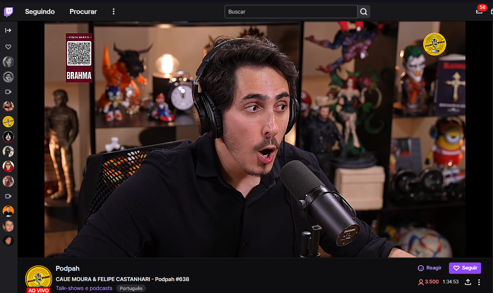|

<h6 align = "center"> Tabela 2: Forward-From de Requisitos Funcionais
  Autor(es): Brunna Louise e Matheus Phillipo
  Fonte: Autor(es)</h6>

| [RFB02](../elicitacao/priorizacao.md#21-moscow)  | O usuário deve ser capaz de assistir a um VOD (Video on Demand).  |
| ------ | ---- | 
| Épico  | [EP01 - Conteúdo](../modelagem/backlog.md#311-ep01---conteúdo) |
| Feature | Assistir a um [VOD](../modelagem/lexico.md#l26-vod) |
| História de Usuário | [USB02](../modelagem/user_stories.md#31-histórias-de-usuário-relacionadas-à-visualização-e-interação-com-conteúdo) |
| Caso de Uso | [Consumir Conteúdo](../modelagem/usecase.md#53-caso-de-uso-consumir-conteúdo) |
| Cenário  | [C06](../modelagem/cenarios.md#c06-assistir-uma-live)  |
| Funcionalidade | 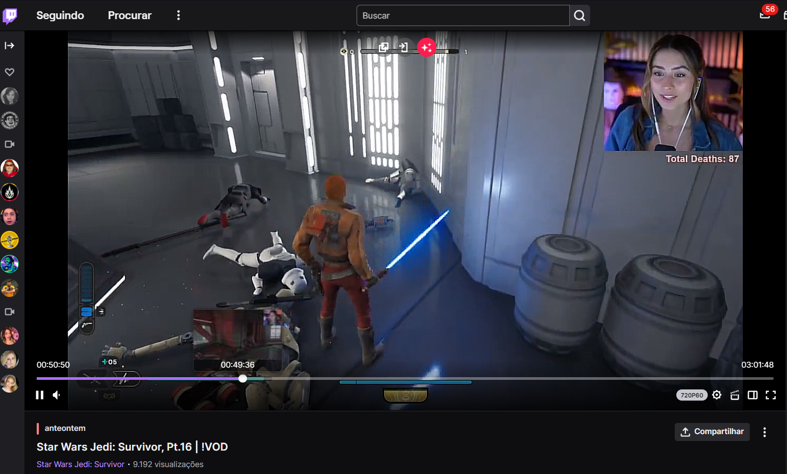|

<h6 align = "center"> Tabela 3: Forward-From de Requisitos Funcionais
  Autor(es): Brunna Louise e Matheus Phillipo
  Fonte: Autor(es)</h6>

| [RFB03](../elicitacao/priorizacao.md#21-moscow)  | O usuário deve ser capaz de interagir em uma live.  |
| ------ | ---- | 
| Épico  | [EP01 - Conteúdo](../modelagem/backlog.md#311-ep01---conteúdo) |
| Feature | [Interagir](../modelagem/lexico.md#l04-interagir) em uma live |
| História de Usuário | [USB03](../modelagem/user_stories.md#31-histórias-de-usuário-relacionadas-à-visualização-e-interação-com-conteúdo) |
| Caso de Uso | [Interagir em Lives](../modelagem/usecase.md#56-caso-de-uso-interagir-em-lives) |
| Cenário  | -  |
| Funcionalidade |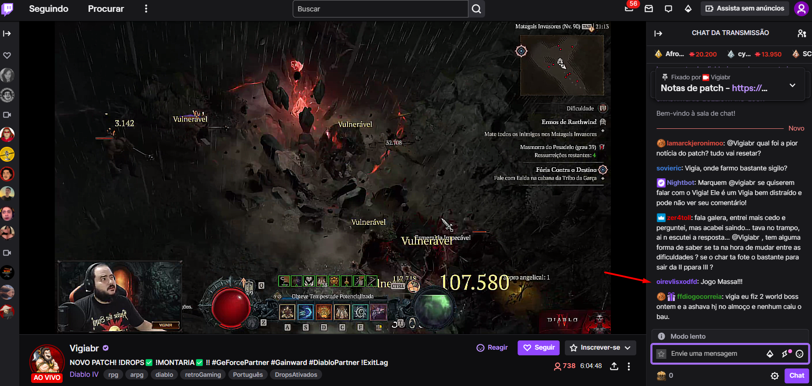 |

<h6 align = "center"> Tabela 4: Forward-From de Requisitos Funcionais
  Autor(es): Brunna Louise e Matheus Phillipo
  Fonte: Autor(es)</h6>

| [RFB04](../elicitacao/priorizacao.md#21-moscow)  | O usuário deve ser capaz de comentar uma live.  |
| ------ | ---- | 
| Épico  | [EP01 - Conteúdo](../modelagem/backlog.md#311-ep01---conteúdo) |
| Feature | [Comentar](../modelagem/lexico.md#l05-comentar) em uma live |
| História de Usuário | [USB04](../modelagem/user_stories.md#31-histórias-de-usuário-relacionadas-à-visualização-e-interação-com-conteúdo) |
| Caso de Uso | [Interagir em Lives](../modelagem/usecase.md#56-caso-de-uso-interagir-em-lives) |
| Cenário  | -  |
| Funcionalidade |  |

<h6 align = "center"> Tabela 5: Forward-From de Requisitos Funcionais
  Autor(es): Brunna Louise e Matheus Phillipo
  Fonte: Autor(es)</h6>

| [RFB06](../elicitacao/priorizacao.md#21-moscow)  | O usuário deve ser capaz de seguir um streamer.  |
| ------ | ---- | 
| Épico  | [EP02 - Conta](../modelagem/backlog.md#312-ep02---conta) |
| Feature | Seguir um [streamer](../modelagem/lexico.md#l01-streamer) |
| História de Usuário | [USB18](../modelagem/user_stories.md#32-histórias-de-usuário-relacionadas-a-inscrições-e-pagamentos) |
| Caso de Uso | [Apoiar Conteúdo](../modelagem/usecase.md#58-caso-de-uso-apoiar-conteúdo) |
| Cenário  | -  |
| Funcionalidade |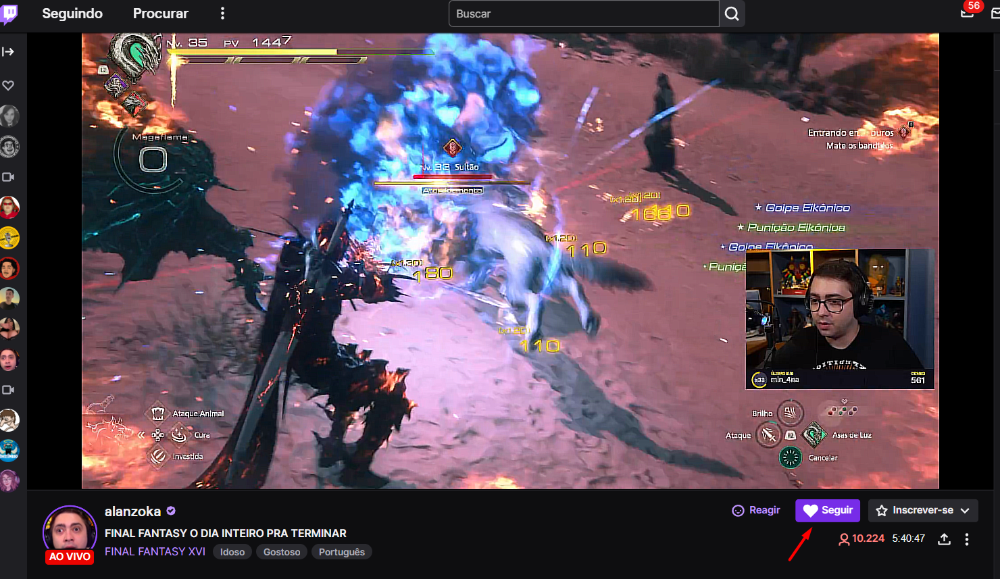 |

<h6 align = "center"> Tabela 6: Forward-From de Requisitos Funcionais
  Autor(es): Brunna Louise e Matheus Phillipo
  Fonte: Autor(es)</h6>

| [RFB09](../elicitacao/priorizacao.md#21-moscow)  | O usuário deve ser capaz de se inscrever em um canal pagando diretamente.  |
| ------ | ---- | 
| Épico  | [EP02 - Conta](../modelagem/backlog.md#312-ep02---conta) |
| Feature | [Inscrição](../modelagem/lexico.md#l08-inscrever) em um canal pago |
| História de Usuário | [USB20](../modelagem/user_stories.md#32-histórias-de-usuário-relacionadas-a-inscrições-e-pagamentos) |
| Caso de Uso | [Apoiar Conteúdo](../modelagem/usecase.md#58-caso-de-uso-apoiar-conteúdo) |
| Cenário  | -  |
| Funcionalidade |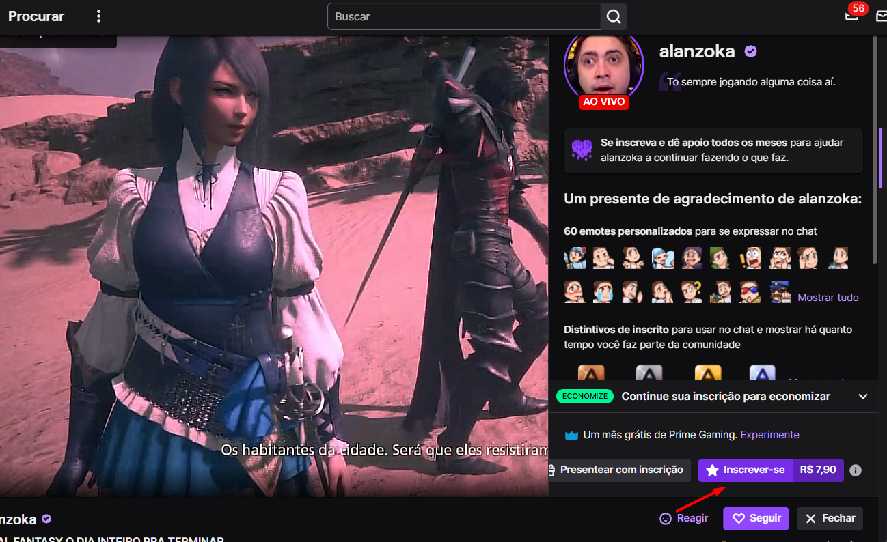 |

<h6 align = "center"> Tabela 7: Forward-From de Requisitos Funcionais
  Autor(es): Brunna Louise e Matheus Phillipo
  Fonte: Autor(es)</h6>

| [RFB14](../elicitacao/priorizacao.md#21-moscow)  | O usuário deve ser capaz denunciar uma transmissão ao vivo.  |
| ------ | ---- | 
| Épico  | [EP01 - Conteúdo](../modelagem/backlog.md#311-ep01---conteúdo) |
| Feature | [Denunciar](../modelagem/lexico.md#l12-denunciar) uma transmissão  |
| História de Usuário | [USB10](../modelagem/user_stories.md#31-histórias-de-usuário-relacionadas-à-visualização-e-interação-com-conteúdo) |
| Caso de Uso | - |
| Cenário  | -  |
| Funcionalidade |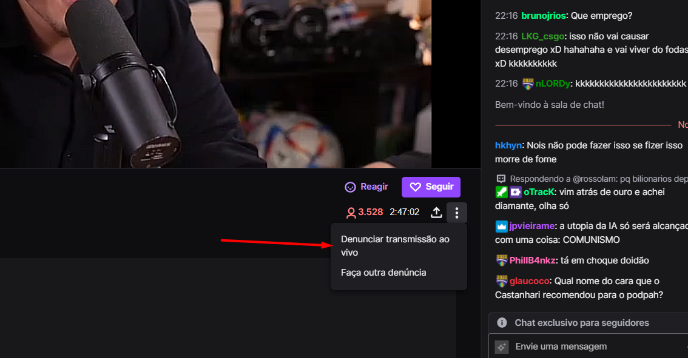 |

<h6 align = "center"> Tabela 8: Forward-From de Requisitos Funcionais
  Autor(es): Brunna Louise e Matheus Phillipo
  Fonte: Autor(es)</h6>

| [RFB15](../elicitacao/priorizacao.md#21-moscow)  | O usuário deve ser capaz de denunciar mensagens de outro usuário.  |
| ------ | ---- | 
| Épico  | [EP01 - Conteúdo](../modelagem/backlog.md#311-ep01---conteúdo) |
| Feature |  [Denunciar](../modelagem/lexico.md#l12-denunciar) mensagens de outro usuário |
| História de Usuário | [USB11](../modelagem/user_stories.md#31-histórias-de-usuário-relacionadas-à-visualização-e-interação-com-conteúdo) |
| Caso de Uso | - |
| Cenário  | -  |
| Funcionalidade | - |

<h6 align = "center"> Tabela 9: Forward-From de Requisitos Funcionais
  Autor(es): Brunna Louise e Matheus Phillipo
  Fonte: Autor(es)</h6>

| [RFB16](../elicitacao/priorizacao.md#21-moscow)  | O usuário deve ser capaz de buscar canais/lives.  |
| ------ | ---- | 
| Épico  | [EP01 - Conteúdo](../modelagem/backlog.md#311-ep01---conteúdo) |
| Feature | [Buscar](../modelagem/lexico.md#l13-buscar) conteúdo de interesse |
| História de Usuário | [USB12](../modelagem/user_stories.md#31-histórias-de-usuário-relacionadas-à-visualização-e-interação-com-conteúdo) |
| Caso de Uso | [Buscar Conteúdo](../modelagem/usecase.md#52-caso-de-uso-buscar-conteúdo) |
| Cenário  | [C05](../modelagem/cenarios.md#c05-fazer-uma-pesquisa)  |
| Funcionalidade |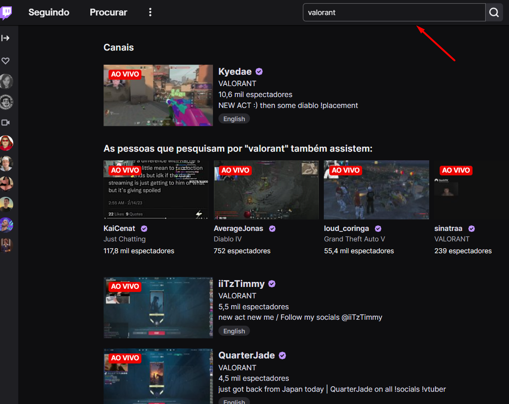 |

<h6 align = "center"> Tabela 10: Forward-From de Requisitos Funcionais
  Autor(es): Brunna Louise e Matheus Phillipo
  Fonte: Autor(es)</h6>

| [RFB17](../elicitacao/priorizacao.md#21-moscow)  | O usuário deve ser capaz de consultar seu saldo de bits (Twitch Wallet).  |
| ------ | ---- | 
| Épico  | [EP01 - Conteúdo](../modelagem/backlog.md#311-ep01---conteúdo) |
| Feature | Consultar saldo de [Bits](../modelagem/lexico.md#l25-bits)  |
| História de Usuário | [USB13](../modelagem/user_stories.md#31-histórias-de-usuário-relacionadas-à-visualização-e-interação-com-conteúdo) |
| Caso de Uso | - |
| Cenário  | -  |
| Funcionalidade | 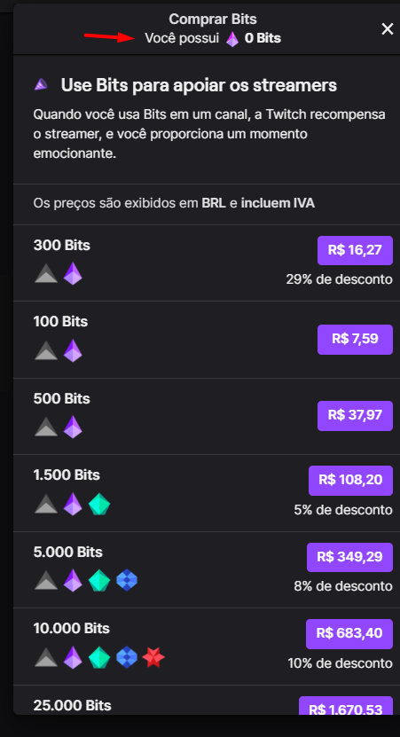|

<h6 align = "center"> Tabela 11: Forward-From de Requisitos Funcionais
  Autor(es): Brunna Louise e Matheus Phillipo
  Fonte: Autor(es)</h6>

| [RFB25](../elicitacao/priorizacao.md#21-moscow)  | O usuário deve ser capaz de configurar o seu perfil.  |
| ------ | ---- | 
| Épico  | [EP02 - Conta](../modelagem/backlog.md#312-ep02---conta) |
| Feature |[Personalizar](../modelagem/lexico.md#l15-personalizar) perfil |
| História de Usuário | [USB23](../modelagem/user_stories.md#32-histórias-de-usuário-relacionadas-a-inscrições-e-pagamentos) |
| Caso de Uso | - |
| Cenário  | -  |
| Funcionalidade |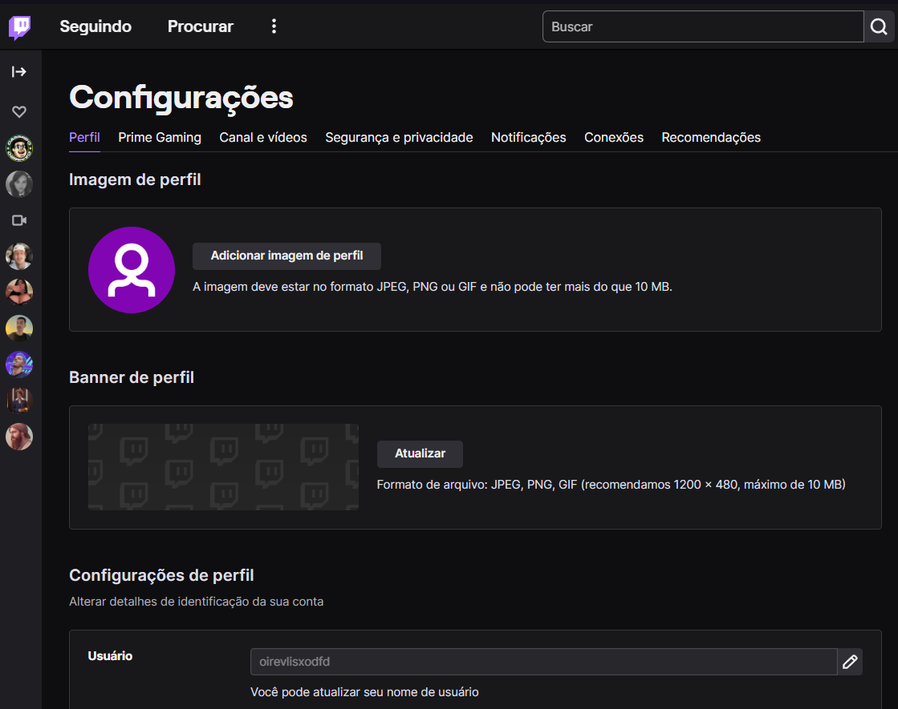 |

<h6 align = "center"> Tabela 12: Forward-From de Requisitos Funcionais
  Autor(es): Brunna Louise e Matheus Phillipo
  Fonte: Autor(es)</h6>

| [RFB26](../elicitacao/priorizacao.md#21-moscow)  | O usuário deve ser capaz de configurar sua Imagem do perfil.  |
| ------ | ---- | 
| Épico  | [EP02 - Conta](../modelagem/backlog.md#312-ep02---conta) |
| Feature | [Personalizar](../modelagem/lexico.md#l15-personalizar) perfil |
| História de Usuário | [USB24](../modelagem/user_stories.md#32-histórias-de-usuário-relacionadas-a-inscrições-e-pagamentos) |
| Caso de Uso | - |
| Cenário  | -  |
| Funcionalidade |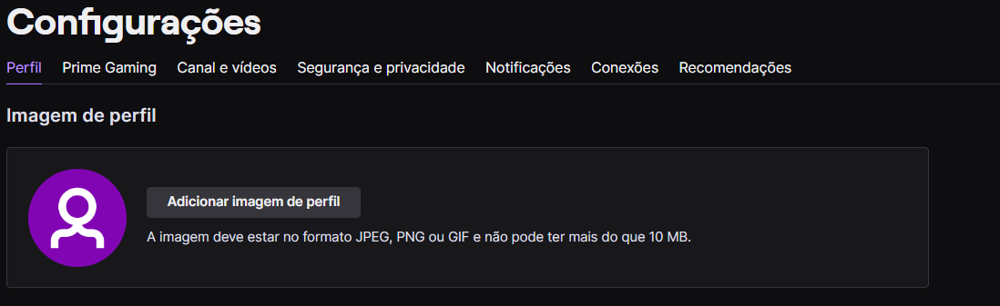 |

<h6 align = "center"> Tabela 13: Forward-From de Requisitos Funcionais
  Autor(es): Brunna Louise e Matheus Phillipo
  Fonte: Autor(es)</h6>

| [RFB27](../elicitacao/priorizacao.md#21-moscow)  | O usuário deve ser capaz de configurar seu Banner do perfil.  |
| ------ | ---- | 
| Épico  | [EP02 - Conta](../modelagem/backlog.md#312-ep02---conta) |
| Feature | [Personalizar](../modelagem/lexico.md#l15-personalizar) perfil |
| História de Usuário | [USB25](../modelagem/user_stories.md#32-histórias-de-usuário-relacionadas-a-inscrições-e-pagamentos) |
| Caso de Uso | - |
| Cenário  | -  |
| Funcionalidade |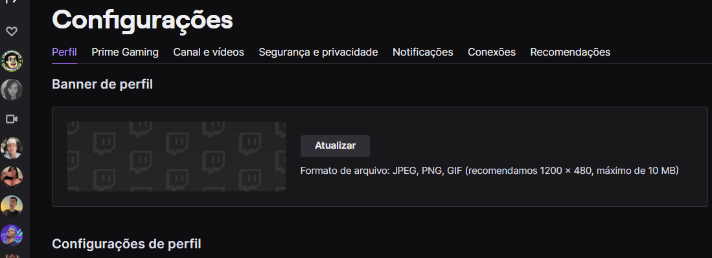 |

<h6 align = "center"> Tabela 14: Forward-From de Requisitos Funcionais
  Autor(es): Brunna Louise e Matheus Phillipo
  Fonte: Autor(es)</h6>

| [RFB28](../elicitacao/priorizacao.md#21-moscow)  | O usuário deve ser capaz de configurar seu Nome de usuário.  |
| ------ | ---- | 
| Épico  | [EP02 - Conta](../modelagem/backlog.md#312-ep02---conta) |
| Feature |[Personalizar](../modelagem/lexico.md#l15-personalizar) perfil  |
| História de Usuário | [USB26](../modelagem/user_stories.md#32-histórias-de-usuário-relacionadas-a-inscrições-e-pagamentos) |
| Caso de Uso | - |
| Cenário  | [C01](../modelagem/cenarios.md#c01-criar-conta)  |
| Funcionalidade | 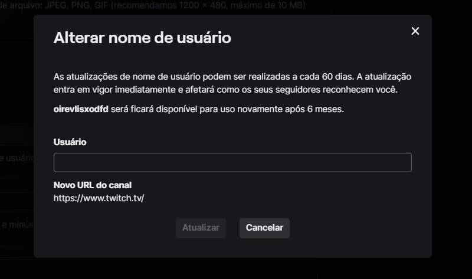|

<h6 align = "center"> Tabela 15: Forward-From de Requisitos Funcionais
  Autor(es): Brunna Louise e Matheus Phillipo
  Fonte: Autor(es)</h6>

| [RFB29](../elicitacao/priorizacao.md#21-moscow)  | O usuário deve ser capaz de configurar seu Nome de Exibição.  |
| ------ | ---- | 
| Épico  | [EP02 - Conta](../modelagem/backlog.md#312-ep02---conta) |
| Feature |[Personalizar](../modelagem/lexico.md#l15-personalizar) perfil  |
| História de Usuário | [USB27](../modelagem/user_stories.md#32-histórias-de-usuário-relacionadas-a-inscrições-e-pagamentos) |
| Caso de Uso | - |
| Cenário  | -  |
| Funcionalidade | 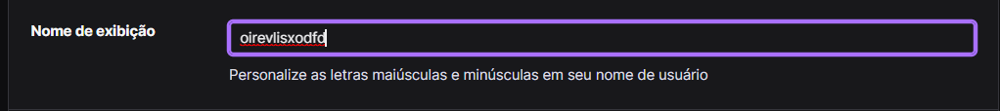|

<h6 align = "center"> Tabela 16: Forward-From de Requisitos Funcionais
  Autor(es): Brunna Louise e Matheus Phillipo
  Fonte: Autor(es)</h6>

| [RFB30](../elicitacao/priorizacao.md#21-moscow)  | O usuário deve ser capaz de configurar sua Biografia.  |
| ------ | ---- | 
| Épico  | [EP02 - Conta](../modelagem/backlog.md#312-ep02---conta) |
| Feature |[Personalizar](../modelagem/lexico.md#l15-personalizar) perfil  |
| História de Usuário | [USB28](../modelagem/user_stories.md#32-histórias-de-usuário-relacionadas-a-inscrições-e-pagamentos) |
| Caso de Uso | - |
| Cenário  | -  |
| Funcionalidade |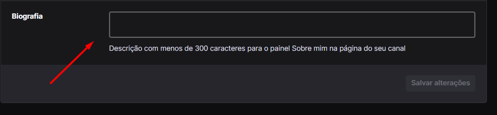 |

<h6 align = "center"> Tabela 17: Forward-From de Requisitos Funcionais
  Autor(es): Brunna Louise e Matheus Phillipo
  Fonte: Autor(es)</h6>

| [RFB37](../elicitacao/priorizacao.md#21-moscow)  | O usuário deve ser capaz de alterar o idioma da plataforma.  |
| ------ | ---- | 
| Épico  | [EP03 - Plataforma](../modelagem/backlog.md#313-ep03---plataforma) |
| Feature | Alterar idioma na plataforma  |
| História de Usuário | [USB33](../modelagem/user_stories.md#33-histórias-de-usuário-relacionadas-à-plataforma-e-configurações) |
| Caso de Uso | - |
| Cenário  | -  |
| Funcionalidade | 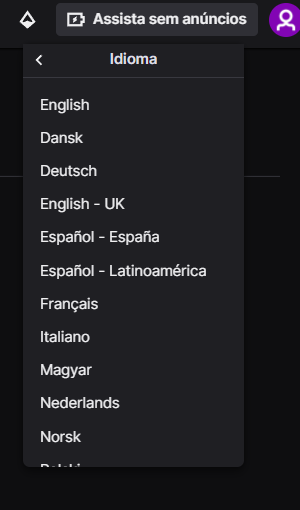|

<h6 align = "center"> Tabela 18: Forward-From de Requisitos Funcionais
  Autor(es): Brunna Louise e Matheus Phillipo
  Fonte: Autor(es)</h6>

| [RFB39](../elicitacao/priorizacao.md#21-moscow)  | O usuário deve ser capaz de realizar o login na plataforma.  |
| ------ | ---- | 
| Épico  | [EP03 - Plataforma](../modelagem/backlog.md#313-ep03---plataforma) |
| Feature | Realizar Login |
| História de Usuário | [USB35](../modelagem/user_stories.md#32-histórias-de-usuário-relacionadas-a-inscrições-e-pagamentos) |
| Caso de Uso | [Fazer Login](../modelagem/usecase.md#51-caso-de-uso-fazer-login) |
| Cenário  | [C02](../modelagem/cenarios.md#c02-login-de-usuário-já-cadastrado)  |
| Funcionalidade |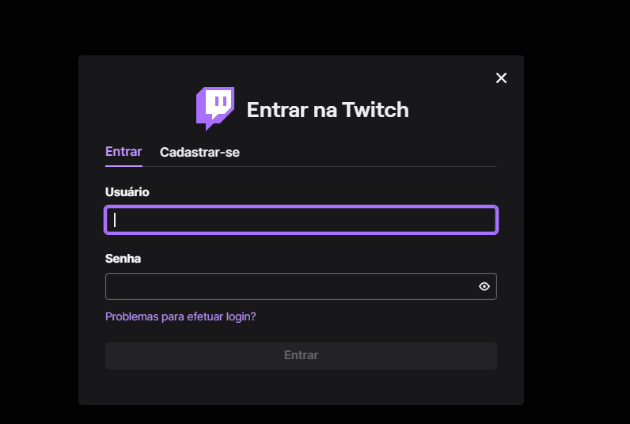 |

<h6 align = "center"> Tabela 19: Forward-From de Requisitos Funcionais
  Autor(es): Brunna Louise e Matheus Phillipo
  Fonte: Autor(es)</h6>

| [RFB40](../elicitacao/priorizacao.md#21-moscow)  | O usuário deve ser capaz de realizar o logoff da plataforma.  |
| ------ | ---- | 
| Épico  | [EP03 - Plataforma](../modelagem/backlog.md#313-ep03---plataforma) |
| Feature | Realizar Logoff |
| História de Usuário | [USB36](../modelagem/user_stories.md#32-histórias-de-usuário-relacionadas-a-inscrições-e-pagamentos) |
| Caso de Uso | - |
| Cenário  | -  |
| Funcionalidade | 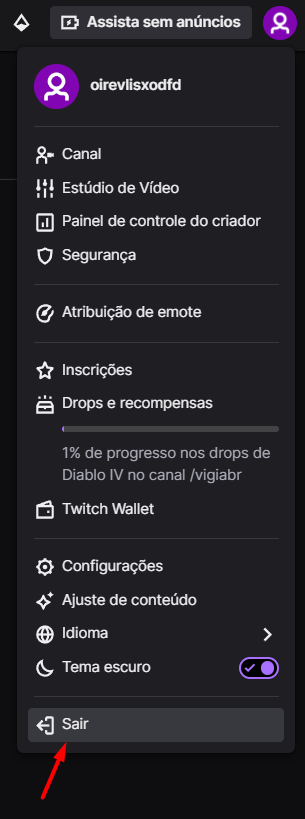|

<h6 align = "center"> Tabela 20: Forward-From de Requisitos Funcionais
  Autor(es): Brunna Louise e Matheus Phillipo
  Fonte: Autor(es)</h6>

| [RFB41](../elicitacao/priorizacao.md#21-moscow)  | O usuário deve ser capaz de desabilitar a sua conta da Twitch.  |
| ------ | ---- | 
| Épico  | [EP03 - Plataforma](../modelagem/backlog.md#313-ep03---plataforma) |
| Feature | Desabilitar conta pessoal |
| História de Usuário | [USB37](../modelagem/user_stories.md#32-histórias-de-usuário-relacionadas-a-inscrições-e-pagamentos) |
| Caso de Uso | - |
| Cenário  | -  |
| Funcionalidade | 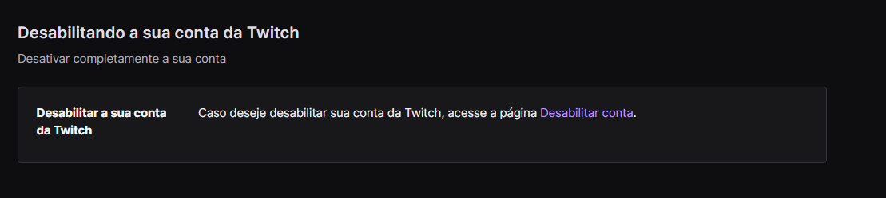|

<h6 align = "center"> Tabela 21: Forward-From de Requisitos Funcionais
  Autor(es): Brunna Louise e Matheus Phillipo
  Fonte: Autor(es)</h6>

| [RFB43](../elicitacao/priorizacao.md#21-moscow)  | O usuário deve ser capaz de personalizar o seu canal.  |
| ------ | ---- | 
| Épico  | [EP03 - Plataforma](../modelagem/backlog.md#313-ep03---plataforma) |
| Feature | [Personalizar](../modelagem/lexico.md#l15-personalizar) canal  |
| História de Usuário | [USB39](../modelagem/user_stories.md#32-histórias-de-usuário-relacionadas-a-inscrições-e-pagamentos) |
| Caso de Uso | - |
| Cenário  | -  |
| Funcionalidade | 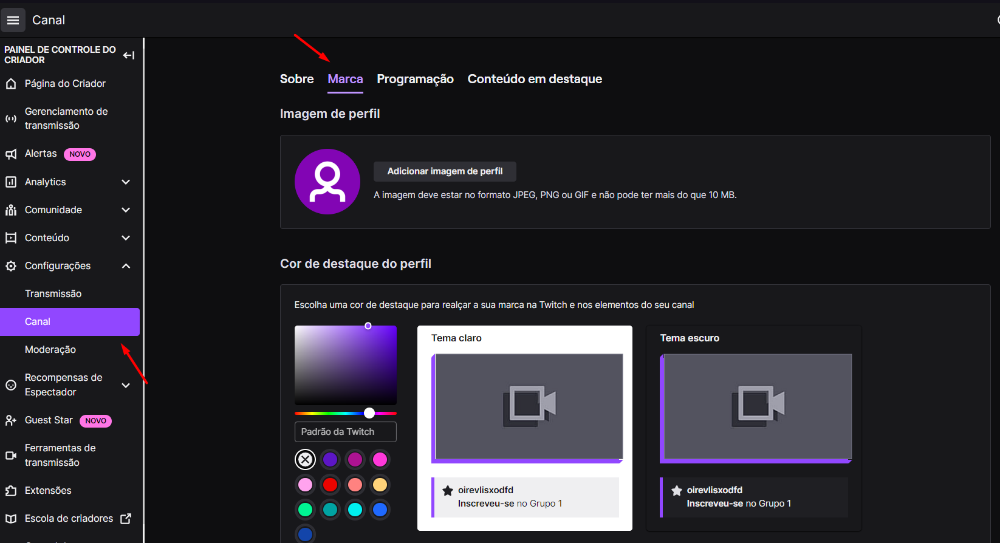 |

<h6 align = "center"> Tabela 22: Forward-From de Requisitos Funcionais
  Autor(es): Brunna Louise e Matheus Phillipo
  Fonte: Autor(es)</h6>

| [RFB44](../elicitacao/priorizacao.md#21-moscow)  | O usuário deve ser capaz de iniciar sua transmissão.  |
| ------ | ---- | 
| Épico  | [EP03 - Plataforma](../modelagem/backlog.md#313-ep03---plataforma) |
| Feature | Iniciar uma [transmissão](../modelagem/lexico.md#l16-transmitir) |
| História de Usuário | [USB40](../modelagem/user_stories.md#32-histórias-de-usuário-relacionadas-a-inscrições-e-pagamentos) |
| Caso de Uso | [Criar Conteúdo](../modelagem/usecase.md#54-caso-de-uso-criar-conteúdo) |
| Cenário  | -  |
| Funcionalidade |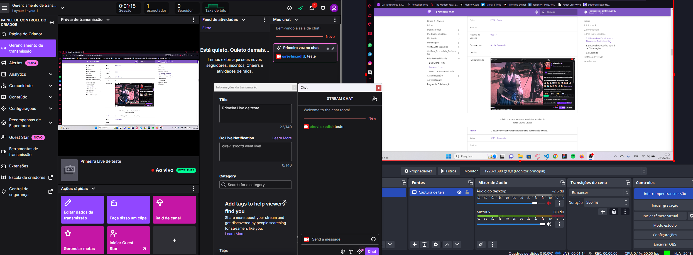 |

<h6 align = "center"> Tabela 23: Forward-From de Requisitos Funcionais
  Autor(es): Brunna Louise e Matheus Phillipo
  Fonte: Autor(es)</h6>

### 3.2 Requisitos obtidos a partir de Observação

| [OBS09](../elicitacao/priorizacao.md#21-moscow)  | Ao acessar "Ajuste de Conteúdo", o usuário deve ter a opção de selecionar se deseja receber sugestões de conteúdos categorizados para adultos.  |
| ------ | ---- | 
| Tipo de Requisito  | Requisito Funcional Não Implementado  |
| Especificação Suplementar  | - |
| História de Usuário | [USB15](../modelagem/user_stories.md#32-histórias-de-usuário-relacionadas-a-inscrições-e-pagamentos) |
| Caso de Uso | - |
| Cenário  | [C08](../modelagem/cenarios.md#c08-restrição-de-conteúdo-18) |
| Funcionalidade |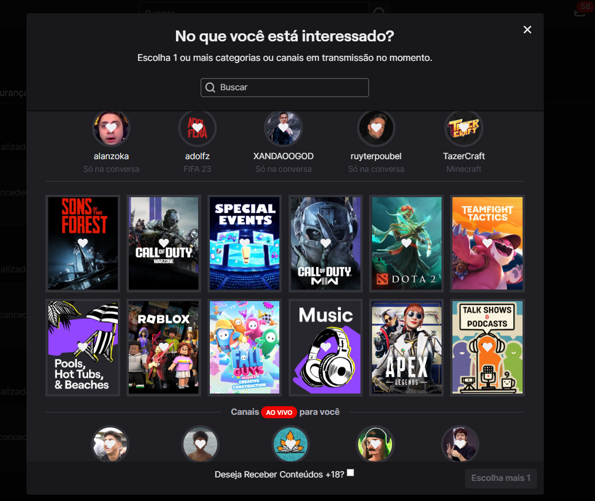 |
<h6 align = "center"> Tabela 24: Forward-From de Requisitos obtidos a partir de Observação
  Autor(es): Brunna Louise e Matheus Phillipo
  Fonte: Autor(es)</h6>

| [OBS10](../elicitacao/priorizacao.md#21-moscow)  | A plataforma deve colocar um efeito Blur nos Thumbnails para cada conteúdo categorizado como adulto ou 18+.  |
| ------ | ---- | 
| Tipo de Requisito  | Requisito Não Funcional Não Implementado  |
| Especificação Suplementar  | - |
| História de Usuário |[USB16](../modelagem/user_stories.md#32-histórias-de-usuário-relacionadas-a-inscrições-e-pagamentos)  |
| Caso de Uso | - |
| Cenário  | [C08](../modelagem/cenarios.md#c08-restrição-de-conteúdo-18)  |
| Funcionalidade | 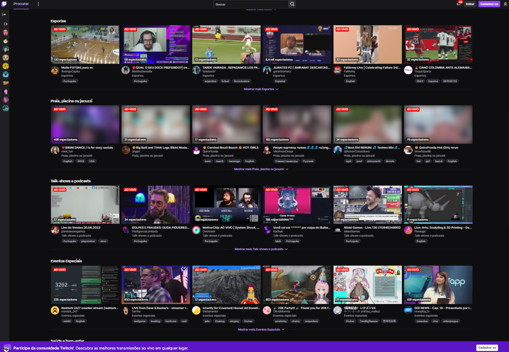 |
<h6 align = "center"> Tabela 25: Forward-From de Requisitos obtidos a partir de Observação
  Autor(es): Brunna Louise e Matheus Phillipo
  Fonte: Autor(es)</h6>

| [OBS11](../elicitacao/priorizacao.md#21-moscow)  | A plataforma deve colocar uma etapa de confirmação, perguntado se o usuário deseja visualizar o conteúdo categorizado como adulto ou 18+.  |
| ------ | ---- | 
| Tipo de Requisito  | Requisito Funcional Não Implementado  |
| Especificação Suplementar  | - |
| História de Usuário | [USB17](../modelagem/user_stories.md#32-histórias-de-usuário-relacionadas-a-inscrições-e-pagamentos) |
| Caso de Uso | - |
| Cenário  | [C08](../modelagem/cenarios.md#c08-restrição-de-conteúdo-18)   |
| Funcionalidade | 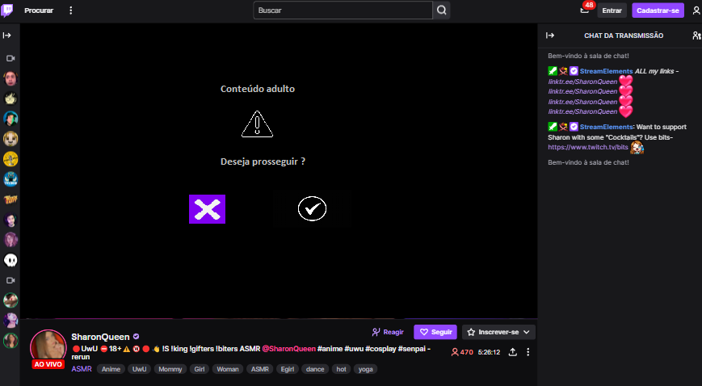 |
<h6 align = "center"> Tabela 26: Forward-From de Requisitos obtidos a partir de Observação
  Autor(es): Brunna Louise e Matheus Phillipo
  Fonte: Autor(es)</h6>

### 3.3 Legenda
A tabela 24 a seguir apresenta a definição de siglas utilizadas ao longo do documento.

|    Sigla no ID    | Significado |
| :--------: | :----: |
| **RFBXX** |  Requisitos Funcionais obtidos a partir da técnica de [Brainstorming](../elicitacao/tecnicas/Brainstorm.md#41-requisitos-funcionais).  |
| **USBXX** |  Histórias de usuário identificadas no artefato de [Histórias de Usuário](../modelagem/user_stories.md#3-histórias-de-usuário).  |
| **EPXX** |  Épicos identificados no artefato de [Backlog](../modelagem/backlog.md#3-épicos).  |
| **CXX** |  Cenários implementados descritos no artefato de [Cenários](../modelagem/cenarios.md#31-cenários-identificados-implementados).  |
| **OBSXX** |  Requisitos obtidos a partir da [técnica de Observação](../elicitacao/tecnicas/observacao.md#3-resultados).  |
<h6 align = "center"> Tabela 24: Legenda das siglas utilizadas ao longo do artefato.
  Autor(es): Brunna Louise e Matheus Phillipo
  Fonte: Autor(es)</h6>

## Histórico de versão
|    Data    | Versão | Descrição                                                                      | Autor(es)  | Revisor  |
| :--------: | :----: | :----------------------------------------------------------------------------: | :--------: | :------: |
| 26.06.2023 | 1.0    | Primeira Versão do artefato de Forward From de Pós-Rastreabilidade. |   Brunna Louise   |  Matheus Phillipo  |
| 26.06.2023 | 1.1    | Adicionando Requisitos Funcionais e Linkando a seus devidos épicos e histórias de usuário. |   Brunna Louise   |  Matheus Phillipo  |
| 26.06.2023 | 1.2    | Adicionando links para casos de uso e cenários. |   Brunna Louise   |  Matheus Phillipo  |
| 26.06.2023 | 1.3    | Adicionando requisitos não implementados elicitados pela Observação. |   Brunna Louise, Matheus Phillipo   |  Matheus Phillipo  |
| 26.06.2023 | 1.4    | Adicionando imagens referentes a funcionalidades e conserto dos IDs de Histórias de usuários |  Matheus Phillipo   |  Brunna Louise  |
| 28.06.2023 | 1.5    | Adicionando links referentes aos artefatos restantes e imagens as funcionalidades restante |  Matheus Phillipo   |  Brunna Louise  |

<h6 align = "center"> Tabela 25: Histórico de Versões
  Autor(es): Brunna Louise e Matheus Phillipo
  Fonte: Autor(es)</h6>

## Referências

>SAYÃO, M.; LEITE, J.C.S.P. Rastreabilidade de requisitos. Disponível em: http://bib-di.inf.puc-rio.br/ftp/pub/docs/techreports/05_20_sayao.pdf. Acesso em 26 de junho de 2023.

>SERRANO, Milene, SERRANO, Maurício. Requisitos (Aula 26). Disponível em: https://aprender3.unb.br/pluginfile.php/2523172/mod_resource/content/1/Requisitos%20-%20Aula%20026.pdf. Acesso em: 26 de junho de 2023.
