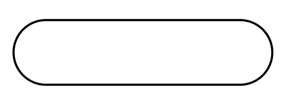
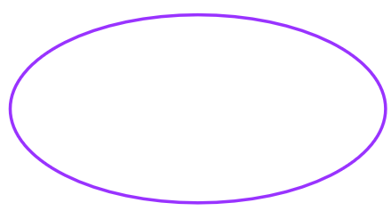
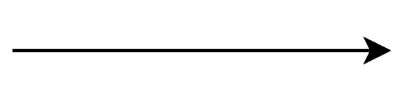

# Rich picture

## 1. Introdução

Rich Picture é uma técnica visual que ajuda a compreender complexidades em um sistema, projeto ou situação de maneira mais holística. A técnica do Rich Picture envolve a criação de uma imagem ou diagrama que representa um sistema em questão, com todos os seus elementos, relacionamentos e nuances. Ao fornecer uma representação visual do sistema, o Rich Picture pode ajudar a criar uma compreensão compartilhada de todos os elementos e suas interações, facilitando assim a tomada de decisões.

## 2. Metodologia

A metodologia utilizada para desenvolvimento dos Rich Picture aqui presentes consistem na investigação analítica e prática da ferramenta, a fim de identificar todos os elementos que compõe o diagrama. A estrutura utilizada se baseia no Guia descrito em Introducing Rich Pictures - Software Development Project, o qual identifica 5 principais componentes:

- Atores
- Operações
- Armazenamento de dados
- Setas
- Barreiras de Sistema

## 3. Rich Picture

A primeira versão do nosso Rich picture pode ser acompanhada na [Figura 1](#Rich_picture_v1.0), e representa as avaliações iniciais da investigação realizada na plataforma da Twitch. A Tabela 1 contém a legenda dos ícones e elementos utilizados.

{: id="Rich_picture_v1.0"}
<h6 align = "center">Figura 1: Rich Picture
 Autor: Rafael Nobre
 Fonte: Autor(es)</h6>

| Componente  | ícones     |
| :-----------: | :----------: |
|**Atores**|{width=50}{width=50} {width=50}{width=50}|
|**Operações**|{width=100}|
|**Armazenamentos de dados**|{width=50}{width=50} {width=50}|
|**Barreira do Sistema**|{width=100}|
|**Setas**|{width=100}|

<h6 align = "center" id='Tabela_rich_picture_v1.0'> Tabela 1: Legenda do Rich Picture
  Autor: Rafael Nobre
 Fonte: Autor(es)</h6>

## 4. Referências

> Introducing Rich Pictures - Software Development Project [CTEC2402]

## Histórico de Versões

A Tabela 2 registra o histórico de versão deste documento

|**Data** | **Versão** | **Descrição** | **Autor** | **Revisor** |
|:---: | :---: | :---: | :---: | :---: |
| 15/04/2023 | 1.0 | Rich Picture - Versão 1.0 | Rafael Nobre | Matheus Phillipo |
| 20/04/2023 | 1.1 | Inserção das chamadas das tabelas/imagens| Rafael Nobre| Milena|
| 01/07/2023 | 1.2 | Ajustes finais | Rafael Nobre | - |

<h6 align = "center"> Tabela 2: Histórico de Versões
  Autor: Rafael Nobre
 Fonte: Autor(es)</h6>