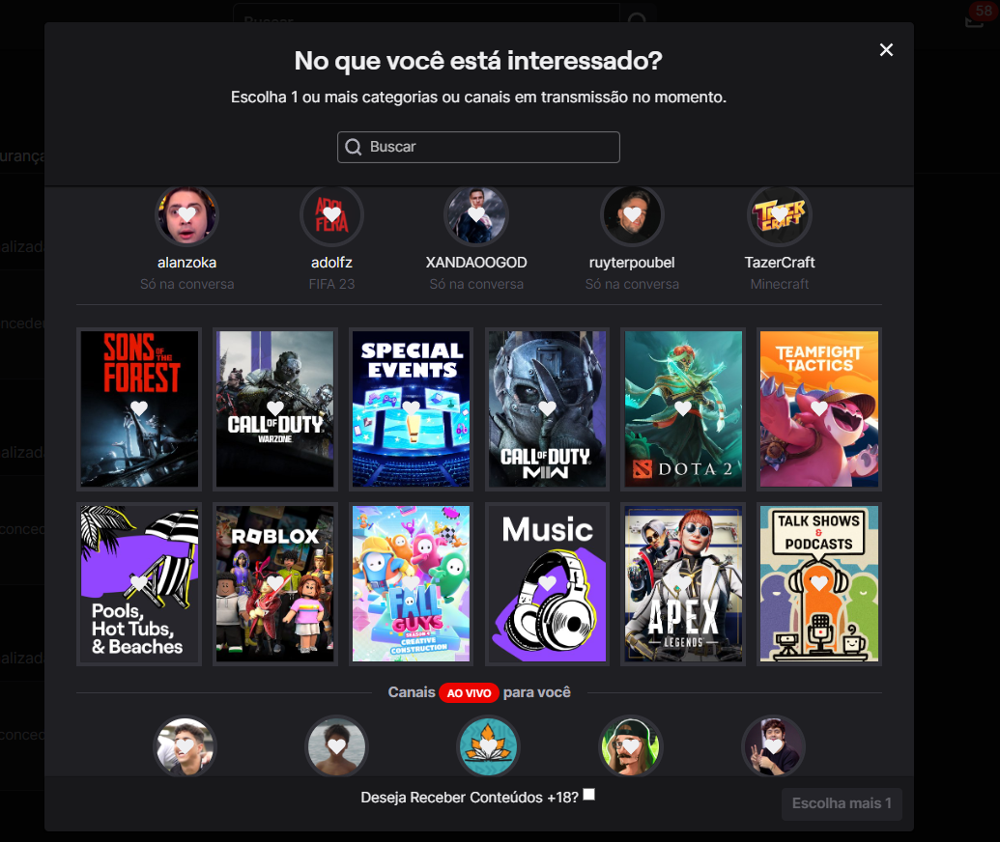

# Validação

## 1. Introdução

&emsp;&emsp;A validação de um software é o processo de confirmação de que o produto é aquele desejado pelo usuário. Em outras palavras, a validação tem o objetivo de demonstrar que o artefato cumpre a funcionalidade pretendida por ele.

&emsp;&emsp;Em geral, busca responder as seguintes perguntas: o artefato está correto? É o que o cliente esperava? Dessa forma, fica evidente que o usuário/cliente tem participação esperada nesse momento.

## 2. Metodologia

### 2.1 Prototipação

&emsp;&emsp;Entre as diversas formas de realizar a validação, a equipe utilizou, primariamente a prototipação.

&emsp;&emsp;Ao analisarmos todo o material desenvolvido encontramos as seguintes funcionalidades como ainda não implementadas no aplicativo:

- **[OBS09](https://requisitos-de-software.github.io/2023.1-Twitch/elicitacao/tecnicas/observacao/)** Ao acessar "Ajuste de Conteúdo", o [usuário](https://requisitos-de-software.github.io/2023.1-Twitch/modelagem/lexico/#l02-usuario-comum) deve ter a opção de selecionar se deseja receber sugestões de conteúdos categorizados para adultos

- **[OBS10](https://requisitos-de-software.github.io/2023.1-Twitch/elicitacao/tecnicas/observacao/)** A plataforma deve colocar um [efeito Blur](https://requisitos-de-software.github.io/2023.1-Twitch/modelagem/lexico/#l32-efeito-blur) nos [Thumbnails](https://requisitos-de-software.github.io/2023.1-Twitch/modelagem/lexico/#l23-thumbnail) para cada conteúdo categorizado como adulto e/ou 18+

- **[OBS11](https://requisitos-de-software.github.io/2023.1-Twitch/elicitacao/tecnicas/observacao/)** A plataforma deve colocar uma [etapa de confirmação](https://requisitos-de-software.github.io/2023.1-Twitch/modelagem/lexico/#l28-confirmacao-de-conteudos-18), perguntado se o usuário deseja visualizar o conteúdo categorizado como adulto ou 18+

&emsp;&emsp;A partir destes resquisitos, foram deselvolvidos protótipos correspondentes a essas funcionalidades.

&emsp;&emsp;Uma entrevista foi realizada com um usuário integrante do grupo, Matheus Phillipo Silverio Silva, estudante de Engenharia de Software pela UnB, para validar os protótipos desenvolvidos tendo o Rafael Nobre como o entrevistador.

<iframe width="800" height="450" src="https://www.youtube.com/embed/BWLdO7RYcdM" title="YouTube video player" frameborder="0" allow="accelerometer; autoplay; clipboard-write; encrypted-media; gyroscope; picture-in-picture; web-share" allowfullscreen></iframe>

### 2.2 Comprovação Informal

Utilizamos da comprovação informal para validar nossos artefatos, enviando uma mensagem para a equipe da Twitch, a fim de compreender e receber feedbacks a respeito do nosso projeto. 

<h6 align = "center"> Imagem 1: Validação informal
  Autor(es): Rafael Nobre
 Fonte: Autor(es)</h6>

Até o dia 21/06/2023, não obtemos resposta.
## 3. Prototipação

### 3.1 OBS09 - Ao acessar "Ajuste de Conteúdo", o usuário deve ter a opção de selecionar se deseja receber sugestões de conteúdos categorizados para adultos

A figura abaixo mostra a prototipação realizada acerca do requisito funcional com ID **[OBS09](https://requisitos-de-software.github.io/2023.1-Twitch/elicitacao/tecnicas/observacao/)**. Note que foi colocado um checkbox no final do pop up, sugerindo ao usuário com uma pergunta se ele deseja receber sugestões de conteúdos categorizados para adultos.

<h6 align = "center"> Imagem 2: Prototipação OBS09
  Autor(es): Matheus Silva
 Fonte: Autor(es)</h6>

### 3.2 OBS10 - A plataforma deve colocar um efeito Blur nos Thumbnails para cada conteúdo categorizado como adulto e/ou 18+.

A figura abaixo mostra a prototipação realizada acerca do requisito funcional com ID **[OBS10](https://requisitos-de-software.github.io/2023.1-Twitch/elicitacao/tecnicas/observacao/)**. Note que há alguns Thumbanils com o efeito Blur para esses tipos de conteúdos.

<h6 align = "center"> Imagem 2: Prototipação OBS10
  Autor(es): Matheus Silva
 Fonte: Autor(es)</h6>

### 3.3 OBS11 - A plataforma deve colocar uma etapa de confirmação, perguntado se o usuário deseja visualizar o conteúdo categorizado como adulto ou 18+.

A figura abaixo mostra a prototipação realizada acerca do requisito funcional com ID **[OBS11](https://requisitos-de-software.github.io/2023.1-Twitch/elicitacao/tecnicas/observacao/)**. Note que no local do videoplayer, está a etapa de confirmação para a pessoa continuar assistindo aquela live, sem deixar com que o usuário visualize o que está sendo transmitido sem a confirmação dele.

<h6 align = "center"> Imagem 3: Prototipação OBS11
  Autor(es): Matheus Silva
 Fonte: Autor(es)</h6>

## 4. Comprovação Informal 

## 5. Referências

> - Milene Serrano, Requisitos - Aula 23. Acesso em: 14 de agosto de 2022. Disponível em: Aprender3.
> - Jacinta Pereira e  Rossana Andrade, Processos de Engenharia de
Requisitos. Acesso em: 16 de agosto de 2022. Disponível em: [Processos de Engenharia de
Requisitos](http://disciplinas.lia.ufc.br/engsof081/arquivos/ProcessosEngRequisitos-v2.pdf).

## 5. Histórico de Versão
|**Data** | **Versão** | **Descrição** | **Autor** | **Revisor** |
|:---: | :---: | :---: | :---: | :---: |
| 21/06/2023 | 1.0 | Criação de template para artefato de validação | Matheus Silva | Rafael Nobre |
| 21/06/2023 | 1.1 | Introdução, metodologia e artefatos de prototipação | Matheus Silva | Rafael Nobre |
| 21/06/2023 | 1.2 | Inserção da validação informal | Rafael Nobre | Matheus Silva |

<h6 align = "center"> Tabela 1: Histórico de versão
  Autor(es): Matheus Silva
 Fonte: Autor(es)</h6>
