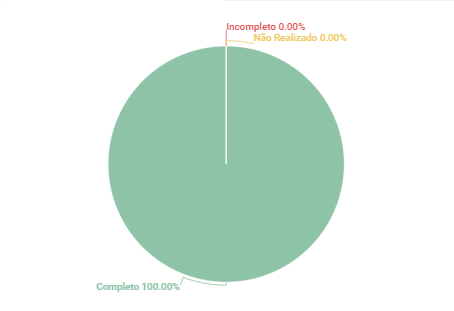

# Análise documental

## 1. Introdução
Esse artefato visa realizar a verificação do artefato de Análise documental produzido pelo nosso próprio grupo, que se encontra [nesse link](https://requisitos-de-software.github.io/2023.1-Twitch/modelagem/backlog/).
É importante lembrar que a versão do artefato que foi verificada é a versão 1.2.

## 2. Metodologia
Você pode conferir a metodologia utilizada para a verificação [nesse link](https://requisitos-de-software.github.io/2023.1-Twitch/verificacao_grupo01/planejamento/).

## 3. Verificação

A tabela 1 a seguir apresenta o checklist que orientou a verificação da Análise documental.

| ID |Questão| Resultado da Verificação |
| :---: | --- | :---: |
| 01 | O artefato possui uma introdução | Completo |
| 02 | O artefato possui a metodologia  | Completo |
| 03 | O artefato possui uma tabela com histórico de versões, com data, descrição, autor(es) e revisor(es)  | Completo |
| 04 | O artefato possui referências bibliográficas  | Completo |
| 05 | As tabelas, imagens ou vídeos do artefato possuem fontes e legendas | Completo |  |
| 06 | O artefato identifica os documentos que foram analisados, como manuais de usuário, relatórios, contratos, especificações técnicas, entre outros.  | Completo |
| 07 | O artefato documenta os requisitos identificados durante a análise documental, descrevendo-os de forma clara e objetiva. | Completo |
| 08 | O artefato estabelece uma identificação para os requisitos identificados para ter rastreabilidade | Completo |

<h6 align = "center"> Tabela 1: Checklist para Verificação
  Autor(es): Ana Beatriz
 Fonte: Autor(es)</h6>

## 4. Resultados
A imagem 1 a seguir apresenta um gráfico de pizza levando em consideração as 11 questões utilizadas para verificação do artefato Análise documental:

<h6 align = "center"> Imagem 1: Resultados da Verificação das Análise documental
  Autor(es): Ana Beatriz
 Fonte: Autor(es)</h6>

## 5. Observações Pertinentes do Grupo 07
A análise realizada pelo Grupo 07 a respeito dos artefatos relacionados a Análise documental se encontra [nesse link](https://requisitos-de-software.github.io/2023.1-Petz/analise/teste/analiseDocumental/).

O grupo concluiu com base no checklist criado por eles que o artefato atende as definições conceituais da Análise documental e não é necessário alterações.

## Histórico de Versões

A Tabela 3 registra o histórico de versão desse documento.

|**Data** | **Versão** | **Descrição** | **Autor** | **Revisor** |
|:---: | :---: | :---: | :---: | :---: |
| 21/06/2023| 1.0 | Criação do documento | Ana Beatriz | Matheus Silva |

<h6 align = "center"> Tabela 3: Histórico de Versões
  Autor(es): 
 Fonte: Autor(es)</h6>

## Referências
> PRESSMAN, Roger S.; 1-MAXIM, Bruce R.. Engenharia de software: uma abordagem profissional. 8 Porto Alegre: AMGH, 2016, 940 p.

>SERRANO, Milene. Requisitos – Aula 15. 2017. Apresentação de slides. Disponível em: https://aprender3.unb.br/pluginfile.php/2523115/mod_resource/content/1/Requisitos%20-%20Aula%2015a.pdf.

>Bourque, P., Fairley, R. E. Guide to the Software Engineering Body of Knowledge, Version 3.0. SWEBOK. IEEE Computer Society, 2014. Disponível em: http://www.computer.org/web/swebok/v3. p. 38.
