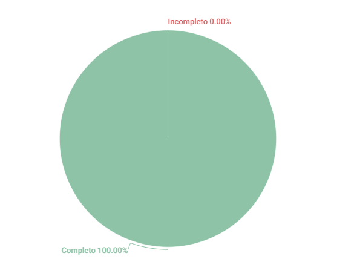

# Three Level Scale
## 1. Introdução
Esse artefato visa realizar a verificação do artefato de Three Level Scale.
É importante lembrar que a versão do artefato que foi verificada é a versão 1.3.

## 2. Metodologia
Você pode conferir a metodologia utilizada para a verificação [nesse link](https://requisitos-de-software.github.io/2023.1-Twitch/verificacao_grupo01/planejamento/).

## 3. Verificação

A tabela 1 a seguir apresenta o checklist que orientou a verificação desse artefato de Three Level Scale, da disciplina de Requisitos de Software no semestre 2023.01.

| ID |Questão| Resultado da Verificação |
| :---: | --- | :---: |
| 01 | O artefato possui uma introdução | Completo |
| 02 | O artefato possui a metodologia  | Completo |
| 03 | O artefato possui uma tabela com histórico de versões, com data, descrição, autor(es) e revisor(es)  | Completo |
| 04 | O artefato possui referências bibliográficas  | Completo |
| 05 | As tabelas e imagens do artefato possuem fontes e legendas | Completo |
| 06 | No documento foi explicado como o método Three Level Scale funciona | Completo |
| 07 | Os requisitos priorizados funcionais e não funcionais foram apresentados no documento | Completo |
| 08 | O documento possui as técnicas de elicitação dos requisitos priorizados utilizados no Three Level Scale | Completo |
| 09 | O documento explica as categorias de priorização do Three Level Scale (alta, média, baixa) e mostra a relação das categorias com "Importante" e "Não muito importante" | Completo|
| 10 | O documento possui as técnicas de elicitação dos requisitos priorizados utilizados no Three Level Scale | Completo |

<h6 align = "center"> Tabela 1: Checklist para Verificação do Three Level Scale
  Autor(es): Matheus SUkva
 Fonte: Autor(es)</h6>

## 4. Resultados
A imagem 1 a seguir apresenta um gráfico de pizza levando em consideração as 10 questões utilizadas para verificação do artefato three level scale:

<h6 align = "center"> Imagem 1: Resultados da Verificação do Three Level Scale
  Autor(es): Matheus Silva
 Fonte: Autor(es)</h6>

## Referências

>SALES, André. Tabela utilizada para análise dos grupos. Disponível em: https://aprender3.unb.br/pluginfile.php/2523005/mod_resource/content/31/Plano_de_Ensino%20RE%20202301%20Turma%202.pdf. Acesso em: 13 de junho de 2023.

>Three-level Scale. In: WIEGERS, Karl E.; BEATTY, Joy. Software Requirements. 3. ed. [S. l.]: Microsoft Press, 2013. cap. 16, p. 313-329. ISBN 0735679665. Acesso em 13 de junho de 2023

## Histórico de Versões

A Tabela 2 registra o histórico de versão desse documento.

|    Data    | Versão | Descrição                                                                      | Autor(es)  | Revisor  |
| :--------: | :----: | :----------------------------------------------------------------------------: | :--------: | :------: |
| 20.06.2023 | 1.0    | Criação do documento de verificação do método de priorização Three Leval Scale |  Matheus Silva  | Diógenes Dantas |

<h6 align = "center"> Tabela 2: Histórico de Versões
  Autor(es): Matheus Silva
 Fonte: Autor(es)</h6>
