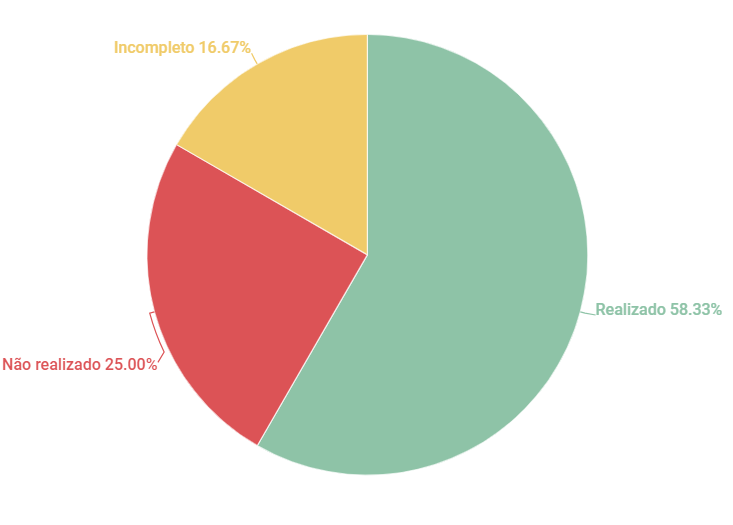

# Verificação Brainstorm

## 1. Introdução

Esse artefato visa realizar a verificação do artefato de Brainstorm na versão 1.3 produzido, que se encontra [nesse link](https://requisitos-de-software.github.io/2023.1-Twitch/elicitacao/tecnicas/Brainstorm/).

## 2. Metodologia

Pode-se conferir a metodologia utilizada para a verificação [nesse link](https://requisitos-de-software.github.io/2023.1-Twitch/verifica_valida_grupo08/planejamento/).

## 3. Verificação

A tabela a seguir apresenta o checklist já contruído pelo grupo anteriormente (questões de 01 a 08) e mais algumas questões relevantes adicionadas com base na bibliografia [1] que orientou a verificação do Brainstorm do Grupo 08 - Twitch, da disciplina de Requisitos de Software no semestre 2023.01.

| ID |Questão| Resultado da Verificação |
| :---: | --- | :---: |
| 01 | O artefato possui introdução.  | Completo |
| 02 | O artefato possui histórico de versionamento completo (datas, descrição, autores, versão).  | Completo |
| 03 | O artefato apresenta as referências utilizadas na sua produção.  | Completo |
| 04 | O artefato apresenta a metodologia utilizada para o brainstorm.  | Completo |
| 05 | O artefato tem definido claramente os objetivos e metas do brainstorm. | Incompleto |
| 06 | O artefato lista os membros da equipe envolvidos no brainstorm, incluindo suas funções. | Completo |
| 07 | O artefato tem registrado as perguntas e desafios que precisam ser abordados durante o brainstorm. | Não realizado |
| 08 | O artefato lista os requisitos funcionais e não funcionais elicitados durante o brainstorming, identificando-os com códigos ou identificadores. | Completo |
| 09 | O artefato possui algum registro de ideias? Como gravação de áudio, vídeo, etc. | Não realizado |
| 10 | O artefato possui um moderador/facilitador? | Completo |
| 11 | O artefato possui regras claras? | Não realizado |
| 12 | O artefato possui todas as ideias obtidas no processo?| Incompleto |

<h6 align = "center"> Tabela 1: Checklist Brainstorm
  Autor(es): Milena Aires
 Fonte: Autor(es)</h6>

## 4. Observações 
### ID 05
Explica o conceito de um Brainstorm mas não é claro o objetivo e a aplicação dentro do projeto.

### ID 07
Não há nenhum registro de como foi guiado o Brainstorm.

## ID 09
Não há registros da reunião.

## ID 11
Não é especificado nenhuma regra do Brainstorm realizado, tal como tempo limite, pessoas, etc.

## ID 12 
Tem o registro dos requisitos elecitados no Brainstorm realizado mas não tem os dados obtidos no processo.

## 5. Resultados
O documento verificado está contruído de forma adequada, porém falta algumas informações relevantes para o enriquecimento de informações e detalhamento do processo realizado, com isso obtemos o gráfico abaixo: 

<h6 align = "center"> Imagem 1: Resultados da Verificação do Artefato de Brainstorm
  Autor(es): Milena Aires 
 Fonte: Autor(es)</h6>

## 6. Referências
> RETRAINING: Requirements engineering. [S. l.]. Disponível em: https://retraining.inf.ufsc.br/guia/app/classificacoes/tecnicas-de-elicitacao-de-requisitos/entidades/tecnicas-de-elicitacao-de-requisitos-brainstorming. Acesso em: 20 de junho de 2023.

## 7. Histórico de Versão

A Tabela seguinte registra o histórico de versão desse documento.

|**Data** | **Versão** | **Descrição** | **Autor** | **Revisor** |
|:---: | :---: | :---: | :---: | :---: |
|20.06.2023| 1.0 | Primeira versão do checklist sobre o Brainstorm produzido pelo grupo 08| Milena Aires | Ana Beatriz |

<h6 align = "center"> Tabela 3: Histórico de Versão
  Autor(es): Milena Aires 
 Fonte: Autor(es)</h6>
