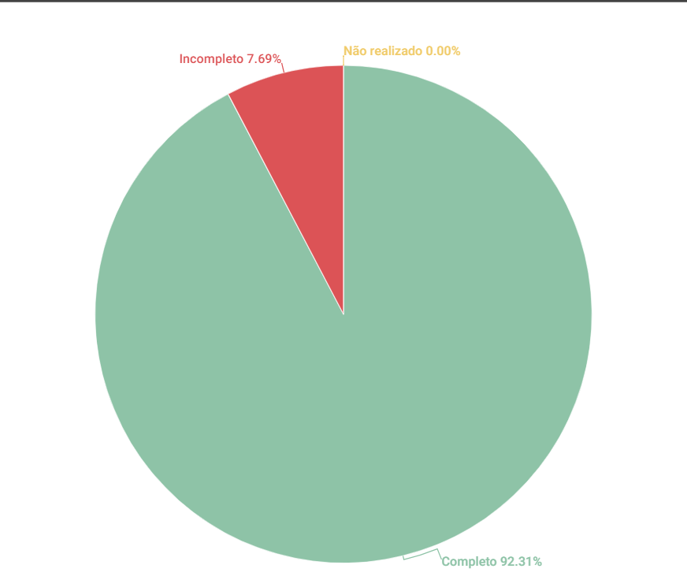

# Cenários

## 1. Introdução
Esse artefato visa realizar a verificação do artefato de [Cenários](https://requisitos-de-software.github.io/2023.1-Twitch/modelagem/cenarios/). É importante ressaltar que a versão do artefato que foi verificada é a versão 1.0

## 2. Metodologia
Você pode conferir a metodologia utilizada para a verificação do artefato de Cenários [nesse link](../planejamento/#2-metodologia).

## 3. Verificação

| ID |Questão| Resultado da Verificação |
| :---: | --- | :---: |
| 1   | O artefato possui introdução? |      Completo    |
| 2   | O artefato possui uma bibliografia/referência bibliográfica?   |     Completo      |
| 3   | O artefato possui um histórico de versões com o id e descrição das versões, data, autores e revisores? |    Completo       |  
| 4   | Todas as tabelas e imagens são chamadas no texto, possuem legendas e fontes? |     Completo |
| 5   | Todos os textos estão na norma padrão? |     Completo      |
| 6   | O cenário possui: título, metas/objetivos, contexto, ator(es), recursos, exceções, restrições e episódios? |     Completo   |
| 7   | O título do cenário é autoexplicativo? |     Completo |
| 8   | O objetivo do cenário é condizente com seu título? |     Completo     |
| 9   | O contexto descreve de forma sucinta o estado inicial do cenário? Em função de local, tempo e pré-condições, por exemplo |    Completo    |
| 10   | O cenário descreve situações realistas e relevantes de interação do sistema?   |     Completo      |
| 11   | Os atores são condizentes com o contexto do cenário? |     Completo      |  
| 12   | Os episódios do cenário estão coerentes e seguem uma ordem lógica para atingir o objetivo? |     Completo      |
| 13   | Existe uma ligação entre os cenários e os léxicos? |     Incompleto  |

<h6 align = "center"> Tabela 1: Checklist para Verificação
  Autor(es): Matheus
 Fonte: Autor(es)</h6>
## 4. Observações

## 4. Observações

### ID-13

Não existem hyperlinks que relacionem os cenários com os léxicos descritos

## 5. Resultados
A imagem 1 a seguir apresenta um gráfico de pizza apresentando os resultados, a partir da Tabela 1

<h6 align = "center"> Imagem 1: Resultados da Verificação do Artefato de Cenários
  Autor(es): Rafael Nobre
 Fonte: Autor(es)</h6>

## Referências

>SALES, André. Tabela utilizada para análise dos grupos. Disponível em: https://aprender3.unb.br/pluginfile.php/2523005/mod_resource/content/31/Plano_de_Ensino%20RE%20202301%20Turma%202.pdf. Acesso em: 13 de junho de 2023.

>SERRANO, Maurício; SERRANO, Milene. Material em Slides produzido para a disciplina de Requisitos de Software.

> Tabela de Verificação do Grupo 07 - [Verificação](https://requisitos-de-software.github.io/2023.1-Petz/analise/teste/cenarios/)

## Histórico de versão
|    Data    | Versão | Descrição                                                                      | Autor(es)  | Revisor  |
| :--------: | :----: | :----------------------------------------------------------------------------: | :--------: | :------: |
| 21.06.2023 | 1.0    | Inspeção do artefato de Cenários|   Rafael Nobre   | Mateus |

<h6 align = "center"> Tabela 2: Histórico de Versões
  Autor: Rafael Nobre</h6>