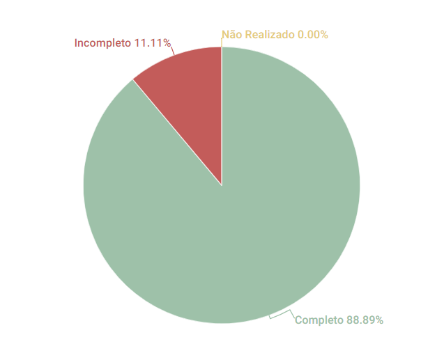

# Cronograma

## 1. Introdução
Esse artefato visa realizar a verificação do artefato de Cronograma produzido pelo nosso próprio grupo, que se encontra [nesse link](https://requisitos-de-software.github.io/2023.1-Twitch/planejamento/cronograma/).
É importante lembrar que a versão do artefato que foi verificada é a versão 1.2. Além disso, também foi vericado o artefato do Cronograma Realizado, que se encontra [nesse link](https://requisitos-de-software.github.io/2023.1-Twitch/planejamento/cronograma_realizado/). A versão verificada desse segundo artefato é a versão 1.1.

## 2. Metodologia
Você pode conferir a metodologia utilizada para a verificação de nosso grupo [nesse link]().

## 3. Verificação

|ID|Questão|Verificação|
|:-:|:-:|:-:|
|01|O cronograma apresenta da de início e de fim para cada atividade?|Completo|
|02|O cronograma apresenta o(s) integrante(s) responsável(eis) por cada atividade?|Completo|
|03|O cronograma apresenta data de revisão para cada atividade?|Completo|
|04|Existe um cronograma executado, com as atividades que foram executadas?|Incompleto, falta atualizá-lo com informações referentes à entrega 5.1|
|05|No cronograma executado, está informada a data de início de fim?|Completo|
|06|No cronograma executado, está informada o integrante responsável e o revisor?|Completo|
|07|No artefato, possui histórico de versão com data, autor e descrição?|Completo|
|08|Todas as tabelas possuem legenda?|Completo|
|09|Todas as tabelas possuem chamada dentro do corpo to texto?|Completo|

<h6 align = "center"> Tabela 1: Checklist para Verificação do Artefato de Cronograma
  Autor(es): Brunna Louise
 Fonte: Autor(es)</h6>

## 4. Resultados
A imagem 1 a seguir apresenta um gráfico de pizza apresentando os resultados contidos na Tabela 1.

<h6 align = "center"> Imagem 1: Resultados da Verificação do Artefato de Cronograma
  Autor(es): Brunna Louise
 Fonte: Autor(es)</h6>

## 5. Observações Pertinentes do Grupo 07
A análise realizada pelo Grupo 07 a respeito dos artefatos relacionados ao Cronogram e ao Cronogram Realizado se encontram [nesse link](https://requisitos-de-software.github.io/2023.1-Petz/analise/teste/planejamento/).

O que foi apontado pelo grupo a respeito dos artefatos, apesar de válido, constitui apenas erros relacionados à padronização, à ortografia e à bibliografia. Conceitualmente, ambos artefatos estão corretos e bem construídos e as alterações são simples de fazer.

## Histórico de versão
|    Data    | Versão | Descrição                                                                      | Autor(es)  | Revisor  |
| :--------: | :----: | :----------------------------------------------------------------------------: | :--------: | :------: |
| 20.06.2023 | 1.0    | Primeira Versão do artefato de Verificação do Cronograma |   Brunna Louise   | Rafael Nobre  |

<h6 align = "center"> Tabela 2: Histórico de Versões
  Autor: Brunna Louise </h6>

## Referências

>SALES, André. Tabela utilizada para análise dos grupos. Disponível em: https://aprender3.unb.br/pluginfile.php/2523005/mod_resource/content/31/Plano_de_Ensino%20RE%20202301%20Turma%202.pdf. Acesso em: 13 de junho de 2023.

>SERRANO, Maurício; SERRANO, Milene. Material em Slides produzido para a disciplina de Requisitos de Software.

>Análise realizada pelo Grupo 07, disponível [nesse GitPages](https://requisitos-de-software.github.io/2023.1-Petz/).