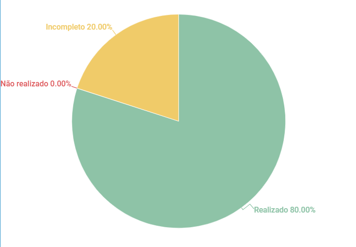

# Verificação Especificação Suplementar

## 1. Introdução

Esse artefato visa realizar a verificação do artefato de Especificação Suplementar na versão 1.3 produzido, que se encontra [nesse link](https://requisitos-de-software.github.io/2023.1-Twitch/modelagem/esp_suplementar/).

## 2. Metodologia

Pode-se conferir a metodologia utilizada para a verificação [nesse link](https://requisitos-de-software.github.io/2023.1-Twitch/verifica_valida_grupo08/planejamento/).

## 3. Verificação

A tabela a seguir apresenta o checklist que orientou a verificação do Brainstorm do Grupo 08 - Twitch, da disciplina de Requisitos de Software no semestre 2023.01. Sendo as questões de 1 a 4 sobre padronização e as demais baseadas na bibliografia [1].

| ID |Questão| Resultado da Verificação |
| :---: | --- | :---: |
| 01 | O artefato possui introdução? | Completo |
| 02 | O artefato possui uma bibliografia/referência bibliográfica?   | Completo |
| 03 | O artefato possui um histórico de versões com o id e descrição das versões, data, autores e revisores? | Completo |  
| 04 | Todas as tabelas e imagens são chamadas no texto, possuem legendas e fontes? | Incompleto |
| 05 | O artefato está em linguagem natural? | Completo |
| 06 | O artefato está utilizando FURPS+? | Completo |
| 07 | O artefato contém todos os elemtos FURPS+? | Incompleto |
| 08 | O artefato possui identificadores únicos? | Completo |
| 09 | Os requisitos estão separados em categorias? | Completo |
| 10 | Todos os requisitos são testáveis? | Completo |

<h6 align = "center"> Tabela 1: Checklist Especificação Suplementar
  Autor(es): Milena Aires
 Fonte: Autor(es)</h6>

## 4. Observações 
### ID 04
Existem tabelas sem chamadas em texto.

### ID 07 
Existem algumas classificações que podem ser utilizadas para enriquecimento do artefato, como: Requisitos de design, Requisitos de implementação, Requisitos de interface, Requisitos físicos.

## 5. Resultados
O documento verificado está construído de forma adequada, porém existem pontos que podem ser melhorados. Com isso obtemos o gráfico abaixo: 

<h6 align = "center"> Imagem 1: Resultados da Verificação do Artefato de Especificação Suplementar
  Autor(es): Milena Aires 
 Fonte: Autor(es)</h6>

## 6. Referências
> SERRANO, Milene; SERRANO, Maurício; Requisitos - Aula 13. Disponível em: Aprender3. Acesso em: 15 de maio de 2023. Twitch Engineering Blog.
> Grupo 8 - Twitch: Verificação Especificação Suplementar. Disponível em: https://requisitos-de-software.github.io/2023.1-Twitch/verificacao_grupo01/verifica01_espsuplementar/. Acesso em: 20 de junho de 2023.

## 7. Histórico de Versão

A Tabela seguinte registra o histórico de versão desse documento.

|**Data** | **Versão** | **Descrição** | **Autor** | **Revisor** |
|:---: | :---: | :---: | :---: | :---: |
|20.06.2023| 1.0 | Primeira versão do checklist sobre a Especificação Suplementar produzido pelo grupo 08| Milena Aires | Ana Beatriz |

<h6 align = "center"> Tabela 3: Histórico de Versão
  Autor(es): Milena Aires 
 Fonte: Autor(es)</h6>
