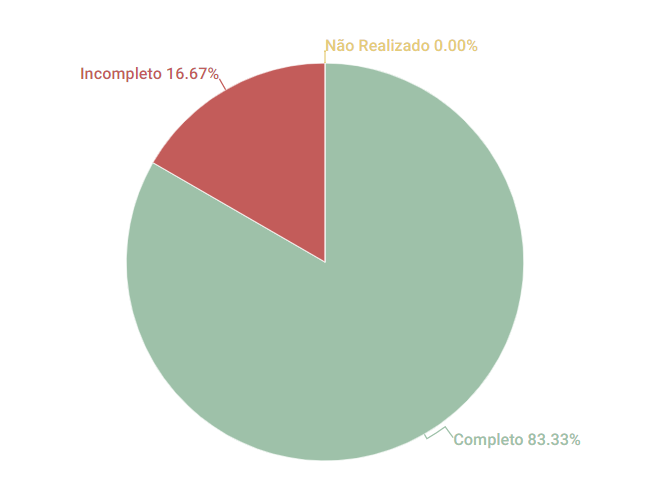

# Ferramentas

## 1. Introdução
Esse artefato visa realizar a verificação do artefato de Ferramentas produzido pelo nosso próprio grupo, que se encontra [nesse link](../planejamento/ferramentas.md).
É importante lembrar que a versão do artefato que foi verificada é a versão 1.5. 

## 2. Metodologia
Você pode conferir a metodologia utilizada para a verificação de nosso grupo [nesse link](./planejamento.md).

## 3. Verificação

| ID |Questão| Resultado da Verificação |
| :---: | --- | :---: |
| 01 | O artefato possui uma introdução. [1](#1)| Completo |
| 02 | O artefato possui uma tabela com histórico de versões, e possui data, descrição, autor(es) e revisor(es). [1](#1) | Incompleto, é necessária a adição de revisores em algumas versões. |
| 03 | O artefato possui referências bibliográficas. [1](#1) | Completo |
| 04 | As tabelas e imagens do artefato possuem fontes, legendas e chamadas no texto. [1](#1)| Completo |
| 05 | O artefato contempla ferramentas básicas de comunicação, edição de texto/código e softwares de versionamento. | Completo |
| 06 | A finalidade de cada ferramenta está bem definida e é de fácil compreensão. | Completo |

<h6 align = "center"> Tabela 1: Checklist para Verificação do Artefato de Ferramentas
  Autor(es): Brunna Louise
 Fonte: Autor(es)</h6>

## 4. Observações 
### ID 02
No histórico de versões, há algumas versões em que falta adicionar os revisores.

## 5. Observações Pertinentes do Grupo 07
A análise realizada pelo Grupo 07 a respeito do artefato de Ferramentas se encontra [nesse link](https://requisitos-de-software.github.io/2023.1-Petz/analise/teste/planejamento/).

As únicas duas observações apontadas pelo Grupo 07 se devem apenas a questões de padronização, sendo elas organizar as ferramentas e a bibliografia em ordem alfabética e adicionar revisores em todas as versões do artefato. Conceitualmente, o documento está correto e suas alterações se devem apenas a adequações a normas e padrões. [3](#3)

## 6. Resultados
A imagem 1 a seguir apresenta um gráfico de pizza apresentando os resultados contidos na Tabela 1.

<h6 align = "center"> Imagem 1: Resultados da Verificação do Artefato de Ferramentas
  Autor(es): Brunna Louise
 Fonte: Autor(es)</h6>

## 7. Referências

> <a id="1">[1]</a> SALES, André. Tabela utilizada para análise dos grupos. Disponível em: https://aprender3.unb.br/pluginfile.php/2523005/mod_resource/content/31/Plano_de_Ensino%20RE%20202301%20Turma%202.pdf. Acesso em: 13 de junho de 2023. 

> <a id="1">[2]</a> SERRANO, Maurício; SERRANO, Milene. Material em Slides produzido para a disciplina de Requisitos de Software.

> <a id="1">[3]</a> Análise realizada pelo Grupo 07, disponível [nesse GitPages](https://requisitos-de-software.github.io/2023.1-Petz/).

## Histórico de versão
|    Data    | Versão | Descrição                                                                      | Autor(es)  | Revisor  |
| :--------: | :----: | :----------------------------------------------------------------------------: | :--------: | :------: |
| 20.06.2023 | 1.0    | Primeira Versão do artefato de Verificação de Ferramentas |   Brunna  | Rafael |
| 03.07.2023 | 2.0    | Versão Final do artefato de Verificação de Ferramentas: padronização |   Brunna   | -  |

<h6 align = "center"> Tabela 2: Histórico de Versões
  Autor: Brunna Louise </h6>

