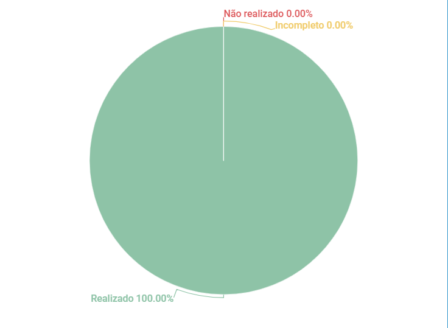

# Verificação First Things First

## 1. Introdução

Esse artefato visa realizar a verificação do artefato de First Things First na versão 1.3 produzido, que se encontra [nesse link](https://requisitos-de-software.github.io/2023.1-Twitch/elicitacao/priorizacao/#22-first-things-first).

## 2. Metodologia

Pode-se conferir a metodologia utilizada para a verificação [nesse link](https://requisitos-de-software.github.io/2023.1-Twitch/verifica_valida_grupo08/planejamento/).

## 3. Verificação

A tabela a seguir apresenta o checklist de verificação do artefato de First Things First. As questões de 1 a 4 são de padronização do documento, enquanto as demais são aplicadas ao conteúdo. Tendo como base a verificação do grupo 07 sobre o artefato construído, as questões de 5 a 14 [2] foram consideradas extremamente relevantes para construção do checklist e com isso utilizadas para a confecção do presente artefato. Também algumas questões foram adicionadas com base na bibliografia [1] que orientou a verificação do Brainstorm do Grupo 08 - Twitch, da disciplina de Requisitos de Software no semestre 2023.01.

| ID |Questão| Resultado da Verificação |
|----|-------|--------------------------|
| 01 | O artefato possui introdução? | Completo |
| 02 | O artefato possui uma bibliografia/referência bibliográfica?   | Completo |
| 03 | O artefato possui um histórico de versões com o id e descrição das versões, data, autores e revisores? | Completo |  
| 04 | Todas as tabelas e imagens são chamadas no texto, possuem legendas e fontes? | Completo |
| 05 | Uma lista de todos os requisitos foi feita em uma planilha? | Completo |
| 06 | O benefício relativo que cada recurso fornece ao cliente ou ao negócio foi estimado em uma escala de 1 a 9?  | Completo | 
| 07 | A penalidade que o negócio sofreria, se o recurso não fosse incluído, foi estimada em uma escala de 1 a 9? | Completo |
| 08 | O valor total foi calculado como a soma do (Benefício Relativo * Peso Relativo) e da (Penalidade Relativa * Peso Relativo)? | Completo | 
| 09 | O custo relativo de implementação de cada característica foi estimado em uma escala que varia de um mínimo de 1 a um máximo de 9? | Completo | 
| 10 | O grau relativo de risco associado à implementação de cada característica foi estimado numa escala de 1 a 9? | Completo |
| 11 | A prioridade de cada recurso foi calculada como o valor total dividido pela soma do custo relativo e do risco relativo? | Completo |
| 12 | Os recursos foram ordenados em ordem de prioridade? | Completo |
| 13 | A decisão de implementação foi tomada com base na prioridade dos recursos? | Completo |
| 14 | A implementação do projeto foi planejada considerando a prioridade dos recursos? | Completo | 
| 15 | Todos os requisitos da fase de elicitação foram priorizados? | Completo |
| 16 | Está clara as prioridades dos requisitos, seja por meio de uma lista numerada ou de uma matriz de priorização? | Sim |

<h6 align = "center"> Tabela 1: Checklist First Things First
  Autor(es): Milena Aires
 Fonte: Autor(es)</h6>

## 4. Observações 
Não há observações a serem feitas. 

## 5. Resultados
O documento verificado está contruído de forma adequada, com isso obtemos o gráfico abaixo: 

<h6 align = "center"> Imagem 1: Resultados da Verificação do Artefato de First Things First
  Autor(es): Milena Aires 
 Fonte: Autor(es)</h6>

## 6. Referências
>Grupo 07 - Aplicativo Petz: Análise do artefato First Things First. Disponível em: https://requisitos-de-software.github.io/2023.1-Petz/analise/teste/firstThingsFirst/. Acesso em: 20 de junho de 2023.

>Software Requirements: Third edition. Disponível em: https://aprender3.unb.br/pluginfile.php/2523072/mod_resource/content/2/PriorizaA%CC%83%C2%A7A%CC%83%C2%A3o%20de%20Req.pdf. Acesso em: 20 de junho de 2023.

## 7. Histórico de Versão

A Tabela seguinte registra o histórico de versão desse documento.

|**Data** | **Versão** | **Descrição** | **Autor** | **Revisor** |
|:---: | :---: | :---: | :---: | :---: |
|20.06.2023| 1.0 | Primeira versão do checklist sobre o First Things First produzido pelo grupo 08| Milena Aires | Ana Beatriz |

<h6 align = "center"> Tabela 2: Histórico de Versão
  Autor(es): Milena Aires 
 Fonte: Autor(es)</h6>
