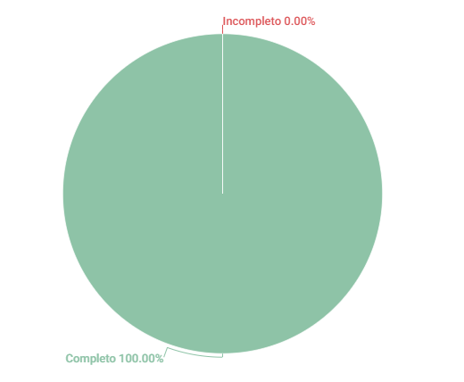

# NFR Framework

## 1. Introdução

Esse artefato visa realizar a verificação do artefato NFR Framework na versão 1.4 produzido, que se encontra [nesse link](https://requisitos-de-software.github.io/2023.1-Twitch/modelagem/nfr/).

## 2. Metodologia

Pode-se conferir a metodologia utilizada para a verificação [nesse link](https://requisitos-de-software.github.io/2023.1-Twitch/verifica_valida_grupo08/planejamento/).

## 3. Verificação

A tabela a seguir apresenta o checklist que orientou a verificação do NFR Framework , da disciplina de Requisitos de Software no semestre 2023.01.

| ID |Questão| Resultado da Verificação |
| :---: | --- | :---: |
| 01 | O artefato possui uma introdução | Completo |
| 02 | O artefato possui a metodologia  | Completo |
| 03 | O artefato possui uma tabela com histórico de versões, com data, descrição, autor(es) e revisor(es)  | Completo |
| 04 | O artefato possui referências bibliográficas  | Completo |
| 05 | As tabelas e imagens do artefato possuem fontes, legendas e chamadas no texto | Completo |
| 06 | Os NFRs relevantes para o sistema foram identificados? | Completo |
| 07 | Os NFRs abrangem diferentes aspectos, como desempenho, segurança, usabilidade, confiabilidade, etc.? | Completo |
| 08 | Os NFRs foram agrupados em categorias ou classes? | Completo |
| 09 | Cada NFR possui uma definição clara e fácil de entender? | Completo |
| 10 | Os NFRs possuem classificação, descrição, etc.? | Completo |
| 11 | Os NFRs estão rastreáveis aos requisitos funcionais correspondentes? | Completo |
| 12 | Os requisitos associados aos NFRs foram identificados e documentados? | Completo |
| 13 | O NFR framework possui uma estrutura clara e organizada? | Completo |
| 14 | As categorias e subcategorias do NFR framework são adequadas e coerentes? | Completo |
| 15 | Os NFRs são relevantes e adequados para o contexto aplicado? | Completo |
| 16 | O NFR framework atende às necessidades específicas do projeto? | Completo |

<h6 align = "center"> Tabela 1: Checklist NFR Framework
  Autor(es): Matheus Silva
 Fonte: Autor(es)</h6>

## 4. Resultados
O documento verificado está bem estruturado e rico de informações. O resultado foi muito bom como pode ser visto abaixo:

<h6 align = "center"> Imagem 1: Resultados da Verificação do Artefato de NFR Framework
  Autor(es): Matheus Silva
 Fonte: Autor(es)</h6>

## 5. Referências
> SERRANO, Milene. Requisitos – Aula 10. 2017. Apresentação de slides. Disponível em: https://aprender3.unb.br/pluginfile.php/2523131/mod_resource/content/1/Requisitos%20-%20Aula%20019a.pdf Acesso em: 14/06/2023.

## 6. Histórico de Versões

A Tabela seguinte registra o histórico de versão desse documento.

|**Data** | **Versão** | **Descrição** | **Autor** | **Revisor** |
|:---: | :---: | :---: | :---: | :---: |
|20.06.2023| 1.0 | Primeiro versão do artefato de verificação sobre o NFR Framework| Matheus Silva | Diógenes Dantas |
|21.06.2023| 1.1 | Correção na referência do artefato verificado| Matheus Silva | Diógenes Dantas |

<h6 align = "center"> Tabela 3: Histórico de Versões
  Autor(es): Matheus Silva
 Fonte: Autor(es)</h6>
