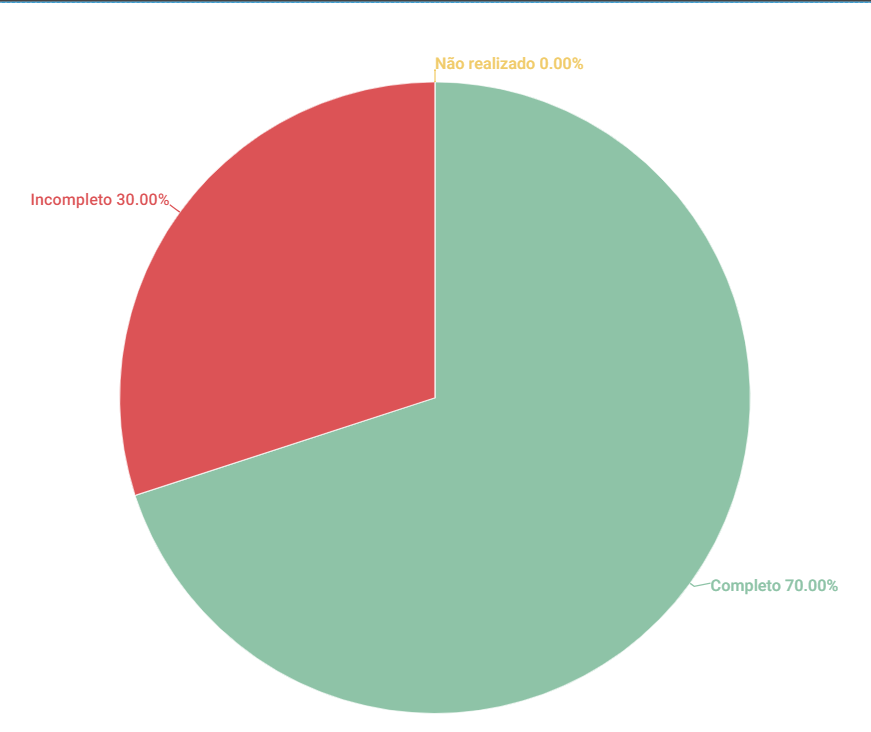

# Perfil de Usuário

## 1. Introdução
Esse artefato visa realizar a verificação do artefato de [Perfil de Usuário](https://requisitos-de-software.github.io/2023.1-Twitch/elicitacao/perfis_usuario/). É importante ressaltar que a versão do artefato que foi verificada é a versão 2.1

## 2. Metodologia
Você pode conferir a metodologia utilizada para a verificação do artefato de perfis de usuário [nesse link](../planejamento/#2-metodologia).

## 3. Verificação

| ID |Questão| Resultado da Verificação |
| :---: | --- | :---: |
| 01 | O artefato possui uma introdução | Completo |
| 02 | O artefato possui a metodologia  | Completo |
| 03 | O artefato possui uma tabela com histórico de versões, com data, descrição, autor(es) e revisor(es)  | Completo |
| 04 | O artefato possui referências bibliográficas  | Completo |
| 05 | As tabelas e imagens do artefato possuem fontes e legendas | Incompleto |
| 06 | O artefato descreve os resultados obtidos, imagens ou texto | Completo |
| 07 | Os dados coletados para utilizar no perfil de usuário foram obtidos através de um estudo conduzido por entrevistas ou aplicação de questionário  | Completo |
| 08 | O artefato apresenta o termo de consentimento utilizado na coleta dos dados | Incompleto |
| 09 | O artefato identifica as características de interesse obtidos na coleta de dados, como nível de instrução, faixa etária, experiência, estado civil, atitudes (tecnófilos, tecnófobos) | Incompleto |
| 10 | O artefato explica como a coleta de dados foi usada para determinar o perfil de usuário principal do aplicativo analisado | Completo |

<h6 align = "center"> Tabela 1: Checklist para Verificação
  Autor(es): Diógenes Dantas
 Fonte: Autor(es)</h6>

## 4. Observações

#### ID-5.
A tabela de Requisitos Elicitados não contém legenda e fonte.

#### ID-8
O termo de consentimento, apesar de ser possível acessá-lo por meio do formulário, não está descrito ou apontado no artefato.

#### ID-9
Não há informações de estado civil ou grau de afinidade com tecnologia.

## 5. Resultados
A imagem 1 a seguir apresenta um gráfico de pizza apresentando os resultados, a partir da Tabela 1

<h6 align = "center"> Imagem 1: Resultados da Verificação do Artefato de Perfis de usuário
  Autor(es): Rafael Nobre
 Fonte: Autor(es)</h6>

## Referências

> Barbosa, S. D. J.; Silva, B. S. da; Silveira, M. S.; Gasparini, I.; Darin, T.; Barbosa, G. D. J. (2021) Interação Humano-Computador e Experiência do usuário. Autopublicação. ISBN: 978-65-00-19677-1
> Reinehr, Sheila. Engenharia de requisitos

> Tabela de Verificação do Grupo 07 - [Verificação](https://requisitos-de-software.github.io/2023.1-Petz/analise/teste/perfilDeUsuario/)

## Histórico de versão
|    Data    | Versão | Descrição                                                                      | Autor(es)  | Revisor  |
| :--------: | :----: | :----------------------------------------------------------------------------: | :--------: | :------: |
| 21.06.2023 | 1.0    | Inspeção do artefato de Perfil de Usuário |   Rafael Nobre   | Mateus |

<h6 align = "center"> Tabela 2: Histórico de Versões
  Autor: Rafael Nobre</h6>