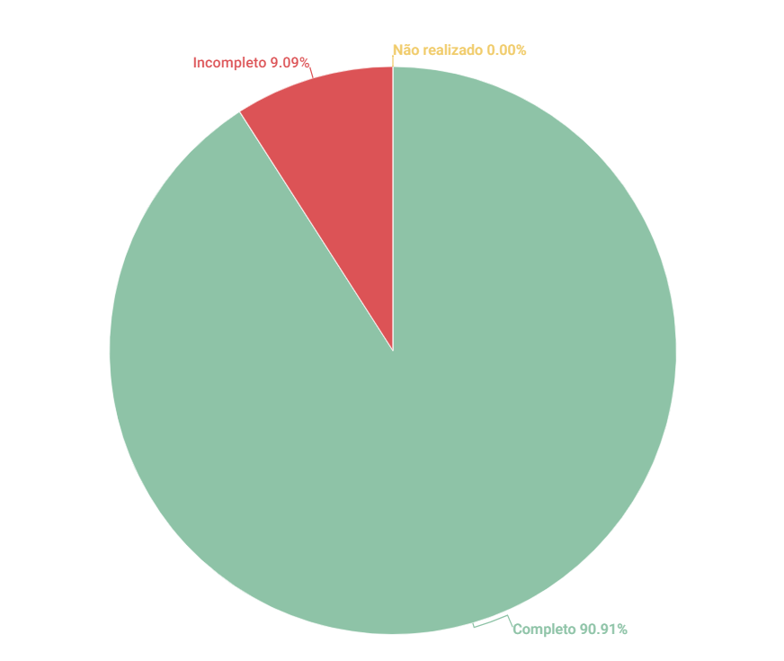

# Personas

## 1. Introdução
Esse artefato visa realizar a verificação do artefato de [Personas](https://requisitos-de-software.github.io/2023.1-Twitch/elicitacao/personas/). É importante ressaltar que a versão do artefato que foi verificada é a versão 2.1

## 2. Metodologia
Você pode conferir a metodologia utilizada para a verificação do artefato de Personas [nesse link](../planejamento/#2-metodologia).

## 3. Verificação

| ID |Questão| Resultado da Verificação |
| :---: | --- | :---: |
| 01 | O artefato possui introdução.  | Completo |
| 02 | O artefato possui histórico de versionamento completo (datas, descrição, autores, versão).  | Completo |
| 03 |  O artefato apresenta as referências utilizadas na sua produção.  | Completo |
| 04 | O artefato apresenta a metodologia utilizada para criação de personas.  | Completo |
| 05 |  Há um elenco de personas e o porquê da quantidade de personas. | Completo |
| 06 |  As personas possuem dados básicos de identidade (nome, sobrenome, idade, dados demográficos). | Completo |
| 07 |  Cada persona tem uma foto para ilustrá-la. Essa foto é de uma pessoa que não existe. | Completo |
| 08 | Há, pelo menos, uma persona primária, uma persona secundária e uma antipersona.  | Completo |
| 09 |  As personas possuem objetivos e necessidades bem definidos. | Completo |
| 10 |  Dentre as metodologias utilizadas para criação de personas, foi levado em consideração o perfil de usuário para elaboração do elenco de personas. | Completo |
| 11 | Tabelas e figuras utilizadas apresentam legendas e fontes.  | Incompleto|

<h6 align = "center"> Tabela 1: Checklist para Verificação do artefato de Personas
  Autor(es): Brunna Louise
 Fonte: Autor(es)</h6>

## 4. Observações

### ID-11
A tabela 'Requisitos das personas' não possue legendas e fontes

## 5. Resultados
A imagem 1 a seguir apresenta um gráfico de pizza apresentando os resultados, a partir da Tabela 1

<h6 align = "center"> Imagem 1: Resultados da Verificação do Artefato de Personas
  Autor(es): Rafael Nobre
 Fonte: Autor(es)</h6>

## Referências

>SALES, André. Tabela utilizada para análise dos grupos. Disponível em: https://aprender3.unb.br/pluginfile.php/2523005/mod_resource/content/31/Plano_de_Ensino%20RE%20202301%20Turma%202.pdf. Acesso em: 13 de junho de 2023.

>SERRANO, Maurício; SERRANO, Milene. Material em Slides produzido para a disciplina de Requisitos de Software.

> Tabela de Verificação do Grupo 07 - [Verificação](https://requisitos-de-software.github.io/2023.1-Petz/analise/teste/perfilDeUsuario/)

## Histórico de versão
|    Data    | Versão | Descrição                                                                      | Autor(es)  | Revisor  |
| :--------: | :----: | :----------------------------------------------------------------------------: | :--------: | :------: |
| 21.06.2023 | 1.0    | Inspeção do artefato de Personas|   Rafael Nobre   | Mateus |

<h6 align = "center"> Tabela 2: Histórico de Versões
  Autor: Rafael Nobre</h6>