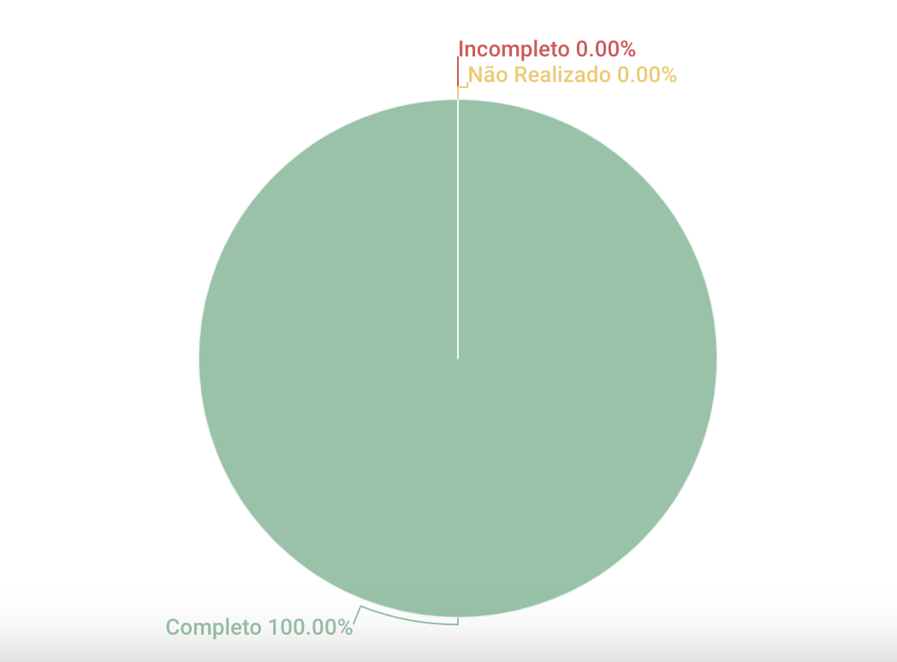

# Rich Picture

## 1. Introdução
Esse artefato visa realizar a verificação do artefato Rich Picture produzido pelo nosso próprio grupo, que se encontra [nesse link](https://requisitos-de-software.github.io/2023.1-Twitch/pre_rastreabilidade/rich_picture/).
É importante lembrar que a versão do artefato que foi verificada é a versão 1.1. 

## 2. Metodologia
Você pode conferir a metodologia utilizada para a verificação de nosso grupo [nesse link](https://requisitos-de-software.github.io/2023.1-Twitch/verificacao_grupo01/planejamento/).

## 3. Verificação

| ID |Questão| Resultado da Verificação |
| :---: | --- | :---: |
| 01 | O artefato possui uma introdução | Completo |
| 02 | O artefato possui a metodologia  | Completo |
| 03 | O artefato possui uma tabela com histórico de versões, com data, descrição, autor(es) e revisor(es)  | Completo |
| 04 | O artefato possui referências bibliográficas  | Completo |
| 05 | As tabelas e imagens do artefato possuem fontes, legendas e chamadas no texto | Completo |
| 06 | O artefato possui legenda dos elementos? | Completo |
| 07 | O artefato possui atores? | Completo |
| 08 | O artefato possui operações? | Completo |
| 09 | O artefato possui armazenamento de dados? | Completo |
| 10 | O artefato possui fluxos? | Completo |
| 11 | O artefato possui fronteira do sistema? | Completo |
| 12 | As atividades são descritas de maneira clara e lógica? | Completo |
| 13 | Os símbolos que representam atividades se conectam com setas para indicar fluxo? | Completo |
| 14 | As relações e interações entre os atores e o sistema estão claramente ilustradas?| Completo |
| 15 | As anotações fornecem explicações ou percepções adicionais sobre os elementos representados?| Completo |
| 16 | O artefato é visualmente claro e fácil de entender? | Completo |

<h6 align = "center"> Tabela 1: Checklist para Verificação do Artefato Rich Picture
  Autor(es): Diógenes Dantas
 Fonte: Autor(es)</h6>

## 4. Resultados
A imagem 1 a seguir apresenta um gráfico de pizza apresentando os resultados contidos na Tabela 1.

<h6 align = "center"> Imagem 1: Resultados da Verificação do Artefato RichPicture
  Autor(es): Diógenes Dantas
 Fonte: Autor(es)</h6>

## 5. Observações Pertinentes do Grupo 07
A análise realizada pelo Grupo 07 a respeito do artefato Rich Picture se encontra [nesse link](https://requisitos-de-software.github.io/2023.1-Petz/analise/teste/richpicture/).

As única observação apontadaa pelo Grupo 07 se devem apenas a questão da Rich Picture não ter um título e deve ser acrescentado no artefato.

## Histórico de versão
|    Data    | Versão | Descrição                                                                      | Autor(es)  | Revisor  |
| :--------: | :----: | :----------------------------------------------------------------------------: | :--------: | :------: |
| 20.06.2023 | 1.0    | Adição da primeira versão do artefato de Verificação Rich Picture |   Diógenes   | Rafael Nobre  |
| 20.06.2023 | 1.1    | Adição da introdução, checklist de verificação da Rich Picture, referências |   Diógenes   | Rafael Nobre |
| 20.06.2023 | 1.2    | Adicão de gráfico de pizza apresentando os resultados do CheckList da Rich Picture |   Diógenes   | Matheus |

<h6 align = "center"> Tabela 2: Histórico de Versões
  Autor: Diógenes Dantas </h6>

## Referências

>SALES, André. Tabela utilizada para análise dos grupos. Disponível em: https://aprender3.unb.br/pluginfile.php/2523005/mod_resource/content/31/Plano_de_Ensino%20RE%20202301%20Turma%202.pdf. Acesso em: 20 de junho de 2023.

>SERRANO, Milene, SERRANO, Maurício. Requisitos (Aula 04): Pré-Rastreabilidade - Rich Picture. Acesso em: 20 de junho de 2023

>Introducing Rich Pictures - Rich Picture Drawing Guidelines (Diretrizes para desenhar Rich Pictures). Disponível em: https://aprender3.unb.br/pluginfile.php/2523045/mod_resource/content/2/1_5145791542719414573.pdf. Acesso em: 20 de junho de 2023
