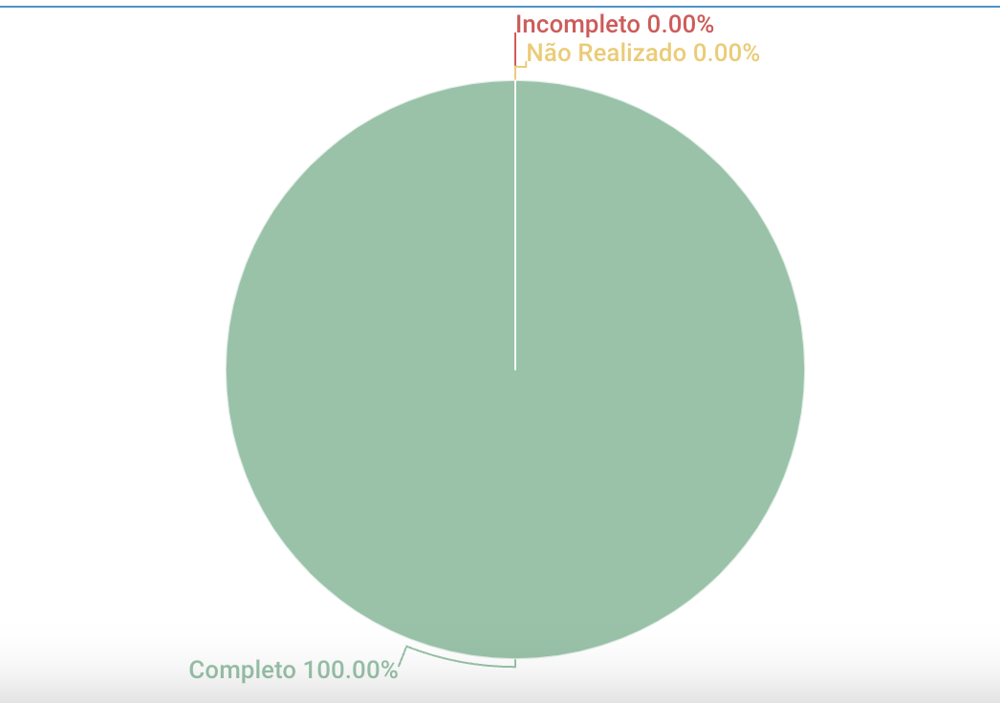

# Casos de Uso

## 1. Introdução
Esse artefato visa realizar a verificação do artefato Casos de Uso produzido pelo nosso próprio grupo, que se encontra [nesse link](https://requisitos-de-software.github.io/2023.1-Twitch/modelagem/usecase/).
É importante lembrar que a versão do artefato que foi verificada é a versão 1.9. 

## 2. Metodologia
Você pode conferir a metodologia utilizada para a verificação de nosso grupo [nesse link](https://requisitos-de-software.github.io/2023.1-Twitch/verificacao_grupo01/planejamento/).

## 3. Verificação

|ID|Questão|Verificação|
|:-:|:-:|:-:|
|1|O artefato possui Introdução e Metodologia descritiva? [1](#1) |Completo|
|2|O artefato possui referências bibliográficas? [1](#1)|Completo|
|3|O artefato possui Histórico de versão com data, autor e descrição? [1](#1)|Completo|
|4|As tabelas e imagems possuem legendas, e são chamadas no corpo do texto? [1](#1)|Completo|
|5|As ações são representadas por elipses? [2](#1)|Completo|
|6|Os atores principais se encontram à esquerda do sistema, no diagrama de casos de uso? [2](#1)|Completo|
|7|Os atores estão fora do limiar do sistema? [2](#1)|Completo|
|8|Existe uma legenda que descreva os objetos do diagrama? [2](#1)|Completo|
|9|Os relacioamentos de _exclude_ e _include_ estão diagramadas corretamente? [2](#1)|Completo|
|10|Os atores possuem identificadores no diagrama? Ex. cliente, usuário [2](#1)|Completo|
|11|Os casos de uso descrevem requisitos funcionais [2](#1)|Completo|
|12|Está especificada a técnica utilizada para realização dos casos de uso? [2](#1)|Completo|
|13|As ações são indicadas por verbos no infinitivo? [2](#1)|Completo|
|14|Os casos de uso possuem fluxos alternativos consistentes? [2](#1)|Completo|
|15|Os casos de uso possuem fluxos de exceção consistentes? [2](#1)|Completo|
|16|Os casos de uso possuem definição de pré-condições e pós-condições? [2](#1)|Completo|
|17|Todos os casos de uso possuem rastreabilidade para os respectivos Requisitos? [2](#1)|Completo|

<h6 align = "center"> Tabela 1: Checklist para Verificação do Artefato Casos de Uso
  Autor(es): Diógenes Dantas
 Fonte: Autor(es)</h6>

## 4. Resultados
A imagem 1 a seguir apresenta um gráfico de pizza apresentando os resultados contidos na Tabela 1.

<h6 align = "center"> Imagem 1: Resultados da Verificação do Artefato Casos de Uso
  Autor(es): Diógenes Dantas
 Fonte: Autor(es)</h6>

## 5. Observações Pertinentes do Grupo 07
A análise realizada pelo Grupo 07 a respeito do artefato Casos de Uso se encontra [nesse link](https://requisitos-de-software.github.io/2023.1-Petz/analise/teste/casosDeUso/).

As única observação apontada pelo Grupo 07 se deve a respeito da ortografia correta e formal do artefato que apresentou alguns erros. Em relação ao conteúdo e as outras métricas dos Casos de Uso, tudo do checklist do Grupo 07 está presente no artefato. 

## Referências

>SALES, André. Tabela utilizada para análise dos grupos. Disponível em: https://aprender3.unb.br/pluginfile.php/2523005/mod_resource/content/31/Plano_de_Ensino%20RE%20202301%20Turma%202.pdf. Acesso em: 20 de junho de 2023. <a id="1">[1]</a>

>SERRANO, Milene, SERRANO, Maurício. Requisitos (Aula 11). Disponível em: https://aprender3.unb.br/pluginfile.php/2523100/mod_resource/content/1/Requisitos%20-%20Aula%20013a.pdf. Acesso em: 20 de junho de 2023. <a id="2">[2]</a>

> Diagrama de caso de uso UML: O que é, como fazer e exemplos, pela equipe do Lucidchart. Acesse o site com o tutorial nesse [link](https://www.lucidchart.com/pages/pt/diagrama-de-caso-de-uso-uml). Acesso em 11 de maio de 2023. <a id="3">[3]</a>

## Histórico de versão
|    Data    | Versão | Descrição                                                                      | Autor(es)  | Revisor  |
| :--------: | :----: | :----------------------------------------------------------------------------: | :--------: | :------: |
| 20.06.2023 | 1.0    | Adição da primeira versão do artefato de Verificação Casos de Uso |   Diógenes   | Rafael Nobre  |
| 20.06.2023 | 1.1    | Adicão do checklist de Casos de Uso, introdução e as referências usadas na verificacão |   Diógenes   | Rafael Nobre  |
| 20.06.2023 | 1.2    | Adicão de gráfico de pizza apresentando os resultados do CheckList do Casos de Uso |   Diógenes   | Rafael Nobre |
| 03.07.2023 | 2.0    | Adição de associação entre a questão da tabela do checklist, referências do artefato. Artefato ajustado para a entrega final | Diógenes | Rafael Nobre |

<h6 align = "center"> Tabela 2: Histórico de Versões
  Autor: Diógenes Dantas </h6>
