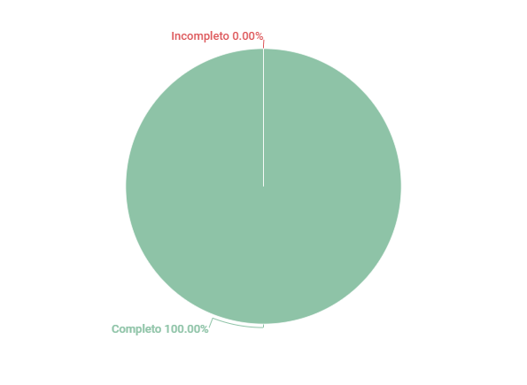

# Brainstorm

## 1. Introdução
Esse artefato visa realizar a verificação do artefato de Brainstorm produzido pelo Grupo 01 - Bilheteria Digital, que se encontra [nesse link](https://requisitos-de-software.github.io/2023.1-BilheteriaDigital/elicitacao/tecnicas/brainstorming/). É importante lembrar que a versão do artefato que foi verificada é a versão 1.2.

## 2. Metodologia
Você pode conferir a metodologia utilizada para a verificação do Grupo 01 [nesse link](https://requisitos-de-software.github.io/2023.1-Twitch/verificacao_grupo01/planejamento/).

## 3. Verificação

A tabela 1 a seguir apresenta o checklist que orientou a verificação do Grupo 01 - Bilheteria Digital, da disciplina de Requisitos de Software no semestre 2023.01.

| ID |Questão| Resultado da Verificação |
| :---: | --- | :---: |
| 01 | O artefato possui introdução.  | Completo |
| 02 | O artefato possui histórico de versionamento completo (datas, descrição, autores, versão).  | Completo |
| 03 | O artefato apresenta as referências utilizadas na sua produção.  | Completo |
| 04 | O artefato apresenta a metodologia utilizada para o brainstorm.  | Completo |
| 05 | O artefato tem definido claramente os objetivos e metas do brainstorm. | Completo |
| 06 | O artefato lista os membros da equipe envolvidos no brainstorm, incluindo suas funções. | Completo |
| 07 | O artefato tem registrado as perguntas e desafios que precisam ser abordados durante o brainstorm. | Completo |
| 08 | O artefato lista os requisitos funcionais e não funcionais elicitados durante o brainstorming, identificando-os com códigos ou identificadores. | Completo |

<h6 align = "center"> Tabela 1: Checklist para Verificação
  Autor(es): Ana Beatriz
 Fonte: Autor(es)</h6>

## 4. Resultados
A imagem 1 a seguir apresenta um gráfico de pizza levando em consideração as 8 questões utilizadas para verificação do artefato brainstorm:

<h6 align = "center"> Imagem 1: Resultados da Verificação do Brainstorm
  Autor(es): Ana Beatriz
 Fonte: Autor(es)</h6>

Com base na análise do documento, todos os elementos do checklist foram abordados, fornecendo uma descrição adequada do processo de brainstorming realizado e os requisitos elicitados a partir dele.

## Histórico de Versões

A Tabela 3 registra o histórico de versão desse documento.

|**Data** | **Versão** | **Descrição** | **Autor** | **Revisor** |
|:---: | :---: | :---: | :---: | :---: |
| 13/06/2023| 1.0 | Criação do documento | Ana Beatriz | - |
| 14/06/2023| 1.1 | Adição da introdução e ajuste na metodologia | Ana Beatriz | Matheus |

<h6 align = "center"> Tabela 3: Histórico de Versões
  Autor(es): 
 Fonte: Autor(es)</h6>

## Referências

>COOPER, Alan; REIMANN, Robert; CRONIN, Dave. About Face: The Essentials of Interaction Design. 

>BARBOSA, S. D. J.; SILVA, B. S. Interação Humano-Computador. Rio de Janeiro: Elsevier, 2011.
