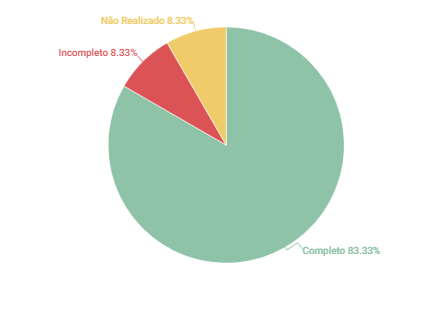

# First Thing First

## 1. Introdução
Esse artefato visa realizar a verificação do artefato da priorização First Thing First produzido pelo Grupo 01 - Bilheteria Digital, que se encontra [nesse link](https://requisitos-de-software.github.io/2023.1-BilheteriaDigital/elicitacao/priorizacao/firstThingsfirst/). É importante lembrar que a versão do artefato que foi verificada é a versão 1.1.

## 2. Metodologia
Você pode conferir a metodologia utilizada para a verificação do Grupo 01 [nesse link](https://requisitos-de-software.github.io/2023.1-Twitch/verificacao_grupo01/planejamento/).

## 3. Verificação

A tabela 1 a seguir apresenta o checklist que orientou a verificação do Grupo 01 - Bilheteria Digital, da disciplina de Requisitos de Software no semestre 2023.01.

| ID |Questão| Resultado da Verificação |
| :---: | --- | :---: |
| 01 | O artefato possui introdução.  | Completo |
| 02 | O artefato possui histórico de versionamento completo (datas, descrição, autores, versão).  | Completo |
| 03 | O artefato apresenta as referências utilizadas na sua produção.  | Completo |
| 04 | O artefato apresenta a metodologia utilizada para a técnica de priorização.  | Completo |
| 05 | O artefato fornece uma visão geral do projeto, incluindo seu objetivo, escopo e principais características.| Completo |
| 06 | O artefato lista as partes interessadas envolvidas no projeto, como usuários, clientes, equipes de desenvolvimento, entre outros. | Completo |
| 07 | O artefato lista os critérios que serão usados para avaliar e priorizar os requisitos. | Completo | 
| 08 | O artefato fornece uma explicação clara de cada critério, definindo o que significa e como será medido ou avaliado. | Completo |
| 09 | O artefato atribui um peso a cada critério para indicar sua importância relativa em relação aos outros critérios. | Completo |
| 10 | O artefato apresenta uma lista dos requisitos identificados para o projeto. | Completo |
| 11 | O artefato fornece uma justificativa clara e detalhada para a priorização de cada requisito. | Incompleto |
| 12 | O artefato estabelece um processo para revisar e atualizar as prioridades regularmente. | Não Realizado |

<h6 align = "center"> Tabela 1: Checklist para Verificação
  Autor(es): Ana Beatriz
 Fonte: Autor(es)</h6>

## 4. Observações

#### ID - 11

Seria útil fornecer uma explicação detalhada da justificativa por trás da priorização de cada requisito, como foi feito na hora de explicar o valor total.

#### ID - 12

Faltou estabelecer um processo para revisar e atualizar as prioridades ao longo do tempo.

## 5. Resultados
A imagem 1 a seguir apresenta um gráfico de pizza levando em consideração as 12 questões utilizadas para verificação do artefato First Things First:

<h6 align = "center"> Imagem 1: Resultados da Verificação First Things First
  Autor(es): Ana Beatriz
 Fonte: Autor(es)</h6>

## Histórico de Versões

A Tabela 3 registra o histórico de versão desse documento.

|**Data** | **Versão** | **Descrição** | **Autor** | **Revisor** |
|:---: | :---: | :---: | :---: | :---: |
| 13/06/2023| 1.0 | Criação do documento | Ana Beatriz | - |
| 14/06/2023| 1.1 | Adição da introdução e ajuste na metodologia | Ana Beatriz | Matheus |

<h6 align = "center"> Tabela 3: Histórico de Versões
  Autor(es): 
 Fonte: Autor(es)</h6>

## Referências
> FIRST things first: Setting requirement priorities. In: WIEGERS, Karl E.; BEATTY, Joy. Software Requirements. 3. ed. [S. l.]: Microsoft Press, 2013. cap. 16, p. 313-329. ISBN 0735679665.
