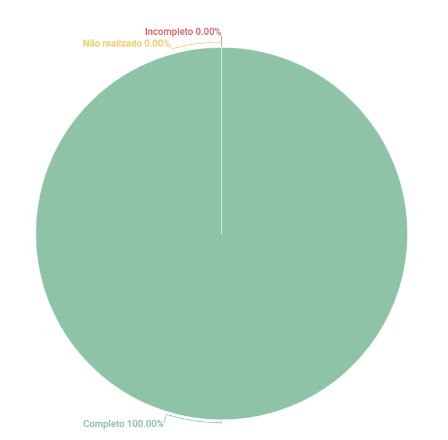

# Aplicativo Escolhido

## 1. Introdução
Esse artefato visa realizar a verificação do Aplicativo Escolhido, produzido pelo Grupo 01 - Bilheteria Digital, que se encontra [nesse link](https://requisitos-de-software.github.io/2023.1-BilheteriaDigital/planejamento/aplicativo/).
É importante lembrar que a versão do artefato que foi verificada é a versão 1.2.

## 2. Metodologia
Você pode conferir a metodologia utilizada para a verificação do Grupo 01 [nesse link](../planejamento/#2-metodologia).

## 3. Verificação

|ID|Questão|Verificação|
|:-:|:-:|:-:|
|1|O artefato apresenta a Metodologia de definição do aplicativo?| Completo |
|2|O artefato apresenta uma escolha de aplicativo que não foi escolhido anteriormente?| Completo |
|3|O artefato apresenta Critérios e Motivações para a escolha?| Completo |
|4|O artefato possui análise dos termos de uso do aplicativo escolhido?| Completo |  
|5|O artefato possui histórico de versão, com data, autor?| Completo |

<h6 align = "center"> Tabela 1: Checklist para Verificação do Artefato de Aplicativo Escolhido
  Autor(es): Rafael Nobre
 Fonte: Autor(es)</h6>

## 4. Resultados
A imagem 1 a seguir apresenta um gráfico de pizza apresentando os resultados, a partir da Tabela 1

<h6 align = "center"> Imagem 1: Resultados da Verificação do Artefato de Aplicativo Escolhido
  Autor(es): Rafael Nobre
 Fonte: Autor(es)</h6>

## Histórico de versão
|    Data    | Versão | Descrição                                                                      | Autor(es)  | Revisor  |
| :--------: | :----: | :----------------------------------------------------------------------------: | :--------: | :------: |
| 13.06.2023 | 1.0    | Inspeção do artefato de aplicativo escolhido |   Rafael   | Diógenes  |

<h6 align = "center"> Tabela 2: Histórico de Versões
  Autor: Rafael Nobre </h6>