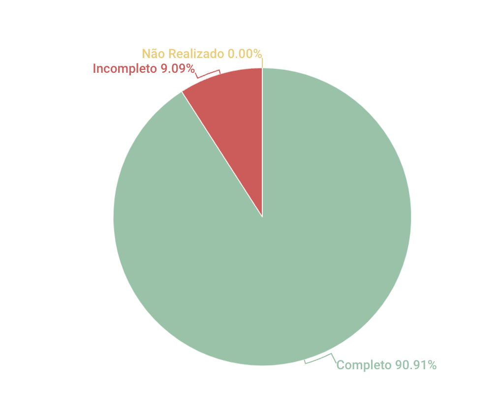

# Backlog

## 1. Introdução
Esse artefato visa realizar a verificação do artefato de Backlog produzido pelo Grupo 01 - Bilheteria Digital, que se encontra [nesse link](https://requisitos-de-software.github.io/2023.1-BilheteriaDigital/modelagem/agil/backlog/). É importante lembrar que a versão do artefato que foi verificada é a versão 2.1.

## 2. Metodologia
Você pode conferir a metodologia utilizada para a verificação do Grupo 01 [nesse link](https://requisitos-de-software.github.io/2023.1-Twitch/verificacao_grupo01/planejamento/).

## 3. Verificação

A tabela 1 a seguir apresenta o checklist que orientou a verificação do Grupo 01 - Bilheteria Digital, da disciplina de Requisitos de Software no semestre 2023.01.

| ID |Questão| Resultado da Verificação |
| :---: | --- | :---: |
| 01 | O artefato possui uma introdução [1](#1) | Completo |
| 02 | O artefato possui a metodologia [1](#1) | Completo |
| 03 | O artefato possui uma tabela com histórico de versões, com data, descrição, autor(es) e revisor(es) [1](#1) | Completo |
| 04 | O artefato possui referências bibliográficas [1](#1) | Completo |
| 05 | As tabelas, imagens ou vídeos do artefato possuem fontes e legendas [1](#1) | Incompleto | Completo |
| 06 | O documento possui os participantes do desenvolvimento do artefato [2](#1)| Completo |
| 07 | O documento possui as funções de cada participante no desenvolvimento do artefato [2](#1)| Completo |
| 08 | O documento possui uma entrevista gravada com o Product Owner [3](#2)| Completo |
| 09 | O documento possui épicos, histórias de usuários e features [2](#1)| Completo |
| 10 | O documento possui uma entrevista gravada com o Product Owner [3](#1) | Completo |
| 11 | O documento possui uma explicação de cada épico [2](#1) | Completo |

<h6 align = "center"> Tabela 1: Checklist para Verificação do Backlog
  Autor(es): Diógenes Dantas
 Fonte: Autor(es)</h6>

## 4. Observações

#### ID - 5
O vídeo possui apenas fonte e a tabela do histórico de versões não possui fonte, nem legenda

## 5. Resultados
A imagem 1 a seguir apresenta um gráfico de pizza levando em consideração as 11 questões utilizadas para verificação do artefato Backlog:

<h6 align = "center"> Imagem 1: Resultados da Verificação do Backlog
  Autor(es): Diógenes Dantas
 Fonte: Autor(es)</h6>

O artefato está bem completo e foi muito bem desenvolvido. Contudo, é necessário apenas que o Grupo 01 se atente as questões relacionadas as legendas e fontes das tabelas e imagens.
## Referências

>SALES, André. Tabela utilizada para análise dos grupos. Disponível em: https://aprender3.unb.br/pluginfile.php/2523005/mod_resource/content/31/Plano_de_Ensino%20RE%20202301%20Turma%202.pdf. Acesso em: 13 de junho de 2023.<a id="1">[1]</a>

>SERRANO, Milene, SERRANO, Maurício. Requisitos (Aula 15): Modelagem de Requisitos - Abordagens Ágeis. Acesso em: 14 de junho de 2023. <a id="2">[2]</a>

>S. PRESSMAN,Roger, R. MAXIM, Bruce Cap. 3 Desenvolvimento Ágil - Engenharia de Software Pressman. Acesso em: 14 de junho de 2023. <a id="3">[3]</a>

## Histórico de Versões

A Tabela 3 registra o histórico de versão desse documento.

|    Data    | Versão | Descrição                                                                      | Autor(es)  | Revisor  |
| :--------: | :----: | :----------------------------------------------------------------------------: | :--------: | :------: |
| 14.06.2023 | 1.0    | Criação do documento de verificação do Backlog (Bilheteria Digital) |   Diógenes   |  Brunna  |
| 14.06.2023 | 1.1    | Adição de Checklist de verificação do Backlog (Bilheteria Digital) e do gráfico de pizza com os resultados |   Diógenes   |  Brunna  |
| 03.07.2023 | 2.0    | Adição de associação entre a questão da tabela do checklist e as referências do artefato. Artefato ajustado para a entrega final |  Diógenes  | Brunna |

<h6 align = "center"> Tabela 2: Histórico de Versões
  Autor(es): Diógenes Dantas
 Fonte: Autor(es)</h6>