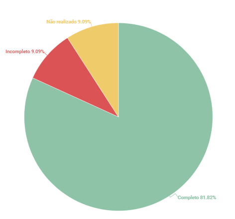

# Casos de uso

## 1. Introdução
Esse artefato visa realizar a verificação do artefato de casos de uso,  produzido pelo Grupo 01 - Bilheteria Digital, que se encontra [nesse link](https://requisitos-de-software.github.io/2023.1-BilheteriaDigital/modelagem/useCase/).
É importante lembrar que a versão do artefato que foi verificada é a versão 1.3.

## 2. Metodologia
Você pode conferir a metodologia utilizada para a verificação do Grupo 01 [nesse link](../planejamento/#2-metodologia).

## 3. Verificação

|ID|Questão|Verificação|
|:-:|:-:|:-:|
|1|O artefato possui Introdução e Metodologia descritiva?|Completo|
|2|O artefato possui referências bibliográficas?|Completo|
|3|O artefato possui Histórico de versão com data, autor e descrição?|Completo|
|4|As tabelas e imagems possuem legendas, e são chamadas no corpo do texto?|Completo|
|5|As ações são representadas por elipses?|Completo|
|6|Os atores principais se encontram à esquerda do sistema, no diagrama de casos de uso?|Completo|
|7|Os atores estão fora do limiar do sistema?|Completo|
|8|Existe uma legenda que descreva os objetos do diagrama?|Completo|
|9|Os relacioamentos de _exclude_ e _include_ estão diagramadas corretamente?|Completo|
|10|Os atores possuem identificadores no diagrama? Ex. cliente, usuário|Não realizado|
|11|Os casos de uso descrevem requisitos funcionais|Completo|
|12|Está especificada a técnica utilizada para realização dos casos de uso?|Incompleto|
|13|As ações são indicadas por verbos no infinitivo?|Completo|
|14|Os casos de uso possuem fluxos alternativos consistentes?|Completo|
|15|Os casos de uso possuem fluxos de exceção consistentes?|Completo|
|16|Os casos de uso possuem definição de pré-condições e pós-condições?|Completo|
|17|Todos os casos de uso possuem rastreabilidade para os respectivos Requisitos?|Completo|

<h6 align = "center"> Tabela 1: Checklist para Verificação do Artefato de casos de uso
  Autor(es): Rafael Nobre
 Fonte: Autor(es)</h6>

## 4. Observações

### ID - 10

No Diagrama de casos de uso, os atores principais não possuem identificador consistente, existe apenas um ator principal e este está identificado como 'Ator'.

### ID - 12

Há apenas a citação no texto, de que foi utilizada uma persona para realização da definição dos casos de uso, porém não há indicação explícita de qual técnica foi utilizada, como Entrevista, Observação, Brainstorm.

## 5. Resultados
A imagem 1 a seguir apresenta um gráfico de pizza apresentando os resultados, a partir da Tabela 1

<h6 align = "center"> Imagem 1: Resultados da Verificação do Artefato de Casos de Uso
  Autor(es): Rafael Nobre
 Fonte: Autor(es)</h6>

## Referências
> [LucidChart - Diagramas de casos de uso UML](https://www.lucidchart.com/pages/pt/diagrama-de-caso-de-uso-uml)

> REINEHR, Sheila. Engenharia de requisitos. [Digite o Local da Editora]: Grupo A, 2020. E-book. ISBN 9786556900674. Disponível em: https://integrada.minhabiblioteca.com.br/#/books/9786556900674/. Acesso em: 13 jun. 2023.

> Slides da aula “Requisitos – Aula 11” dos professores Milene Serrano e Maurício Serrano. Disponível em: https://aprender3.unb.br/pluginfile.php/2523100/mod_resource/content/1/Requisitos%20-%20Aula%20013a.pdf Acesso em: 05 de junho de 2023.

## Histórico de versão
|    Data    | Versão | Descrição                                                                      | Autor(es)  | Revisor  |
| :--------: | :----: | :----------------------------------------------------------------------------: | :--------: | :------: |
| 13.06.2023 | 1.0    | Inspeção do artefato de casos de uso |   Rafael   | Bruna  |

<h6 align = "center"> Tabela 2: Histórico de Versões
  Autor: Rafael Nobre </h6>