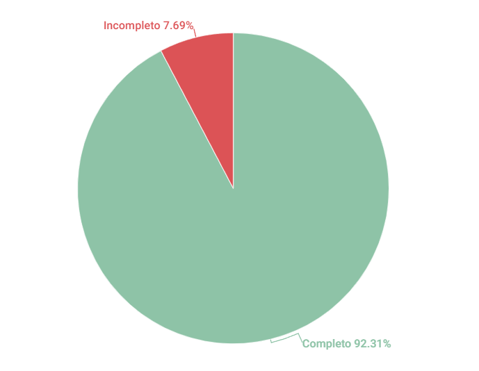

# Cenários 

## 1. Introdução

Esse artefato visa realizar a verificação do artefato de Cenários produzido pelo Grupo 01 - Bilheteria Digital, que se encontra nesse [link](https://requisitos-de-software.github.io/2023.1-BilheteriaDigital/modelagem/cenarios/). É importante lembrar que a versão do artefato que foi verificada é a versão 1.0.

## 2. Metodologia
Você pode conferir a metodologia utilizada para a verificação do Grupo 01 [nesse link](https://requisitos-de-software.github.io/2023.1-Twitch/verificacao_grupo01/planejamento/).

## 3. Verificação

A tabela 1 a seguir apresenta o checklist que orientou a verificação do Grupo 01 - Bilheteria Digital, da disciplina de Requisitos de Software no semestre 2023.01.

| ID |Questão| Resultado da Verificação |
| :---: | --- | :---: |
| 1   | O artefato possui introdução? |      Completo    |
| 2   | O artefato possui uma bibliografia/referência bibliográfica?   |     Completo      |
| 3   | O artefato possui um histórico de versões com o id e descrição das versões, data, autores e revisores? |    Completo       |  
| 4   | Todas as tabelas e imagens são chamadas no texto, possuem legendas e fontes? |     Completo |
| 5   | Todos os textos estão na norma padrão? |     Completo      |
| 6   | O cenário possui: título, metas/objetivos, contexto, ator(es), recursos, exceções, restrições e episódios? |     Completo   |
| 7   | O título do cenário é autoexplicativo? |     Completo |
| 8   | O objetivo do cenário é condizente com seu título? |     Completo     |
| 9   | O contexto descreve de forma sucinta o estado inicial do cenário? Em função de local, tempo e pré-condições, por exemplo |    Completo    |
| 10   | O cenário descreve situações realistas e relevantes de interação do sistema?   |     Completo      |
| 11   | Os atores são condizentes com o contexto do cenário? |     Completo      |  
| 12   | Os episódios do cenário estão coerentes e seguem uma ordem lógica para atingir o objetivo? |     Completo      |
| 13   | Existe uma ligação entre os cenários e os léxicos? |     Incompleto  |

<h6 align = "center"> Tabela 1: Checklist para Verificação
  Autor(es): Matheus
 Fonte: Autor(es)</h6>

## 4. Observações

#### ID - 4

Sugiro a correção da ortografia da palavra "Filtrar" nas legendas das tabelas.

#### ID - 7

Recomendo que os títulos não se limite a ficar dentro da tabela, mas que fiquem também nos tópicos para melhorar o índice e navegação do artefato. Ex: "Cenário 1 - Filtrar eventos por categorias".

#### ID - 13

O cenário de Conectar uma carteira digital não possui ligação e os demais são todas um tipo de filtro, sendo que elas poderiam estar relacionadas em apenas um cenário e dando espaço para os outros léxicos como "Mudar Idioma",  "Notificar Eventos",  "Sugestões de Eventos".

## 5. Resultados
A imagem a seguir apresenta um gráfico de pizza levando em consideração as 13 questões utilizadas para verificação do artefato de Cenários:

<h6 align = "center"> Imagem 1: Resultados da Verificação de Cenários
  Autor(es): Matheus
 Fonte: Autor(es)</h6>

## Histórico de Versões

A Tabela abaixo registra o histórico de versão desse documento.

|**Data** | **Versão** | **Descrição** | **Autor** | **Revisor** |
|:---: | :---: | :---: | :---: | :---: |
| 14.06.2023 | 1.0 | Criação do artefato de verificação de Cenários do Grupo 2 | Matheus | Milena |

<h6 align = "center"> Tabela 2: Histórico de Versões
  Autor(es): Matheus
 Fonte: Autor(es)</h6>
