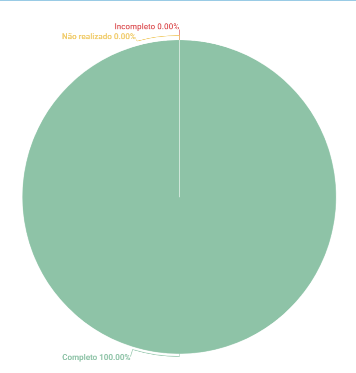

# Cronograma

## 1. Introdução
Esse artefato visa realizar a verificação do Cronograma, produzido pelo Grupo 01 - Bilheteria Digital, que se encontra [nesse link](https://requisitos-de-software.github.io/2023.1-BilheteriaDigital/planejamento/cronograma/).
É importante lembrar que a versão do artefato que foi verificada é a versão 1.3.

## 2. Metodologia
Você pode conferir a metodologia utilizada para a verificação do Grupo 01 [nesse link](../planejamento/#2-metodologia).

## 3. Verificação

|ID|Questão|Verificação|
|:-:|:-:|:-:|
|1|O cronograma apresenta da de início e de fim para cada atividade?|Completo|
|2|O cronograma apresenta o integrante(s) responsável por cada atividade?|Completo|
|3|O cronograma apresenta data de revisão para cada atividade?|Completo|
|4|Existe um cronograma executado, com as atividades que foram executadas?|Completo|
|5|No cronograma executado, está informada a data de início de fim?|Completo|
|6|No cronograma executado, está informada o integrante responsável e o revisor?|Completo|
|7|No artefato, possui histórico de versão com data, autor e descrição?|Completo|
|8|Todas as tabelas possuem legenda?|Completo|
|9|Todas as tabelas possuem chamada dentro do corpo to texto?|Completo|

<h6 align = "center"> Tabela 1: Checklist para Verificação do Artefato de Cronograma
  Autor(es): Rafael Nobre
 Fonte: Autor(es)</h6>

## 4. Resultados
A imagem 1 a seguir apresenta um gráfico de pizza apresentando os resultados, a partir da Tabela 1

<h6 align = "center"> Imagem 1: Resultados da Verificação do Artefato de Cronograma
  Autor(es): Rafael Nobre
 Fonte: Autor(es)</h6>

## Histórico de versão
|    Data    | Versão | Descrição                                                                      | Autor(es)  | Revisor  |
| :--------: | :----: | :----------------------------------------------------------------------------: | :--------: | :------: |
| 13.06.2023 | 1.0    | Inspeção de Cronograma |   Rafael   | Bruna  |

<h6 align = "center"> Tabela 2: Histórico de Versões
  Autor: Rafael Nobre </h6>