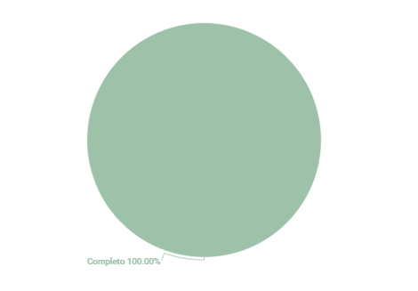

# Especificação Suplementar

## 1. Introdução
Esse artefato visa realizar a verificação do artefato de Especificação Suplementar produzido pelo Grupo 01 - Bilheteria Digital, que se encontra [nesse link](https://requisitos-de-software.github.io/2023.1-BilheteriaDigital/modelagem/especificacao-suplementar/).
É importante lembrar que a versão do artefato que foi verificada é a versão 1.2.

## 2. Metodologia
Você pode conferir a metodologia utilizada para a verificação do Grupo 01 [nesse link](./planejamento.md).

## 3. Verificação

A tabela 1 a seguir apresenta o checklist que orientou a verificação do artefato de Especificação Suplementar do Grupo 01 - Bilheteria Digital, da disciplina de Requisitos de Software no semestre 2023.01.

| ID |Questão| Resultado da Verificação |
| :---: | --- | :---: |
| 01 | O artefato possui introdução. [1](#1) | Completo |
| 02 | O artefato possui histórico de versionamento completo (datas, descrição, autores, versão). [1](#1) | Completo |
| 03 | O artefato apresenta as referências utilizadas na sua produção. [1](#1) | Completo |
| 04 | Tabelas e figuras utilizadas apresentam legendas e fontes. [1](#1) | Incompleto |
| 05 | O artefato segue o modelo FURPS+. [1](#1) | Completo |
| 06 | O artefato referencia corretamente os requisitos funcionais já elicitados.  | Completo |
| 07 | O artefato aborda eficiência. [3](#3) | Completo |
| 08 | O artefato aborda tempo de resposta. [1](#1) | Completo |
| 09 | O artefato aborda tolerância a falhas. [1](#1) | Completo |
| 10 | O artefato aborda satisfação do usuário. [3](#3) | Completo |
| 11 | O artefato aborda segurança e privacidade. [3](#3) | Completo |
| 12 | O artefato aborda adaptabilidade e suportabilidade. [3](#3) | Completo |
| 13 | O artefato especifica a plataforma em que o aplicativo pode ser executado. [1](#1) | Completo |
| 14 | Todos os requisitos elicitados podem ser testados. [1](#1) | Completo |

<h6 align = "center"> Tabela 1: Checklist para Verificação do artefato de Especificação Suplementar
  Autor(es): Brunna Louise
 Fonte: Autor(es)</h6>

## 4. Observações

O artefato foi muito bem elaborado e apresenta atributos extras que enriquecem o artefato. Recomenda-se apenas que o Grupo 01 se atente a colocar legendas apropriadas nas imagens e tabelas que utilizarem em seus artefatos.

#### ID 04

Apesar de apresentarem fontes, não há legendas nas tabelas e figuras.

## 5. Resultados
A imagem 1 a seguir apresenta um gráfico de pizza levando em consideração as 14 questões utilizadas para verificação do artefato de especificação suplementar:

<h6 align = "center"> Imagem 1: Resultados da Verificação do Artefato de Especificação Suplementar
  Autor(es): Brunna Louise
 Fonte: Autor(es)</h6>

## 6. Referências

> <a id="1">[1]</a> SALES, André. Tabela utilizada para análise dos grupos. Disponível em: https://aprender3.unb.br/pluginfile.php/2523005/mod_resource/content/31/Plano_de_Ensino%20RE%20202301%20Turma%202.pdf. Acesso em: 13 de junho de 2023.

> <a id="2">[2]</a> SERRANO, Maurício; SERRANO, Milene. Material em Slides produzido para a disciplina de Requisitos de Software. Acesso em: 13 de junho de 2023.

> <a id="3">[3]</a> Conceitos: Requisitos. UFPE, Copyright  © 1987 - 2001 Rational Software Corporation. Disponível em: https://www.cin.ufpe.br/~rls2/processo_tg/Metodologia%20S&B/workproducts/resources/co_req.htm. Acesso em: 13 de junho de 2023.

## Histórico de Versões

A Tabela 2 registra o histórico de versão desse documento.

|**Data** | **Versão** | **Descrição** | **Autor** | **Revisor** |
|:---: | :---: | :---: | :---: | :---: |
|13/06/2023 | 1.0 | Primeira versão da verificação do artefato Especificação Suplementar (Grupo 01) | Brunna Louise | Diógenes Dantas |
|04/07/2023 | 2.0 | Versão final da verificação do artefato Especificação Suplementar (Grupo 01) | Brunna Louise | Diógenes Dantas |
<h6 align = "center"> Tabela 2: Histórico de Versões
  Autor(es): Brunna Louise
 Fonte: Autor(es)</h6>
