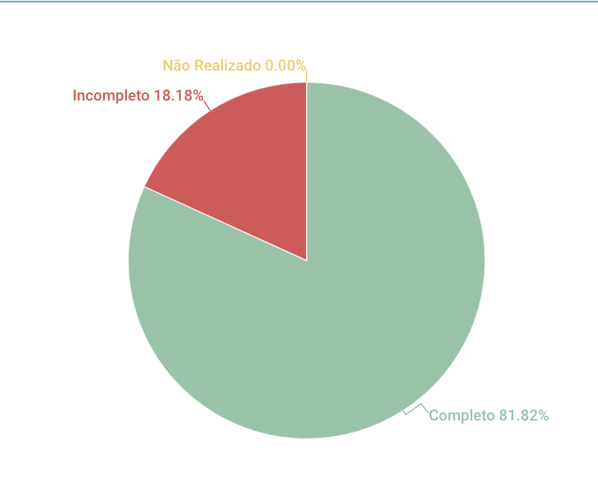

# Introspecção
## 1. Introdução
Esse artefato visa realizar a verificação do artefato de Introspecção produzido pelo Grupo 01 - Bilheteria Digital, que se encontra [nesse link](https://requisitos-de-software.github.io/2023.1-BilheteriaDigital/elicitacao/tecnicas/introspeccao/).
É importante lembrar que a versão do artefato que foi verificada é a versão 1.4.

## 2. Metodologia
Você pode conferir a metodologia utilizada para a verificação do Grupo 01 [nesse link](https://requisitos-de-software.github.io/2023.1-Twitch/verificacao_grupo01/planejamento/).

## 3. Verificação

A tabela 1 a seguir apresenta o checklist que orientou a verificação do Grupo 01 - Bilheteria Digital, da disciplina de Requisitos de Software no semestre 2023.01.

| ID |Questão| Resultado da Verificação |
| :---: | --- | :---: |
| 01 | O artefato possui uma introdução [1](#1) | Incompleto|
| 02 | O artefato possui a metodologia  [1](#1) | Completo |
| 03 | O artefato possui uma tabela com histórico de versões, com data, descrição, autor(es) e revisor(es) [1](#1) | Completo |
| 04 | O artefato possui referências bibliográficas [1](#1) | Completo |
| 05 | As tabelas e imagens do artefato possuem fontes e legendas [1](#1) | Incompleto  |
| 06 | O documento possui requisitos funcionais e não funcionais [2](#2)| Completo |
| 07 | O documento possui requisitos tanto implementados quanto não implementados. [2](#2) | Completo |
| 08 | O documento possui requisitos que são prioridades para o sucesso do sistema analisado [2](#2) | Completo |
| 09 | O documento possui os membros do grupo que tiveram a função de desempenhar um Engenheiro(a) de Requisitos que imaginasse o que gostaria, se tivesse que desempenhar uma dada tarefa, com os equipamentos disponíveis e demais recursos. [2](#2) | Completo |

<h6 align = "center"> Tabela 1: Checklist para Verificação da Introspecção
  Autor(es): Diógenes Dantas
 Fonte: Autor(es)</h6>

## 4. Observações
e
#### ID - 1

Necessário destacar que a introspecção pode não ser apropriada para refletir de maneira precisa a experiência ou desempenho real dos envolvidos, uma vez que sua utilização requer a presença de um especialista. 

#### ID - 5

As tabelas de requisitos priorizados possuem apenas fonte e a tabela do histórico de versões não possui fonte, nem legenda.

## 5. Resultados
A imagem 1 a seguir apresenta um gráfico de pizza levando em consideração as 9 questões utilizadas para verificação da técnica de elicitação de requisitos Introspecção:

<h6 align = "center"> Imagem 1: Resultados da Verificação da Introspecção
  Autor(es): Diógenes Dantas
 Fonte: Autor(es)</h6>

O artefato está bem completo e foi muito bem desenvolvido. Contudo, na introdução seria mais completa se falasse a respeito de que a técnica de introspecção não necessariamente atende o ponto de vista do usuário, pois o trabalho é feito por um Engenheiro de Requisitos especializado, assim como foi afirmado no slide do Professor Maurício e Milene Serrano usado como referência pelo grupo e pela disciplina. Além disso, é necessário que o Grupo 01 se atente as questões relacionadas as legendas e fontes das tabelas e imagens.

## Referências

>SALES, André. Tabela utilizada para análise dos grupos. Disponível em: https://aprender3.unb.br/pluginfile.php/2523005/mod_resource/content/31/Plano_de_Ensino%20RE%20202301%20Turma%202.pdf. Acesso em: 13 de junho de 2023. <a id="1">[1]</a>

>SERRANO, Milene, SERRANO, Maurício. Requisitos (Aula 07): Elicitação, Modelagem e Análise. Aceso em: 14 de junho de 2023. <a id="2">[2]</a>

## Histórico de Versões

A Tabela 2 registra o histórico de versão desse documento.

|    Data    | Versão | Descrição                                                                      | Autor(es)  | Revisor  |
| :--------: | :----: | :----------------------------------------------------------------------------: | :--------: | :------: |
| 13.06.2023 | 1.0    | Criação do documento de verificação da técnica de elicitação Instrospecção(Bilheteria Digital) |   Diógenes  |  Milena  |
| 14.06.2023 | 1.1    | Adição de Checklist de verificação da técnica de elicitação Instrospecção (Bilheteria Digital) e o gráfico com os resultados |   Diógenes  |  Rafael  |
| 14.06.2023 | 1.2    | Adição de Referências no Documento | Diógenes  |  Milena  |
| 03.07.2023 | 2.0    | Adição de associação entre a questão da tabela do checklist e as referências do artefato. Artefato ajustado para a entrega final |   Diógenes   | Rafael |

<h6 align = "center"> Tabela 2: Histórico de Versões
  Autor(es): Diógenes Dantas
 Fonte: Autor(es)</h6>
