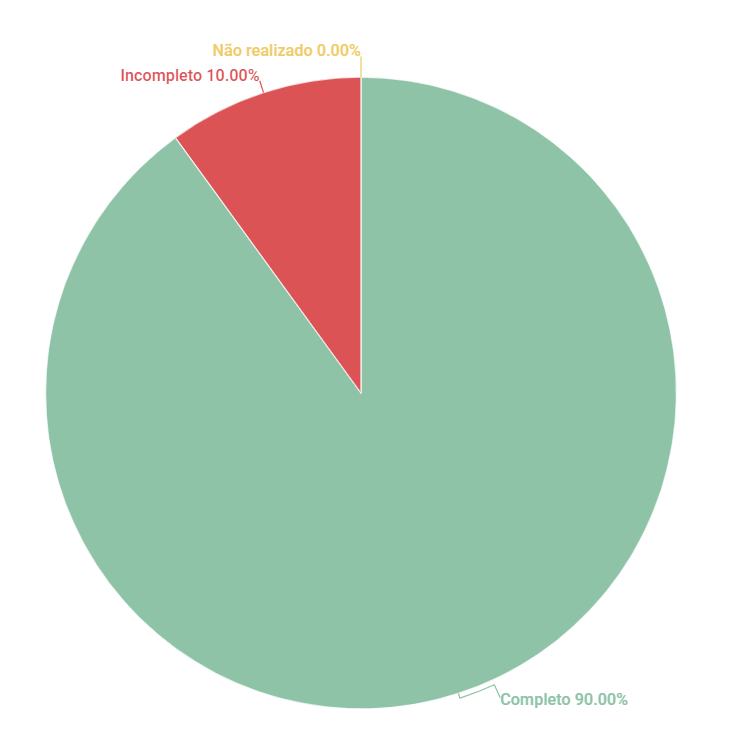

# Observação

## 1. Introdução
Esse artefato visa realizar a verificação do artefato de Observação, produzido pelo Grupo 01 - Bilheteria Digital, que se encontra [nesse link](https://requisitos-de-software.github.io/2023.1-BilheteriaDigital/elicitacao/tecnicas/observacao/).
É importante lembrar que a versão do artefato que foi verificada é a versão 1.2.

## 2. Metodologia
Você pode conferir a metodologia utilizada para a verificação do Grupo 01 [nesse link](../planejamento/#2-metodologia).

## 3. Verificação

|ID|Questão|Verificação|
|:-:|:-:|:-:|
|1|O(s) usuário(s) participante(s) da observação foi identificado?|Completo|
|2|A observação foi gravada e está disponível para visualização?| Completo |
|3|O artefato possui referência bibliográfica?|Completo|
|4|O artefato possui histórico de versão, com autor, data e descrição?|Completo|
|5|A técnica de Observação destacou requisitos funcionais?|Completo|
|6|A técnica de Observação destacou requisitos não-funcionais?|Incompleto|
|7|Os Requisitos elicitados são todos verificáveis?|Completo|
|8|Todas as tabelas e imagens possuem legendas e chamadas no corpo do texto?|Completo|
|9|Todos os requisitos possuem códigos de identificação únicos?|Completo|
|10|Todos os requisitos são testáveis?|Completo|

<h6 align = "center"> Tabela 1: Checklist para Verificação do Artefato de Observação
  Autor(es): Rafael Nobre
 Fonte: Autor(es)</h6>

## 4. Observações

#### ID - 6

Os requisitos não funcionais descritos não são requisitos não-funcionais, e sim requisitos funcionais. Os requisitos não funcioais descrevem características como Desempenho, Segurança, Usabilidade, Confiabilidade, entre outros.
Os requisitos descritos, são de maneira geral, descrições de telas, páginas que devem ser implementadas.

## 5. Resultados
A imagem 1 a seguir apresenta um gráfico de pizza apresentando os resultados, a partir da Tabela 1

<h6 align = "center"> Imagem 1: Resultados da Verificação do Artefato de Observação
  Autor(es): Rafael Nobre
 Fonte: Autor(es)</h6>

## Referências

> Barbosa, S. D. J.; Silva, B. S. da; Silveira, M. S.; Gasparini, I.; Darin, T.; Barbosa, G. D. J. (2021) Interação Humano-Computador e Experiência do usuário. Autopublicação. ISBN: 978-65-00-19677-1
> Reinehr, Sheila. Engenharia de requisitos

## Histórico de versão
|    Data    | Versão | Descrição                                                                      | Autor(es)  | Revisor  |
| :--------: | :----: | :----------------------------------------------------------------------------: | :--------: | :------: |
| 13.06.2023 | 1.0    | Inspeção do artefato de Observação |   Rafael   | Diógenes  |

<h6 align = "center"> Tabela 2: Histórico de Versões
  Autor: Rafael Nobre </h6>