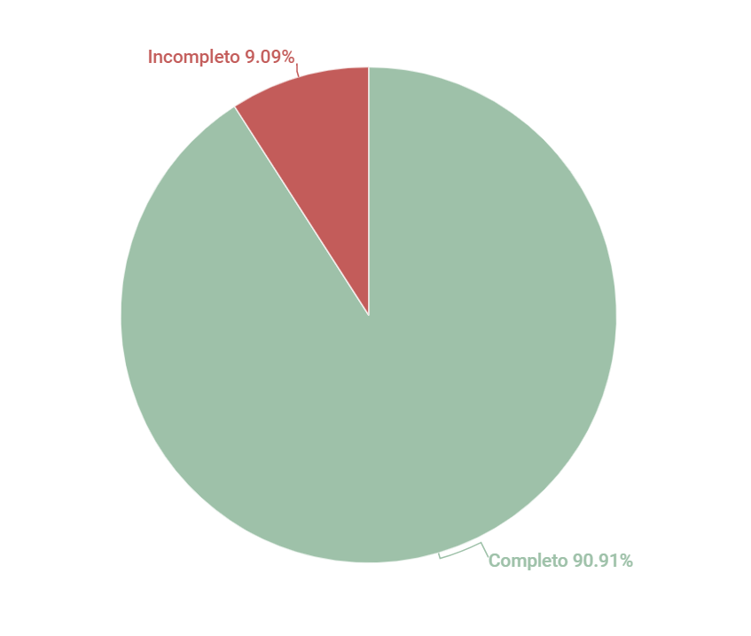

# Personas
## 1. Introdução
Esse artefato visa realizar a verificação do artefato de Personas produzido pelo Grupo 01 - Bilheteria Digital, que se encontra [nesse link](https://requisitos-de-software.github.io/2023.1-BilheteriaDigital/elicitacao/personas/).
É importante lembrar que a versão do artefato que foi verificada é a versão 1.5.

## 2. Metodologia
Você pode conferir a metodologia utilizada para a verificação do Grupo 01 [nesse link](./planejamento.md).

## 3. Verificação

A tabela 1 a seguir apresenta o checklist que orientou a verificação do artefato de Personas do Grupo 01 - Bilheteria Digital, da disciplina de Requisitos de Software no semestre 2023.01.

| ID |Questão| Resultado da Verificação |
| :---: | --- | :---: |
| 01 | O artefato possui introdução. [1](#1) | Completo |
| 02 | O artefato possui histórico de versionamento completo (datas, descrição, autores, versão). [1](#1) | Completo |
| 03 | O artefato apresenta as referências utilizadas na sua produção. [1](#1) | Completo |
| 04 | O artefato apresenta a metodologia utilizada para criação de personas. [1](#1) | Completo |
| 05 | Há um elenco de personas e o porquê da quantidade de personas. [1](#1) | Completo |
| 06 | As personas possuem dados básicos de identidade (nome, sobrenome, idade, dados demográficos). [1](#1) | Completo |
| 07 | Cada persona tem uma foto para ilustrá-la. Essa foto é de uma pessoa que não existe. [1](#1) | Completo |
| 08 | Há, pelo menos, uma persona primária, uma persona secundária e uma antipersona. [2](#2)  | Completo |
| 09 | As personas possuem objetivos e necessidades bem definidos. [1](#1) | Completo |
| 10 | Dentre as metodologias utilizadas para criação de personas, foi levado em consideração o perfil de usuário para elaboração do elenco de personas. [1](#1) | Completo |
| 11 | Tabelas e figuras utilizadas apresentam legendas e fontes. [1](#1) | Incompleto|
<h6 align = "center"> Tabela 1: Checklist para Verificação do artefato de Personas
  Autor(es): Brunna Louise
 Fonte: Autor(es)</h6>

## 4. Observações

#### ID 11
O artefato está bem completo e foi muito bem desenvolvido. Recomenda-se apenas que o Grupo 01 se atente a colocar legendas apropriadas nas imagens e tabelas que utilizarem em seus artefatos.

## 5. Resultados
A imagem 1 a seguir apresenta um gráfico de pizza levando em consideração as 11 questões utilizadas para verificação do artefato de personas:

<h6 align = "center"> Imagem 1: Resultados da Verificação do Artefato de Personas
  Autor(es): Brunna Louise
 Fonte: Autor(es)</h6>

## 6. Referências

> <a id="1">[1]</a> SALES, André. Tabela utilizada para análise dos grupos. Disponível em: https://aprender3.unb.br/pluginfile.php/2523005/mod_resource/content/31/Plano_de_Ensino%20RE%20202301%20Turma%202.pdf. Acesso em: 13 de junho de 2023.

> <a id="2">[2]</a> SERRANO, Maurício; SERRANO, Milene. Material em Slides produzido para a disciplina de Requisitos de Software. Acesso em: 13 de junho de 2023.

## Histórico de Versões

A Tabela 2 registra o histórico de versão desse documento.

|**Data** | **Versão** | **Descrição** | **Autor** | **Revisor** |
|:---: | :---: | :---: | :---: | :---: |
|13/06/2023 | 1.0 | Primeira versão da verificação do artefato Personas (Grupo 01) | Brunna Louise | Diógenes Dantas |
|04/07/2023 | 2.0 | Versão final da verificação do artefato Personas (Grupo 01) | Brunna Louise | Diógenes Dantas |

<h6 align = "center"> Tabela 2: Histórico de Versões
  Autor(es): Brunna Louise
 Fonte: Autor(es)</h6>
