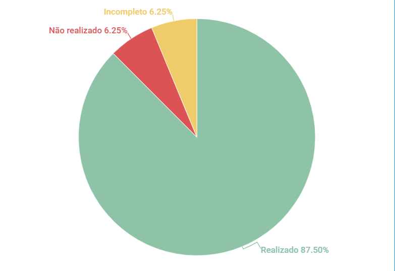

# Léxicos

## 1. Introdução

Esse artefato visa realizar a verificação do artefato Léxico na versão 1.2 produzido pelo Grupo 01 - Bilheteria Digital, que se encontra [nesse link](https://requisitos-de-software.github.io/2023.1-BilheteriaDigital/modelagem/lexicos/).

## 2. Metodologia

Pode-se conferir a metodologia utilizada para a verificação do Grupo 01 [nesse link](https://requisitos-de-software.github.io/2023.1-Twitch/verificacao_grupo01/planejamento/).

## 3. Verificação

A tabela a seguir apresenta o checklist que orientou a verificação do Léxico do Grupo 01 - Bilheteria Digital, da disciplina de Requisitos de Software no semestre 2023.01.

| ID |Questão| Resultado da Verificação |
| :---: | --- | :---: |
| 01 | O artefato possui uma introdução | Completo |
| 02 | O artefato possui a metodologia  | Completo |
| 03 | O artefato possui uma tabela com histórico de versões, com data, descrição, autor(es) e revisor(es)  | Completo |
| 04 | O artefato possui referências bibliográficas  | Completo |
| 05 | As tabelas e imagens do artefato possuem fontes, legendas e chamadas no texto | Incompleto |
| 06 | Os léxicos possuem classificação? (verbo, objeto, estado) | Completo |
| 07 | Os léxicos são coerentes entre si? | Completo |
| 08 | Os léxicos possuem noção e impacto? | Completo |
| 09 | Possui rastreabilidade das informações?| Completo |
| 10 | As informações são suficientes para compreensão? | Completo |
| 11 | As definições estão claras e precisas? | Completo |
| 12 | Foi estabelecido um modelo ou formato para a apresentação dos léxicos? | Completo |
| 13 | A terminologia e a formatação são consistentes em todo o léxico? | Completo |
| 14 | Os léxicos possuem sinônimos? | Não Realizados|
| 15 | Os impactos descrevem o efeito, uso ou coerência do símbolo no sistema ou efeito de algo na aplicação sobre o símbolo?| Completo |
| 16 | Os Léxicos estão descritos em linguagem natural para entendimento entre os stakeholders? | Completo |

<h6 align = "center"> Tabela 1: Checklist Léxico
  Autor(es): Milena Aires
 Fonte: Autor(es)</h6>

## 4. Observações

#### ID - 5
As fontes das tabelas não estão de acordo com a ABNT.

#### ID - 14 

Não há evidências de que os léxicos apresentados no documento incluam sinônimos. O documento se concentra na descrição dos símbolos, classificações, impacto e noção associados a cada léxico.

## 5. Resultados
Os léxicos foram muito bem contruídos e explicados, com hiperlinks onde relacionam cada requisito. Com isso obtemos o gráfico abaixo:

<h6 align = "center"> Imagem 1: Resultados da Verificação do Artefato de Léxico
  Autor(es): Milena Aires
 Fonte: Autor(es)</h6>

## 5. Referências
>SERRANO, Milene. Requisitos – Aula 10. 2017. Apresentação de slides. Disponível em: https://aprender3.unb.br/pluginfile.php/2523091/mod_resource/content/1/Aula%2010.pdf. Acesso em: 14/06/2023.

## 6. Histórico de Versão

A Tabela seguinte registra o histórico de versão desse documento.

|**Data** | **Versão** | **Descrição** | **Autor** | **Revisor** |
|:---: | :---: | :---: | :---: | :---: |
|14.06.2023| 1.0 | Primeiro versão do checklist sobre o Léxico produzido pelo grupo 01| Milena Aires | Matheus |

<h6 align = "center"> Tabela 3: Histórico de Versão
  Autor(es): Milena Aires
 Fonte: Autor(es)</h6>
