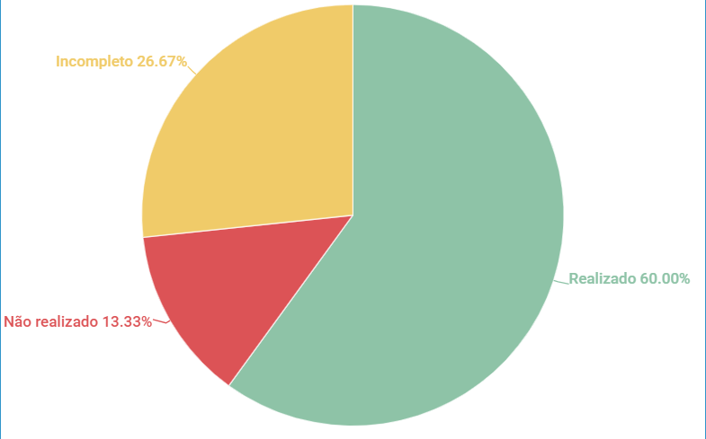

# Questionário

## 1. Introdução

Esse artefato visa realizar a verificação do artefato Questionário das técnicas de Elicitação na versão 1.0 produzido pelo Grupo 01 - Bilheteria Digital, que se encontra [nesse link](https://requisitos-de-software.github.io/2023.1-BilheteriaDigital/elicitacao/tecnicas/questionario/).

## 2. Metodologia

Pode-se conferir a metodologia utilizada para a verificação do Grupo 01 [nesse link](https://requisitos-de-software.github.io/2023.1-Twitch/verificacao_grupo01/planejamento/).

## 3. Verificação

A tabela a seguir apresenta o checklist que orientou a verificação do Questionário do Grupo 01 - Bilheteria Digital, da disciplina de Requisitos de Software no semestre 2023.01.

| ID |Questão| Resultado da Verificação |
| :---: | --- | :---: |
| 01 | O artefato possui uma introdução | Completo |
| 02 | O artefato possui a metodologia  | Incompleto |
| 03 | O artefato possui uma tabela com histórico de versões, com data, descrição, autor(es) e revisor(es)  | Completo |
| 04 | O artefato possui referências bibliográficas  | Completo |
| 05 | As tabelas e imagens do artefato possuem fontes, legendas e chamadas no texto | Incompleto |
| 06 | A preparação do questionário está documentada? Tal como: público-alvo, instruções | Não Realizado|
| 07 | O questionário possui um análise dos resultados? | Incompleto|
| 08 | As perguntas foram elaboradas de forma clara? | Completo |
| 09 | As perguntas foram elaboradas sendo relevantes para a elicitação de requisitos? | Completo |
| 10 | As perguntas se referem a diferentes aspectos dos requisitos, como funcionalidades, interfaces etc.? | Completo |
| 11 | As perguntas foram elaboradas de forma lógica e ordenada que não houve influência nas respostas? | Completo |
| 12 | As perguntas permitem respostas detalhadas e abrangentes? | Incompleto |
| 13 | O questionário teve um teste piloto para garantir sua eficácia e possíveis erros? | Não Realizado |
| 14 | O tempo estimado foi informado para os usuários? | Completo |
| 15 | Foram realizadas medidas para garantir a privacidade e o anonimato das respostas dos participantes?| Completo |

<h6 align = "center"> Tabela 1: Checklist Questionário
  Autor(es): Milena Aires
 Fonte: Autor(es)</h6>

## 4. Observações

#### ID - 2
No artefato não possui a metodologia de uma forma explicida.

#### ID - 5

Algunas imagens e tabelas não possuem chamada no texto e a forma em que a legenda foi colocada não está de acordo com a ABNT.

#### ID - 6

É possível visualizar alguns apscetos como o termo de consentimento e a separação de pessoas que já utilizaram ou não o aplicativo, porém a preparação não foi documentada.

#### ID - 7

O artefato mostra os gráficos de acordo com as respostas e objetivo de cada perguntas mas não analisa os resultados obtidos e já pula para a elicitação.

#### ID - 12

As perguntas foram todas fechadas não permitindo que o usuário fornecesse mais detalhes, e no questionário há perguntas onde poderiam ser com respostas livres.

## 5. Resultados

O questionário aplicado foi feito de forma coerente, porém houve pontos que podem ser melhorados de acordo com o checklist feito acima. Com isso obtemos um gráfico dos resultados. 

<h6 align = "center"> Imagem 1: Resultados da Verificação do Questionário
  Autor(es): Milena Aires
 Fonte: Autor(es)</h6>

## 5. Referências
>VAZQUEZ, Carlos Eduardo; SIMÕES, Guilherme Siqueira. Engenharia de requisitos: software orientado ao negócio. 1. ed. [S. l.]: Brasport, 2016.

## 6. Histórico de Versões

A Tabela seguinte registra o histórico de versão desse documento.

|**Data** | **Versão** | **Descrição** | **Autor** | **Revisor** |
|:---: | :---: | :---: | :---: | :---: |
|14.06.2023| 1.0 | Primeiro versão do checklist sobre o Questionário produzido pelo grupo 01| Milena Aires | Matheus |

<h6 align = "center"> Tabela 3: Histórico de Versão
  Autor(es): Milena Aires
 Fonte: Autor(es)</h6>
