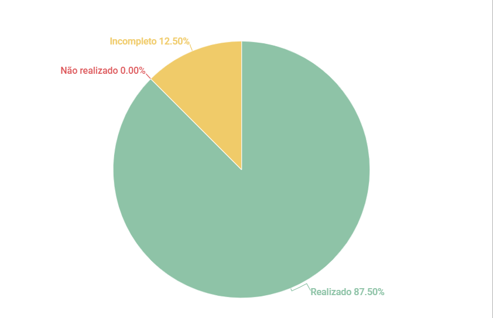

# Rich Picture

## 1. Introdução

Esse artefato visa realizar a verificação do artefato Rich Picture na versão 1.1 produzido pelo Grupo 01 - Bilheteria Digital, que se encontra [nesse link](https://requisitos-de-software.github.io/2023.1-BilheteriaDigital/rastreabilidade/rich_picture/).

## 2. Metodologia

Pode-se conferir a metodologia utilizada para a verificação do Grupo 01 [nesse link](https://requisitos-de-software.github.io/2023.1-Twitch/verificacao_grupo01/planejamento/).

## 3. Verificação

A tabela a seguir apresenta o checklist que orientou a verificação do Rich Picture do Grupo 01 - Bilheteria Digital, da disciplina de Requisitos de Software no semestre 2023.01.

| ID |Questão| Resultado da Verificação |
| :---: | --- | :---: |
| 01 | O artefato possui uma introdução | Completo |
| 02 | O artefato possui a metodologia  | Completo |
| 03 | O artefato possui uma tabela com histórico de versões, com data, descrição, autor(es) e revisor(es)  | Completo |
| 04 | O artefato possui referências bibliográficas  | Completo |
| 05 | As tabelas e imagens do artefato possuem fontes, legendas e chamadas no texto | Incompleto|
| 06 | O artefato possui legenda dos elementos? | Completo |
| 07 | O artefato possui atores? | Completo |
| 08 | O artefato possui operações? | Completo |
| 09 | O artefato possui armazenamento de dados? | Completo |
| 10 | O artefato possui fluxos? | Completo |
| 11 | O artefato possui fronteira do sistema? | Completo |
| 12 | As atividades são descritas de maneira clara e lógica? | Completo |
| 13 | Os símbolos que representam atividades se conectam com setas para indicar fluxo? | Completo |
| 14 | As relações e interações entre os atores e o sistema estão claramente ilustradas?| Completo |
| 15 | As anotações fornecem explicações ou percepções adicionais sobre os elementos representados?| Incompleto|
| 16 | O artefato é visualmente claro e fácil de entender? | Completo |

<h6 align = "center"> Tabela 1: Checklist Rich Picture
  Autor(es): Milena Aires
 Fonte: Autor(es)</h6>

## 4. Observações

#### ID - 5

Algunas imagens não possuem chamada no texto e a forma em que a legenda foi colocada não está de acordo com a ABNT.

#### ID - 15
Alguns fluxos poderiam estar explicados, como os que vão de "eventos" para as demais atividades. 

## 5. Resultados
O Rich Picture analisado está conforme as diretrizes e estrutura exigidas. Os únicos pontos que que estão incompletos são os comentados acima. Com isso foi montado o gráfico a seguir com os resultados analisados.

<h6 align = "center"> Imagem 1: Resultados da Verificação do Artefato de Rich Picture
  Autor(es): Milena Aires
 Fonte: Autor(es)</h6>

## 5. Referências
>SALES, André. Rich Picture. Disponível em:https://www.youtube.com/watch?v=NxEPxW_Ku8M. Acesso em: 14 de junho de 2023.

## 6. Histórico de Versão

A Tabela seguinte registra o histórico de versão desse documento.

|**Data** | **Versão** | **Descrição** | **Autor** | **Revisor** |
|:---: | :---: | :---: | :---: | :---: |
|14.06.2023| 1.0 | Primeiro versão do checklist sobre o Rich Picture produzido pelo grupo 01| Milena Aires | Matheus |

<h6 align = "center"> Tabela 3: Histórico de Versão
  Autor(es): Milena Aires
 Fonte: Autor(es)</h6>
